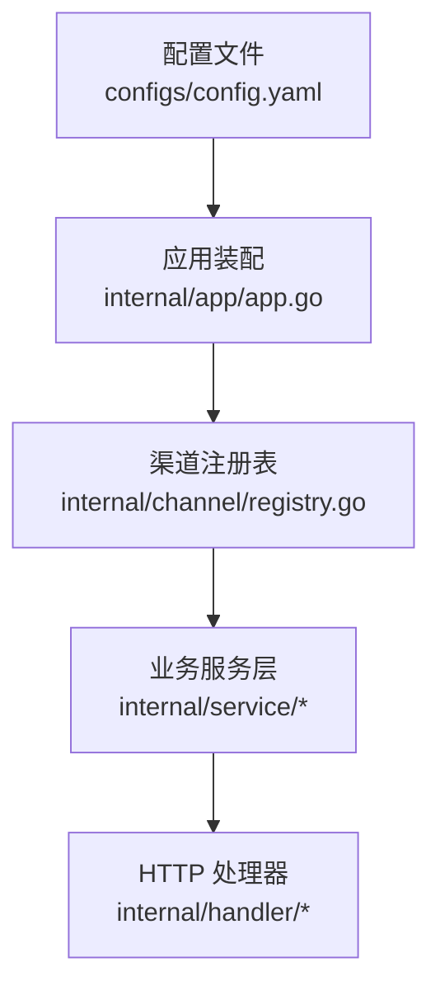
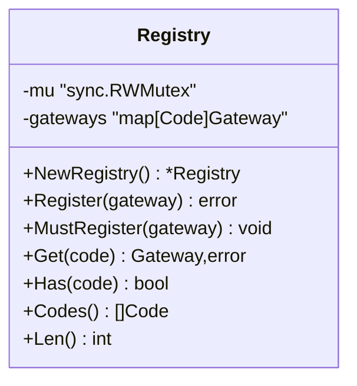
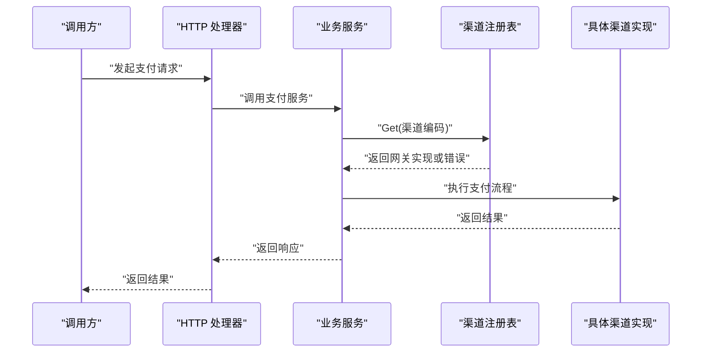
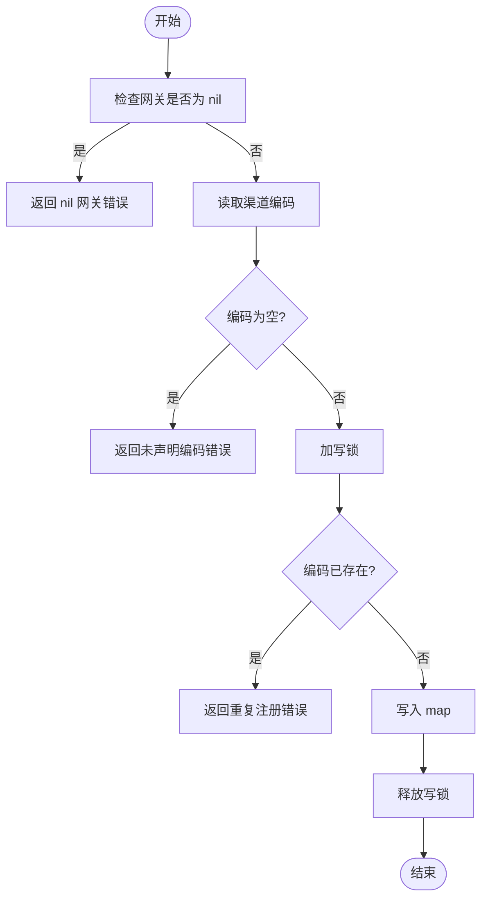
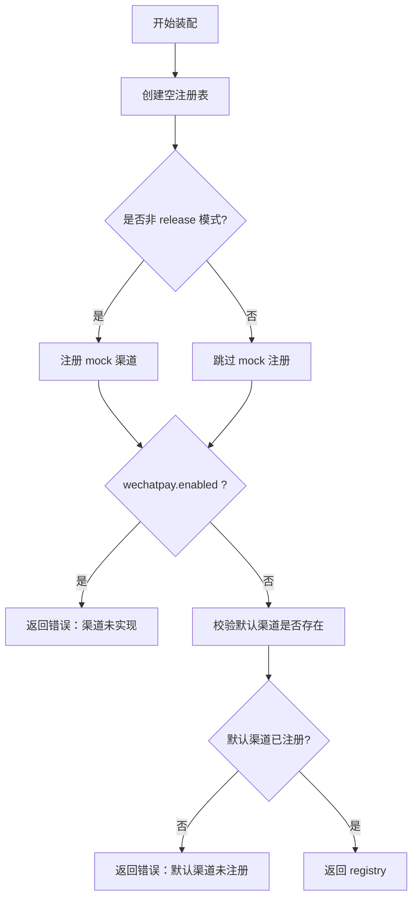

# 渠道注册表

<cite>
**本文引用的文件**   
- [internal/channel/registry.go](file://internal/channel/registry.go)
- [internal/app/app.go](file://internal/app/app.go)
- [configs/config.yaml](file://configs/config.yaml)
</cite>

## 目录
1. [引言](#引言)
2. [项目结构中的定位](#项目结构中的定位)
3. [核心组件：Registry 设计](#核心组件registry-设计)
4. [架构总览](#架构总览)
5. [关键方法详解](#关键方法详解)
6. [启动装配与配置驱动](#启动装配与配置驱动)
7. [依赖关系分析](#依赖关系分析)
8. [性能与并发特性](#性能与并发特性)
9. [错误处理与故障排查](#错误处理与故障排查)
10. [最佳实践与扩展建议](#最佳实践与扩展建议)
11. [结论](#结论)

## 引言
本文件围绕支付服务中的“渠道注册表”进行系统化说明，重点解释 Registry 结构体的并发安全设计、map 存储模型、线程安全保证，以及 Register()、MustRegister()、Get()、Has()、Codes() 等方法的行为差异和适用场景。文档还结合应用启动装配流程，说明如何通过配置文件动态决定可用渠道，并给出注册流程的参考路径与最佳实践。

## 项目结构中的定位
渠道注册表位于 internal/channel 包中，是连接“配置驱动的渠道实现”与“业务服务层”的关键基础设施。应用装配逻辑在 internal/app/app.go 中完成，根据 configs/config.yaml 决定是否注册 mock 或真实渠道；service 层通过 registry 查询具体网关实现，避免直接 import 具体渠道实现类。

**图表来源** 
- [internal/app/app.go:45-105](file://internal/app/app.go#L45-L105)
- [internal/channel/registry.go:11-29](file://internal/channel/registry.go#L11-L29)
- [configs/config.yaml:30-45](file://configs/config.yaml#L30-L45)

**章节来源**
- [internal/app/app.go:1-105](file://internal/app/app.go#L1-L105)
- [internal/channel/registry.go:1-29](file://internal/channel/registry.go#L1-L29)
- [configs/config.yaml:1-45](file://configs/config.yaml#L1-L45)

## 核心组件：Registry 设计
Registry 是一个并发安全的渠道注册表，核心字段包括读写锁和 map 存储：
- mu：sync.RWMutex，用于保护 gateways 的并发访问。
- gateways：map[Code]Gateway，以渠道编码为键、渠道网关实现为值。

设计要点：
- 将“有哪些渠道可用”从编译期硬编码转为运行期数据，使装配层与服务层解耦。
- 使用 RWMutex 而非简单只读假设，即使当前是启动时一次性写入，也为未来可能的热加载预留安全边界。
- 重复注册同一编码视为配置错误，返回 error 而不是静默覆盖，避免支付场景下出现不可预期的生效实现。

**图表来源** 
- [internal/channel/registry.go:11-29](file://internal/channel/registry.go#L11-L29)
- [internal/channel/registry.go:26-106](file://internal/channel/registry.go#L26-L106)

**章节来源**
- [internal/channel/registry.go:11-29](file://internal/channel/registry.go#L11-L29)

## 架构总览
渠道注册表在整体架构中承担“运行时渠道发现”的职责。应用装配阶段按配置构建 registry，随后注入到 service 与 handler 中。请求进入后，service 通过 registry.Get() 获取具体网关实现执行支付逻辑。

**图表来源** 
- [internal/app/app.go:69-90](file://internal/app/app.go#L69-L90)
- [internal/channel/registry.go:63-74](file://internal/channel/registry.go#L63-L74)

**章节来源**
- [internal/app/app.go:69-105](file://internal/app/app.go#L69-L105)
- [internal/channel/registry.go:63-74](file://internal/channel/registry.go#L63-L74)

## 关键方法详解

### Register() 与 MustRegister()
- Register()：注册一个渠道实现。参数校验包括不能注册 nil 网关、网关必须声明非空渠道编码；若同一编码已存在则返回错误，不覆盖。
- MustRegister()：包装 Register()，失败时 panic，仅用于启动装配阶段，确保配置错误让进程起不来，而不是带着残缺渠道集合对外服务。

区别与使用场景：
- Register() 适合需要显式错误处理的装配逻辑，例如 buildRegistry() 中根据配置条件注册 mock 渠道。
- MustRegister() 适合“配置即契约”的场景，一旦失败立即终止进程，便于运维快速发现问题。

**图表来源** 
- [internal/channel/registry.go:31-52](file://internal/channel/registry.go#L31-L52)

**章节来源**
- [internal/channel/registry.go:31-61](file://internal/channel/registry.go#L31-L61)

### Get()、Has()、Codes()、Len()
- Get(code)：按编码取出网关实现；不存在时返回 ErrChannelNotRegistered 错误，错误消息包含未注册的渠道编码。
- Has(code)：判断渠道是否已注册，内部使用读锁保护。
- Codes()：返回所有已注册渠道编码，并按字典序排序，保证日志与健康检查输出稳定，便于 diff 排查配置漂移。
- Len()：返回已注册渠道数量，用于健康检查与诊断。

性能考虑：
- 读操作（Get、Has、Codes、Len）均使用 RLock，支持并发读取。
- Codes() 会复制 map 键并排序，时间复杂度 O(n log n)，适用于低频诊断接口。

**章节来源**
- [internal/channel/registry.go:63-106](file://internal/channel/registry.go#L63-L106)

## 启动装配与配置驱动
应用装配过程在 app.New() 中完成，核心步骤包括：
- 初始化日志。
- 构建 registry：根据配置决定是否注册 mock 渠道，校验默认渠道是否已注册。
- 创建仓储、服务、路由，并将 registry 注入到服务与处理器中。
- 记录装配完成日志，包含模式、默认渠道、可用渠道列表等。

buildRegistry() 的逻辑：
- 非 release 模式下注册 mock 渠道。
- 如果配置启用微信支付但代码尚未实现，直接返回错误，避免“配置与行为不一致”。
- 校验默认渠道是否存在；release 模式下若无可用渠道，给出明确提示，引导使用 debug 模式或先实现微信支付。

**图表来源** 
- [internal/app/app.go:108-152](file://internal/app/app.go#L108-L152)

**章节来源**
- [internal/app/app.go:45-152](file://internal/app/app.go#L45-L152)
- [configs/config.yaml:30-45](file://configs/config.yaml#L30-L45)

## 依赖关系分析
- app.go 依赖 channel.Registry，并通过 buildRegistry() 控制渠道注册策略。
- registry.go 依赖 errcode 包提供统一错误类型，并通过 sync.RWMutex 保证并发安全。
- config.yaml 提供 server.mode、payment.default_channel、channels.wechatpay.enabled 等关键配置项，驱动装配逻辑。

**图表来源** 
- [internal/app/app.go:14-29](file://internal/app/app.go#L14-L29)
- [internal/channel/registry.go:3-9](file://internal/channel/registry.go#L3-L9)
- [configs/config.yaml:9-45](file://configs/config.yaml#L9-L45)

**章节来源**
- [internal/app/app.go:14-29](file://internal/app/app.go#L14-L29)
- [internal/channel/registry.go:3-9](file://internal/channel/registry.go#L3-L9)
- [configs/config.yaml:9-45](file://configs/config.yaml#L9-L45)

## 性能与并发特性
- 并发模型：Registry 使用 RWMutex，读多写少场景下读操作可并发执行，写操作串行化。
- 内存占用：gateways 为 map[Code]Gateway，空间复杂度 O(n)，n 为已注册渠道数量。
- 时间复杂度：
  - Register()/Get()/Has()/Len()：O(1)。
  - Codes()：O(n log n)，因需排序。
- 为什么选择 RWMutex 而不是简单只读假设：
  - 当前装配流程是启动时一次性注册，但只读假设容易被破坏（例如未来支持热加载配置）。
  - 一旦破坏只读假设，数据竞争排查成本极高；RWMutex 能在读多写少场景下保持低开销，同时为扩展预留安全边界。

**章节来源**
- [internal/channel/registry.go:11-29](file://internal/channel/registry.go#L11-L29)
- [internal/channel/registry.go:31-106](file://internal/channel/registry.go#L31-L106)

## 错误处理与故障排查
常见错误与处理策略：
- 重复注册：Register() 检测到同一编码已存在时返回错误，避免静默覆盖导致的不确定状态。
- 未声明编码：网关未声明渠道编码时返回错误，防止无效注册。
- 渠道未注册：Get() 返回 ErrChannelNotRegistered，错误消息包含未注册渠道编码，便于定位。
- 默认渠道未注册：buildRegistry() 校验默认渠道是否存在，不存在时返回错误并列出当前可用渠道。
- release 模式无可用渠道：明确提示 mock 被禁用且微信支付未实现，引导使用 debug 模式或先实现微信支付。

排查建议：
- 检查 configs/config.yaml 中 payment.default_channel 与 channels.wechatpay.enabled 的配置是否与代码实现一致。
- 查看应用启动日志中的 channels 列表，确认期望渠道是否已注册。
- 若生产环境报错“渠道未注册”，优先确认 release 模式下是否误配了未实现的渠道。

**章节来源**
- [internal/channel/registry.go:31-74](file://internal/channel/registry.go#L31-L74)
- [internal/app/app.go:108-152](file://internal/app/app.go#L108-L152)

## 最佳实践与扩展建议
- 启动装配阶段：
  - 使用 MustRegister() 注册强依赖渠道，失败即 panic，确保进程带完整依赖启动。
  - 使用 Register() 注册可选渠道，并根据错误进行条件处理。
- 配置驱动：
  - 通过 config.yaml 控制渠道开关，避免硬编码。
  - 严格校验默认渠道是否已注册，避免运行时报错。
- 并发安全：
  - 不要绕过 Registry 直接操作 gateways map。
  - 如需热加载渠道，应在写操作前做好版本切换与一致性保障。
- 扩展性：
  - 新增渠道只需实现 Gateway 接口并在 buildRegistry() 中按配置注册。
  - 利用 Codes() 输出稳定排序，便于监控与告警。

注册流程参考路径：
- 应用装配入口：[internal/app/app.go:45-105](file://internal/app/app.go#L45-L105)
- 渠道注册逻辑：[internal/app/app.go:108-152](file://internal/app/app.go#L108-L152)
- 注册表实现：[internal/channel/registry.go:26-106](file://internal/channel/registry.go#L26-L106)

**章节来源**
- [internal/app/app.go:45-152](file://internal/app/app.go#L45-L152)
- [internal/channel/registry.go:26-106](file://internal/channel/registry.go#L26-L106)

## 结论
渠道注册表通过 Registry 结构体实现了并发安全的渠道管理，结合配置驱动的应用装配流程，使得“哪些渠道可用”成为运行期可配置的数据。Register() 与 MustRegister() 分别面向错误处理与启动契约，Get()、Has()、Codes()、Len() 提供稳定的查询能力。选择 RWMutex 不仅满足当前读多写少的性能需求，也为未来可能的热加载扩展预留了安全边界。通过严格的错误处理与配置校验，系统能够在启动阶段暴露问题，避免在生产环境携带残缺依赖运行。