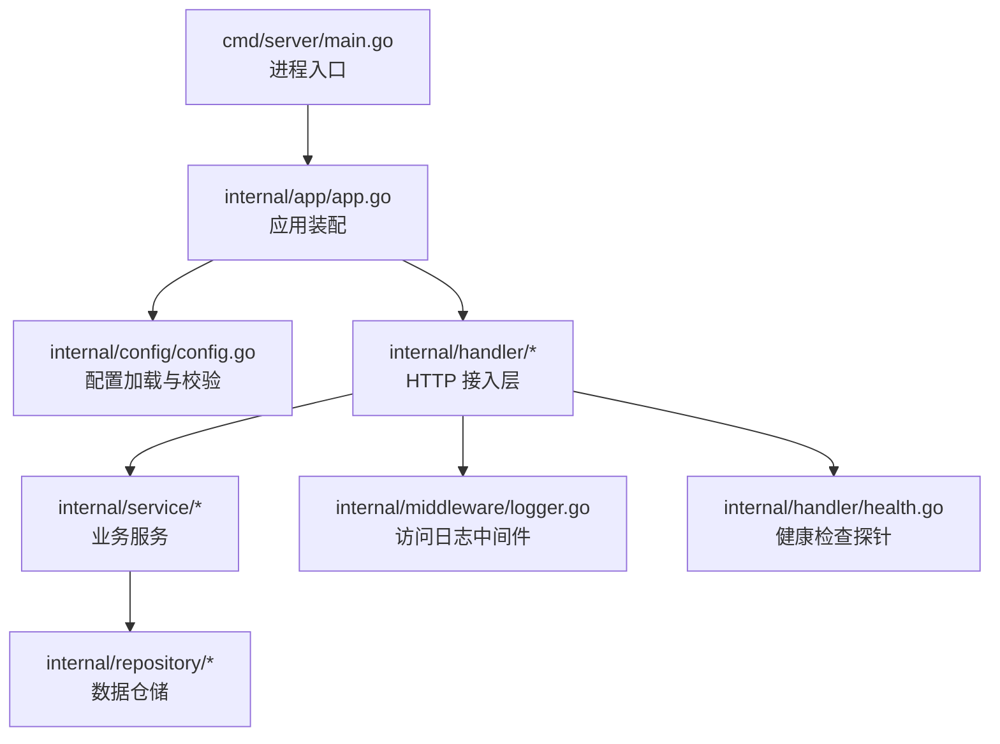
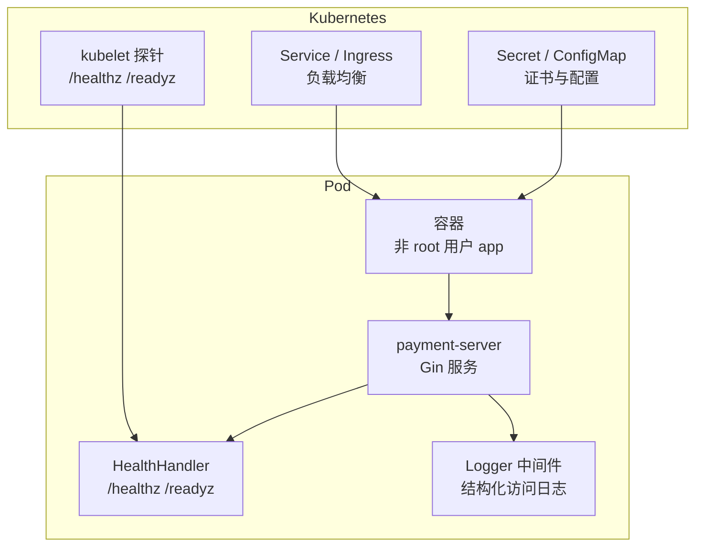
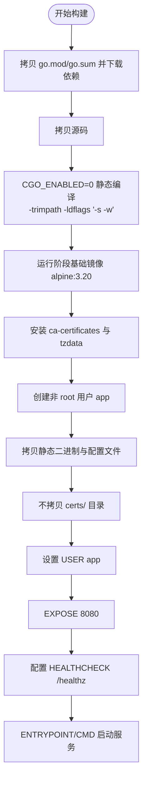
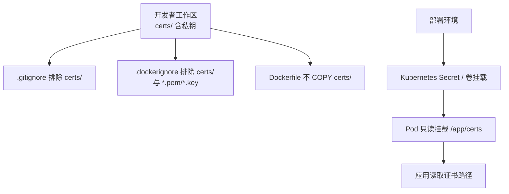
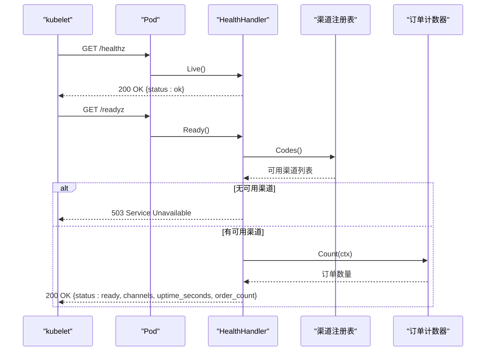
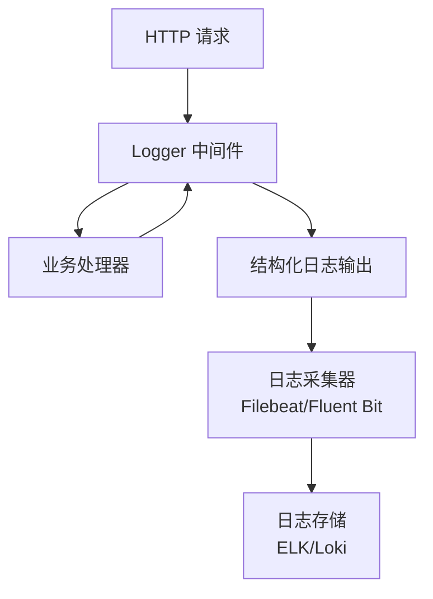
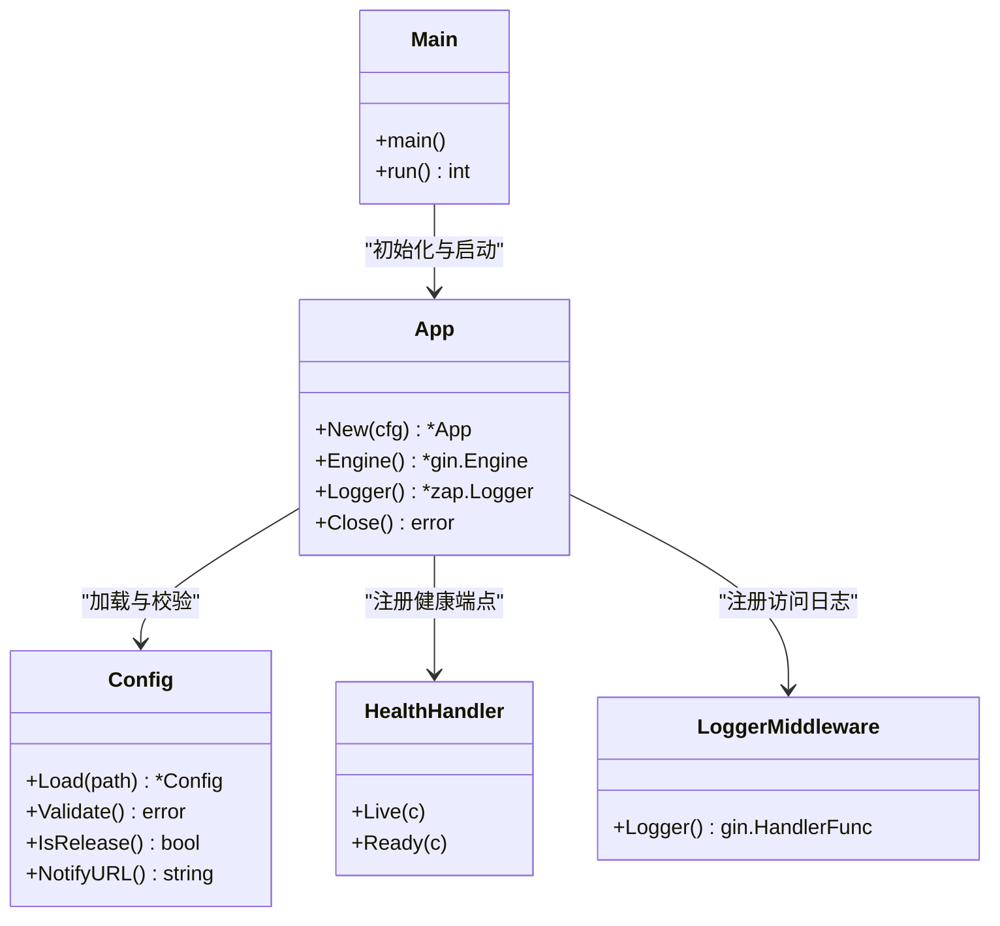

# 部署与运维

<cite>
**本文引用的文件**   
- [Dockerfile](file://Dockerfile)
- [Makefile](file://Makefile)
- [.dockerignore](file://.dockerignore)
- [configs/config.yaml](file://configs/config.yaml)
- [cmd/server/main.go](file://cmd/server/main.go)
- [internal/handler/health.go](file://internal/handler/health.go)
- [internal/app/app.go](file://internal/app/app.go)
- [internal/config/config.go](file://internal/config/config.go)
- [internal/middleware/logger.go](file://internal/middleware/logger.go)
- [README.md](file://README.md)
</cite>

## 目录
1. [引言](#引言)
2. [项目结构](#项目结构)
3. [核心组件](#核心组件)
4. [架构总览](#架构总览)
5. [详细组件分析](#详细组件分析)
6. [依赖关系分析](#依赖关系分析)
7. [性能与容量规划](#性能与容量规划)
8. [监控、日志与告警](#监控日志与告警)
9. [故障排查指南](#故障排查指南)
10. [生产安全与合规](#生产安全与合规)
11. [结论](#结论)

## 引言
本文面向支付服务的部署与运维，覆盖容器化构建、镜像优化、证书管理、Kubernetes 部署清单、健康检查与负载均衡集成、日志与指标采集、告警策略、性能调优、容量规划、扩容策略以及生产安全加固。文档以仓库中的 Dockerfile、Makefile、配置文件和源码为依据，给出可落地的实施方案与注意事项。

## 项目结构
本项目采用 Go + Gin 的经典分层：进程入口负责启动与优雅关闭；配置加载与校验在独立包中；应用装配层组装渠道、仓储、服务与路由；HTTP 接入层处理请求并调用业务服务；中间件提供结构化访问日志。

**图示来源**
- [cmd/server/main.go:31-124](file://cmd/server/main.go#L31-L124)
- [internal/app/app.go:39-106](file://internal/app/app.go#L39-L106)
- [internal/config/config.go:113-155](file://internal/config/config.go#L113-L155)
- [internal/middleware/logger.go:34-76](file://internal/middleware/logger.go#L34-L76)
- [internal/handler/health.go:24-78](file://internal/handler/health.go#L24-L78)

**章节来源**
- [README.md:38-61](file://README.md#L38-L61)

## 核心组件
- 容器镜像与构建：通过多阶段构建生成静态二进制，运行镜像仅包含运行时依赖与非 root 用户。
- 构建脚本：Makefile 统一封装格式化、检查、编译、测试、覆盖率、镜像构建等目标。
- 配置系统：Viper 加载 YAML 与环境变量，严格校验模式、端口、超时、回调地址与微信支付凭据。
- HTTP 服务：Gin 引擎，带结构化日志中间件、健康检查与优雅关闭。
- 健康检查：存活探针 `/healthz` 不查依赖；就绪探针 `/readyz` 检查渠道注册情况与订单计数。

**章节来源**
- [Dockerfile:9-55](file://Dockerfile#L9-L55)
- [Makefile:1-70](file://Makefile#L1-L70)
- [internal/config/config.go:113-155](file://internal/config/config.go#L113-L155)
- [cmd/server/main.go:61-124](file://cmd/server/main.go#L61-L124)
- [internal/handler/health.go:36-78](file://internal/handler/health.go#L36-L78)

## 架构总览
下图展示从容器编排到应用内部的关键交互：Kubernetes 通过 Service 暴露端口，探针访问健康端点；应用启动时加载配置、装配依赖、注册路由；访问日志中间件输出结构化字段；证书通过 Secret 或卷挂载到只读路径。

**图示来源**
- [Dockerfile:27-55](file://Dockerfile#L27-L55)
- [internal/handler/health.go:36-78](file://internal/handler/health.go#L36-L78)
- [internal/middleware/logger.go:34-76](file://internal/middleware/logger.go#L34-L76)

## 详细组件分析

### 容器化与镜像优化
- 多阶段构建：构建阶段使用 `golang:1.26-alpine`，下载依赖后编译静态二进制；运行阶段使用 `alpine:3.20`，仅安装 CA 证书与时区数据。
- 静态链接与安全：启用 `CGO_ENABLED=0`，使用 `-trimpath -ldflags "-s -w"` 去除调试信息与绝对路径，减小镜像体积并降低信息泄露风险。
- 非 root 运行：创建 `app` 用户组与用户，并以该用户运行进程，限制容器逃逸时的权限面。
- 证书隔离：镜像不包含 `certs/`，证书通过部署时挂载到 `/app/certs`，避免私钥进入镜像历史。
- 健康检查：内置 `HEALTHCHECK` 探测 `/healthz`，间隔、超时、重试参数适合容器编排。

**图示来源**
- [Dockerfile:10-24](file://Dockerfile#L10-L24)
- [Dockerfile:27-55](file://Dockerfile#L27-L55)

**章节来源**
- [Dockerfile:9-55](file://Dockerfile#L9-L55)
- [.dockerignore:21-30](file://.dockerignore#L21-L30)

### Makefile 构建目标与参数
- `help`：列出所有可用目标。
- `fmt` / `fmt-check`：格式化源码与仅检查格式。
- `vet`：执行 `go vet` 静态检查。
- `lint`：可选的 `golangci-lint` 检查，未安装时跳过。
- `check`：组合检查（格式、vet、编译）。
- `tidy`：整理依赖，同步 `go.mod` / `go.sum`。
- `build`：静态编译二进制到 `bin/payment-server`。
- `run`：本地前台运行服务，支持优雅关闭。
- `test`：运行全部测试并开启竞态检测。
- `cover`：生成覆盖率报告。
- `clean`：清理构建产物与覆盖率文件。
- `docker-build`：构建容器镜像。

关键参数说明：
- `CGO_ENABLED=0`：确保静态链接，便于运行在不含 glibc 的基础镜像。
- `-trimpath -ldflags "-s -w"`：去除路径与符号表，减小二进制体积。
- `-config configs/config.yaml`：指定配置文件路径，也可通过环境变量覆盖。

**章节来源**
- [Makefile:1-70](file://Makefile#L1-L70)

### 证书管理与安全策略
- 三层排除机制：
  - `.gitignore`：忽略 `certs/` 目录，防止私钥提交到代码仓库。
  - `.dockerignore`：排除 `certs/` 及各类密钥扩展名，避免进入构建上下文。
  - `Dockerfile`：明确不拷贝 `certs/`，证书由部署时挂载。
- 只读挂载：建议将证书目录以只读方式挂载到容器内，例如 `/app/certs`，并在 Kubernetes 中使用 Secret 或 ConfigMap 管理敏感文件。
- 环境变量注入：微信支付 APIv3 密钥仅允许通过环境变量注入，不在 YAML 中出现对应字段，从源头避免密钥误提交。

**图示来源**
- [.dockerignore:21-30](file://.dockerignore#L21-L30)
- [Dockerfile:40-43](file://Dockerfile#L40-L43)
- [internal/config/config.go:25-27](file://internal/config/config.go#L25-L27)

**章节来源**
- [.dockerignore:21-30](file://.dockerignore#L21-L30)
- [Dockerfile:40-43](file://Dockerfile#L40-L43)
- [internal/config/config.go:25-27](file://internal/config/config.go#L25-L27)
- [README.md:240-246](file://README.md#L240-L246)

### Kubernetes 部署清单示例
以下为基于本项目的推荐清单要点（不直接粘贴代码，按字段说明）：
- Deployment
  - 副本数：根据流量与资源配额设定初始副本，结合 HorizontalPodAutoscaler 进行弹性扩缩容。
  - 资源限制：设置 CPU 与内存的 requests/limits，避免单 Pod 占用过多节点资源。
  - 安全上下文：以非 root 用户运行，禁用特权模式，最小化文件系统权限。
  - 环境变量：通过 `env` 或 `envFrom` 注入配置项，如 `PAYMENT_SERVER_MODE`、`PAYMENT_LOG_FORMAT`、`WECHATPAY_*` 系列。
  - 卷挂载：将 Secret 挂载为只读卷，映射到 `/app/certs`。
  - 探针：配置 livenessProbe 与 readinessProbe，分别指向 `/healthz` 与 `/readyz`。
  - 优雅关闭：`terminationGracePeriodSeconds` 应大于 `server.shutdown_timeout`，保证存量请求完成。
- Service
  - 类型：ClusterIP 用于集群内访问；Ingress 暴露公网回调地址。
  - 端口：对外暴露 8080 或经 Ingress 映射到 80/443。
- ConfigMap
  - 存放非敏感配置，如 `configs/config.yaml` 模板内容，供 Deployment 引用。
- Secret
  - 存储敏感信息：微信支付 APIv3 密钥、商户私钥、公钥文件等。
  - 以 base64 编码或 KMS 集成方式管理，避免明文落地。

健康检查与负载均衡集成：
- LivenessProbe：探测 `/healthz`，失败则重启容器。
- ReadinessProbe：探测 `/readyz`，失败则从 Service endpoints 摘除，不触发重启。
- Ingress：配置 HTTPS 终止与域名解析，确保回调地址为公网可达且备案。

**章节来源**
- [Dockerfile:49-55](file://Dockerfile#L49-L55)
- [internal/handler/health.go:36-78](file://internal/handler/health.go#L36-L78)
- [configs/config.yaml:9-22](file://configs/config.yaml#L9-L22)

### 健康检查与就绪探针
- 存活探针 `/healthz`：只要进程能响应即返回成功，不检查外部依赖，避免因依赖抖动导致容器被频繁重启。
- 就绪探针 `/readyz`：检查支付渠道是否已注册，若无可用渠道则返回服务不可用；同时返回运行时长与订单计数，便于诊断。
- 探针级别：探针日志记录为 debug 级别，避免淹没业务日志。

**图示来源**
- [internal/handler/health.go:36-78](file://internal/handler/health.go#L36-L78)

**章节来源**
- [internal/handler/health.go:36-78](file://internal/handler/health.go#L36-L78)

### 日志收集与访问日志
- 中间件：自定义访问日志中间件替代 Gin 默认日志，输出结构化字段（状态码、方法、路径、延迟、客户端 IP、UA、路由模板、错误信息等）。
- 探针过滤：对 `/healthz` 与 `/readyz` 使用 debug 级别，避免高频探针污染日志。
- 敏感信息保护：不记录请求体与响应体，避免泄露订单金额、商品信息或回调加密报文。
- 生产建议：日志格式设置为 `json`，便于 ELK/Loki 等系统解析与检索。

**图示来源**
- [internal/middleware/logger.go:34-76](file://internal/middleware/logger.go#L34-L76)

**章节来源**
- [internal/middleware/logger.go:34-76](file://internal/middleware/logger.go#L34-L76)
- [configs/config.yaml:24-28](file://configs/config.yaml#L24-L28)

## 依赖关系分析
- 进程入口依赖应用装配层，装配层依赖配置、日志、渠道注册、仓储、服务与路由。
- 健康检查依赖渠道注册表与订单计数器接口，避免跨层直接依赖存储实现。
- 配置加载依赖 Viper，显式绑定环境变量，避免自动推导带来的隐蔽风险。

**图示来源**
- [cmd/server/main.go:31-124](file://cmd/server/main.go#L31-L124)
- [internal/app/app.go:39-106](file://internal/app/app.go#L39-L106)
- [internal/config/config.go:113-155](file://internal/config/config.go#L113-L155)
- [internal/handler/health.go:24-78](file://internal/handler/health.go#L24-L78)
- [internal/middleware/logger.go:34-76](file://internal/middleware/logger.go#L34-L76)

**章节来源**
- [internal/app/app.go:39-106](file://internal/app/app.go#L39-L106)
- [internal/config/config.go:113-155](file://internal/config/config.go#L113-L155)

## 性能与容量规划
- 连接与超时：
  - `read_header_timeout` 单独收紧，抵御慢速攻击（Slowloris）。
  - `read_timeout` 与 `write_timeout` 根据回调报文大小与网络状况调整，默认 15s。
  - `shutdown_timeout` 必须小于编排系统的 `terminationGracePeriodSeconds`，确保优雅关闭生效。
- 并发与资源：
  - 使用 HorizontalPodAutoscaler 基于 CPU/内存或自定义指标（如 QPS、延迟）进行扩缩容。
  - 设置合理的 Pod 资源 requests/limits，避免节点过载与抢占。
- 镜像与启动：
  - 多阶段构建与静态二进制减少镜像体积，提升拉取与启动速度。
  - 预装 CA 证书与时区数据，避免首次请求因证书或时区问题导致延迟。
- 容量规划：
  - 根据峰值 QPS 与平均处理时间估算所需副本数。
  - 预留 20%-30% 冗余应对突发流量与滚动升级。

[本节为通用指导，无需特定文件引用]

## 监控、日志与告警
- 日志采集：
  - 使用 Filebeat/Fluent Bit 采集容器 stdout 或挂载日志目录，输出到 ELK/Loki。
  - 生产环境使用 JSON 格式，便于结构化查询与聚合。
- 指标监控：
  - 暴露 Prometheus 指标（可在路由层添加），包括 HTTP 请求数、延迟分布、错误率、渠道可用性。
  - 使用 Node Exporter 监控节点资源，使用 cAdvisor 监控容器资源。
- 告警规则：
  - 高错误率：HTTP 5xx 比例超过阈值。
  - 高延迟：P95/P99 延迟超过 SLA。
  - 渠道不可用：就绪探针返回不可用或渠道数量为 0。
  - 证书过期：Secret 中证书有效期低于阈值。
  - 资源不足：CPU/内存使用率持续高于 limits。

[本节为通用指导，无需特定文件引用]

## 故障排查指南
- 启动失败：
  - 检查配置校验错误：模式非法、端口越界、回调地址非 HTTPS（release 模式）、微信支付凭据缺失。
  - 查看进程 stderr 与日志，确认配置加载与应用装配阶段错误。
- 健康检查失败：
  - `/healthz` 失败：进程无法响应，检查容器状态与端口监听。
  - `/readyz` 失败：无可用渠道或渠道未注册，检查渠道配置与 Secret 挂载。
- 回调失败：
  - 检查回调地址是否为公网可达 HTTPS，域名是否备案。
  - 验签失败：确认 APIv3 密钥与证书路径正确，Secret 挂载可读。
- 优雅关闭异常：
  - 确认 `shutdown_timeout` 与 `terminationGracePeriodSeconds` 的关系，避免强制断开导致掉单。
- 日志问题：
  - 确认日志格式为 JSON，探针日志为 debug 级别，避免业务日志被淹没。
  - 检查是否记录了敏感信息，必要时调整中间件与业务层日志策略。

**章节来源**
- [internal/config/config.go:226-321](file://internal/config/config.go#L226-L321)
- [internal/handler/health.go:36-78](file://internal/handler/health.go#L36-L78)
- [cmd/server/main.go:98-124](file://cmd/server/main.go#L98-L124)
- [internal/middleware/logger.go:34-76](file://internal/middleware/logger.go#L34-L76)

## 生产安全与合规
- 密钥管理：
  - 所有密钥仅通过环境变量或 Secret 注入，不在 YAML 中定义。
  - 证书目录只读挂载，禁止写入与传播。
- 最小权限：
  - 容器以非 root 用户运行，禁用特权模式。
  - 文件系统权限最小化，仅开放必要目录。
- 安全加固：
  - 生产模式禁用 mock 路由与调试接口。
  - CORS 在生产环境默认关闭，如需跨域需明确白名单。
  - 回调必须验签，校验失败直接拒绝，不交给业务层。
- 合规要求：
  - 日志不记录敏感信息（订单金额、商品信息、回调加密报文）。
  - 审计配置变更与密钥轮换流程，保留变更记录。
  - 定期扫描镜像漏洞与依赖漏洞，及时修复。

**章节来源**
- [internal/app/app.go:91-94](file://internal/app/app.go#L91-L94)
- [internal/config/config.go:25-27](file://internal/config/config.go#L25-L27)
- [README.md:240-246](file://README.md#L240-L246)

## 结论
本项目通过多阶段构建、静态链接与非 root 运行实现安全的容器化部署；Makefile 提供统一的工程化目标；配置系统严格校验并支持环境变量覆盖；健康检查与就绪探针保障编排稳定性；证书通过三层排除与只读挂载确保安全。生产环境应结合结构化日志、指标监控与告警策略，配合容量规划与弹性扩缩容，确保支付服务的高可用与合规性。