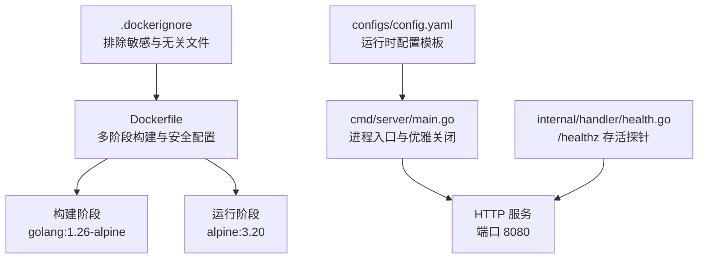
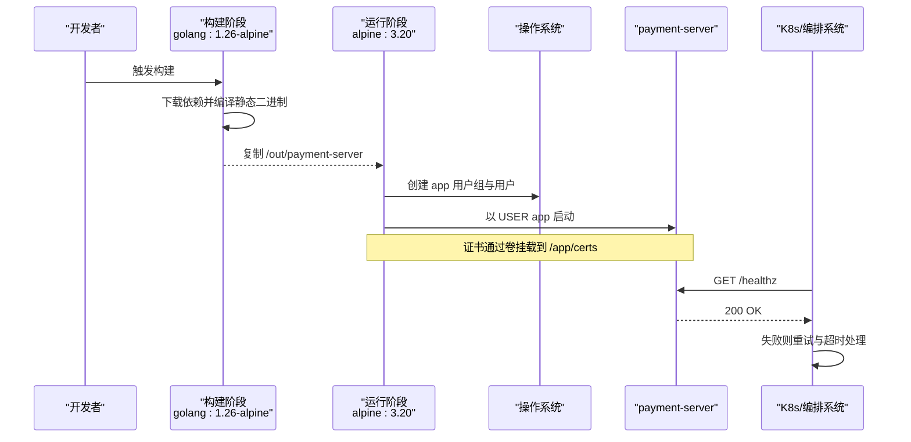
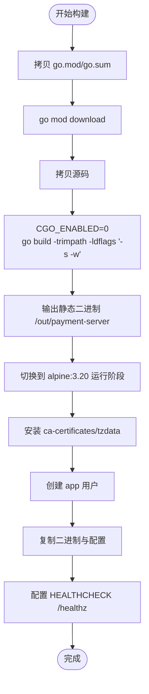
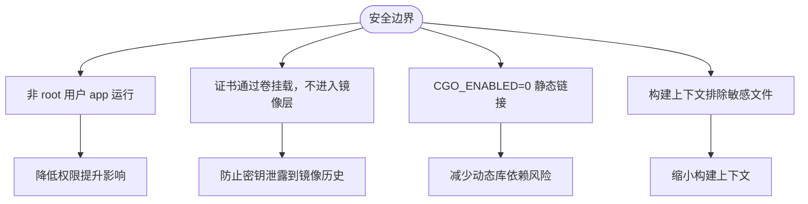
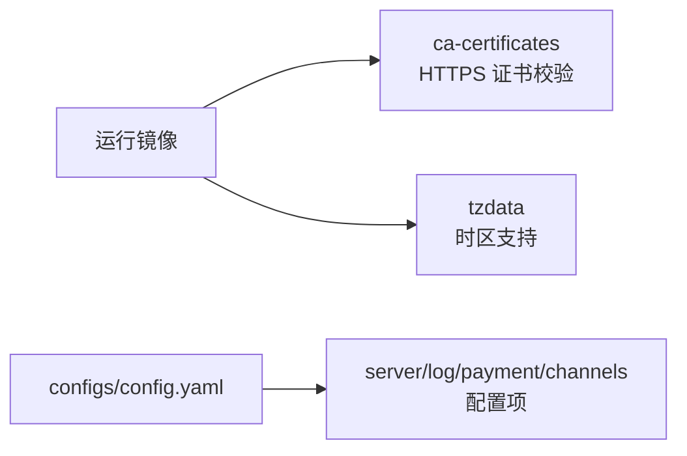
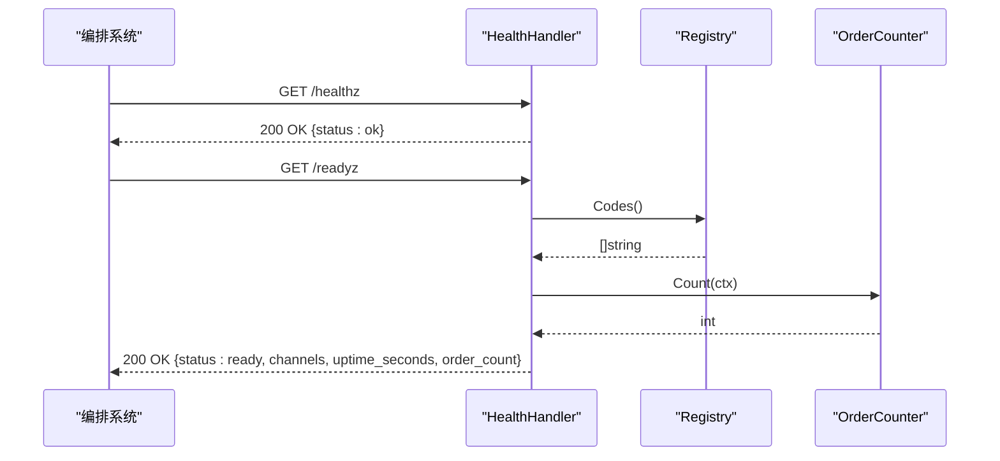
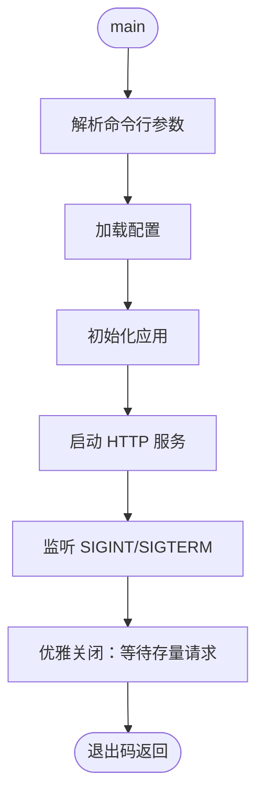
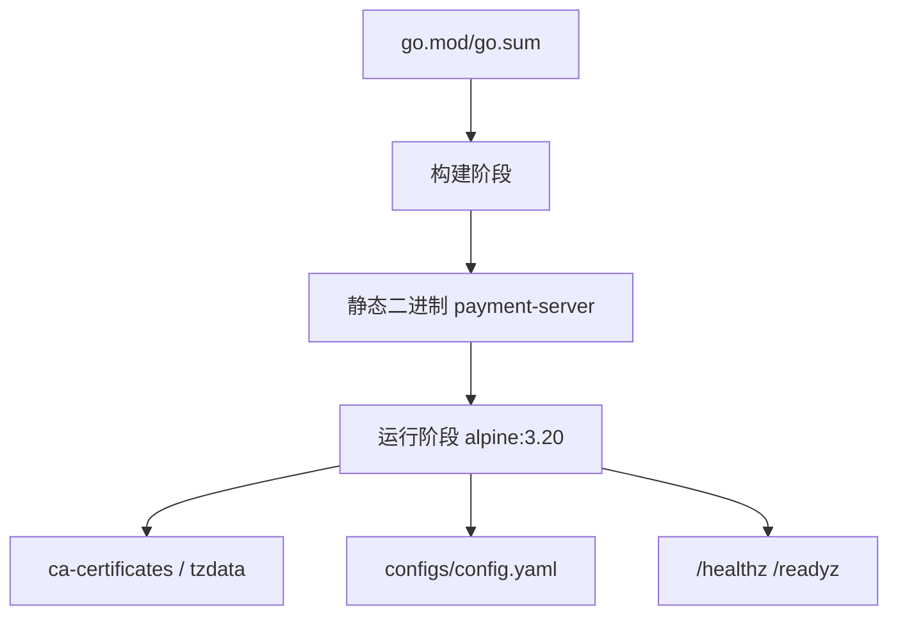
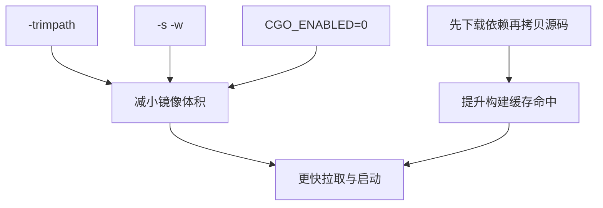

# Docker 容器化

<cite>
**本文引用的文件**   
- [Dockerfile](file://Dockerfile)
- [.dockerignore](file://.dockerignore)
- [cmd/server/main.go](file://cmd/server/main.go)
- [internal/handler/health.go](file://internal/handler/health.go)
- [configs/config.yaml](file://configs/config.yaml)
</cite>

## 目录
1. [简介](#简介)
2. [项目结构](#项目结构)
3. [核心组件](#核心组件)
4. [架构总览](#架构总览)
5. [详细组件分析](#详细组件分析)
6. [依赖关系分析](#依赖关系分析)
7. [性能与镜像优化](#性能与镜像优化)
8. [故障排查指南](#故障排查指南)
9. [结论](#结论)

## 简介
本文面向支付服务的 Docker 容器化实践，重点说明多阶段构建、安全设计、依赖管理、健康检查与镜像优化策略。目标是让读者在不深入源码的情况下，也能理解镜像分层、运行权限、证书挂载、探针配置以及二进制静态链接等关键决策。

## 项目结构
本仓库采用 Go 标准分层结构：入口在 `cmd/server`，业务逻辑位于 `internal`，运行时配置位于 `configs`，容器化相关定义集中在根目录的 `Dockerfile` 与 `.dockerignore`。

**图表来源**
- [Dockerfile:9-55](file://Dockerfile#L9-L55)
- [.dockerignore:1-38](file://.dockerignore#L1-L38)
- [cmd/server/main.go:31-124](file://cmd/server/main.go#L31-L124)
- [internal/handler/health.go:36-78](file://internal/handler/health.go#L36-L78)
- [configs/config.yaml:9-22](file://configs/config.yaml#L9-L22)

**章节来源**
- [Dockerfile:1-56](file://Dockerfile#L1-L56)
- [.dockerignore:1-38](file://.dockerignore#L1-L38)
- [cmd/server/main.go:1-125](file://cmd/server/main.go#L1-L125)
- [internal/handler/health.go:1-79](file://internal/handler/health.go#L1-L79)
- [configs/config.yaml:1-61](file://configs/config.yaml#L1-L61)

## 核心组件
- 多阶段构建：构建阶段使用 `golang:1.26-alpine`，编译出静态二进制；运行阶段使用 `alpine:3.20` 最小镜像。
- 安全设计：非 root 用户 `app` 运行；证书不进入镜像层；CGO 禁用以静态链接。
- 依赖管理：安装 `ca-certificates` 用于 HTTPS 校验；安装 `tzdata` 提供时区支持。
- 健康检查：暴露 `/healthz` 存活端点，配合 `HEALTHCHECK` 探针进行重试与超时控制。
- 镜像优化：启用 `-trimpath`、`-s -w` 去除路径信息与压缩符号表。

**章节来源**
- [Dockerfile:9-55](file://Dockerfile#L9-L55)

## 架构总览
下图展示从镜像构建到容器运行的关键流程，包括构建产物复制、证书挂载、非 root 运行与健康检查。

**图表来源**
- [Dockerfile:9-55](file://Dockerfile#L9-L55)
- [internal/handler/health.go:36-47](file://internal/handler/health.go#L36-L47)

## 详细组件分析

### 多阶段构建与静态链接
- 构建阶段基于 `golang:1.26-alpine`，先拷贝 `go.mod` 与 `go.sum` 再执行依赖下载，最大化利用缓存。
- 使用 `CGO_ENABLED=0` 编译静态二进制，避免运行阶段依赖宿主 glibc。
- 编译参数包含 `-trimpath` 去除本地绝对路径，`-ldflags "-s -w"` 去除符号表与调试信息，减小二进制体积。
- 运行阶段仅复制编译产物与配置文件，不包含任何构建工具链。

**图表来源**
- [Dockerfile:9-55](file://Dockerfile#L9-L55)

**章节来源**
- [Dockerfile:9-55](file://Dockerfile#L9-L55)

### 安全设计
- 非 root 运行：通过 `addgroup` 与 `adduser` 创建 `app` 用户，并以 `USER app` 启动，降低容器逃逸风险。
- 证书隔离：`certs/` 目录被刻意排除在镜像之外，商户私钥通过部署时的 Secret 或卷挂载到 `/app/certs`，避免密钥进入镜像历史。
- 静态链接：禁用 CGO 确保二进制不依赖宿主动态库，减少攻击面。
- 构建上下文隔离：`.dockerignore` 明确排除证书、密钥、环境变量文件与文档等敏感或不必要内容。

**图表来源**
- [Dockerfile:27-52](file://Dockerfile#L27-L52)
- [.dockerignore:1-38](file://.dockerignore#L1-L38)

**章节来源**
- [Dockerfile:27-52](file://Dockerfile#L27-L52)
- [.dockerignore:1-38](file://.dockerignore#L1-L38)

### 依赖管理
- `ca-certificates`：为 HTTPS 调用（如微信支付）提供 CA 证书校验能力。
- `tzdata`：提供时区数据库，避免日志与订单时间戳因缺少时区信息而回退到 UTC 或解析失败。
- 运行时配置模板 `configs/config.yaml` 不含真实密钥，敏感项通过环境变量注入。

**图表来源**
- [Dockerfile:29-33](file://Dockerfile#L29-L33)
- [configs/config.yaml:9-61](file://configs/config.yaml#L9-L61)

**章节来源**
- [Dockerfile:29-33](file://Dockerfile#L29-L33)
- [configs/config.yaml:1-61](file://configs/config.yaml#L1-L61)

### 健康检查与探针
- 存活探针 `/healthz`：仅验证进程可响应请求，不检查外部依赖，避免因部分依赖抖动导致容器重启。
- 就绪探针 `/readyz`：检查渠道注册情况与订单计数，适合摘除流量而非重启。
- `HEALTHCHECK` 配置：间隔 30 秒、超时 3 秒、启动宽限期 5 秒、重试 3 次，使用 `wget` 访问本地 8080 端口。

**图表来源**
- [internal/handler/health.go:36-78](file://internal/handler/health.go#L36-L78)
- [Dockerfile:49-52](file://Dockerfile#L49-L52)

**章节来源**
- [internal/handler/health.go:36-78](file://internal/handler/health.go#L36-L78)
- [Dockerfile:49-52](file://Dockerfile#L49-L52)

### 进程生命周期与优雅关闭
- 入口 `main.go` 负责解析参数、加载配置、装配应用、启动 HTTP 服务、监听退出信号并优雅关闭。
- 设置 `ReadHeaderTimeout` 抵御慢速连接攻击；`ShutdownTimeout` 控制存量请求处理时限。
- 优雅关闭对支付回调至关重要，硬切断可能导致掉单。

**图表来源**
- [cmd/server/main.go:31-124](file://cmd/server/main.go#L31-L124)

**章节来源**
- [cmd/server/main.go:31-124](file://cmd/server/main.go#L31-L124)

## 依赖关系分析
- 构建期依赖：Go toolchain（由基础镜像提供）、Go 模块依赖（由 `go.mod` 声明）。
- 运行期依赖：`ca-certificates`、`tzdata`；二进制为静态链接，无额外动态库依赖。
- 配置依赖：`configs/config.yaml` 提供默认值，敏感项通过环境变量注入。
- 探针依赖：`/healthz` 仅依赖 HTTP 服务；`/readyz` 依赖渠道注册与订单计数接口。

**图表来源**
- [Dockerfile:9-55](file://Dockerfile#L9-L55)
- [configs/config.yaml:1-61](file://configs/config.yaml#L1-L61)
- [internal/handler/health.go:36-78](file://internal/handler/health.go#L36-L78)

**章节来源**
- [Dockerfile:9-55](file://Dockerfile#L9-L55)
- [configs/config.yaml:1-61](file://configs/config.yaml#L1-L61)
- [internal/handler/health.go:36-78](file://internal/handler/health.go#L36-L78)

## 性能与镜像优化
- 静态链接与裁剪：`CGO_ENABLED=0` 与 `-ldflags "-s -w"` 显著减小二进制体积，减少运行期依赖。
- 路径剥离：`-trimpath` 移除本地绝对路径，避免泄露构建机环境信息。
- 缓存优化：先拷贝依赖清单再下载依赖，提高构建缓存命中率。
- 最小镜像：运行阶段仅保留必要运行时依赖，不包含开发工具与文档。

**图表来源**
- [Dockerfile:21-24](file://Dockerfile#L21-L24)
- [Dockerfile:14-17](file://Dockerfile#L14-L17)

**章节来源**
- [Dockerfile:14-24](file://Dockerfile#L14-L24)

## 故障排查指南
- 证书问题
  - 现象：HTTPS 调用失败或证书校验错误。
  - 排查：确认已安装 `ca-certificates`；确认证书通过卷挂载到 `/app/certs`；检查配置中证书路径与环境变量是否正确。
  - 依据：镜像安装 `ca-certificates`，且 `certs/` 不进入镜像层。
- 时区异常
  - 现象：日志或订单时间戳显示为 UTC 或解析失败。
  - 排查：确认已安装 `tzdata`；检查容器时区环境变量是否设置。
  - 依据：镜像安装 `tzdata` 提供时区数据库。
- 健康检查失败
  - 现象：容器被重启或未被纳入流量。
  - 排查：检查 `/healthz` 是否可达；确认 `HEALTHCHECK` 参数（间隔、超时、重试）是否符合预期；若 `/readyz` 失败，检查渠道注册与订单计数接口。
  - 依据：`HEALTHCHECK` 配置与 `HealthHandler` 实现。
- 优雅关闭超时
  - 现象：服务未能在期望时间内停止。
  - 排查：检查 `shutdown_timeout` 配置与编排系统的 `terminationGracePeriodSeconds` 关系；确认存量请求处理耗时。
  - 依据：进程入口中的优雅关闭逻辑。

**章节来源**
- [Dockerfile:29-52](file://Dockerfile#L29-L52)
- [internal/handler/health.go:36-78](file://internal/handler/health.go#L36-L78)
- [cmd/server/main.go:61-124](file://cmd/server/main.go#L61-L124)
- [configs/config.yaml:9-22](file://configs/config.yaml#L9-L22)

## 结论
该容器化方案通过多阶段构建、静态链接与非 root 运行，显著降低了攻击面与镜像体积；通过证书隔离与最小依赖，提升了安全性与可移植性；通过 `/healthz` 存活探针与合理的 `HEALTHCHECK` 参数，保障了编排系统的稳定性。建议在生产环境中严格遵循证书挂载、环境变量注入与探针配置的最佳实践，并结合监控与告警体系持续优化。