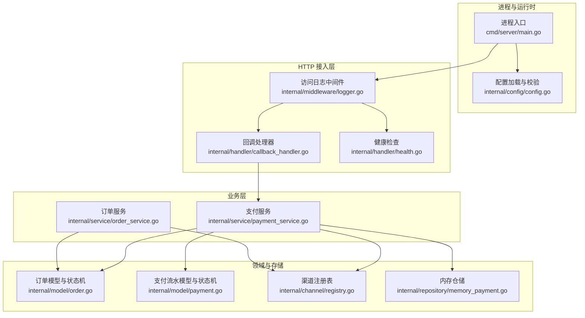
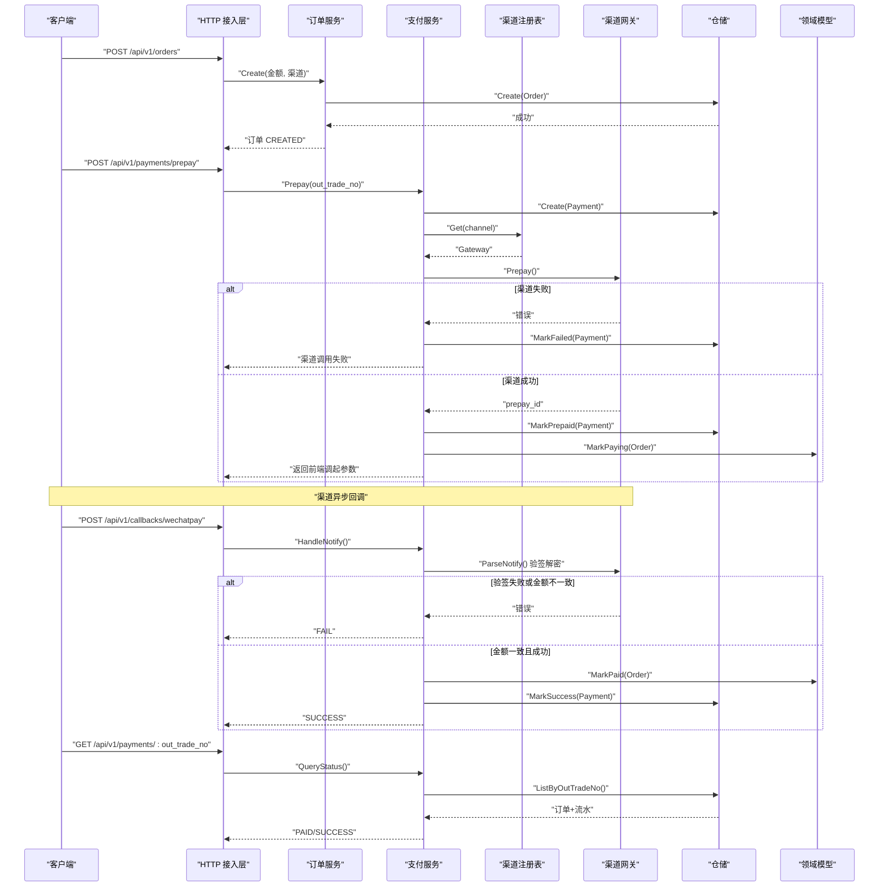
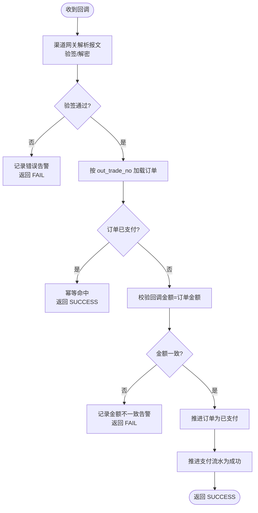
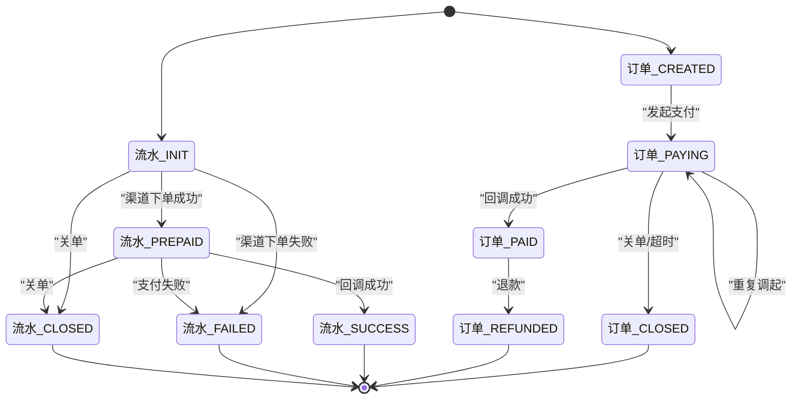
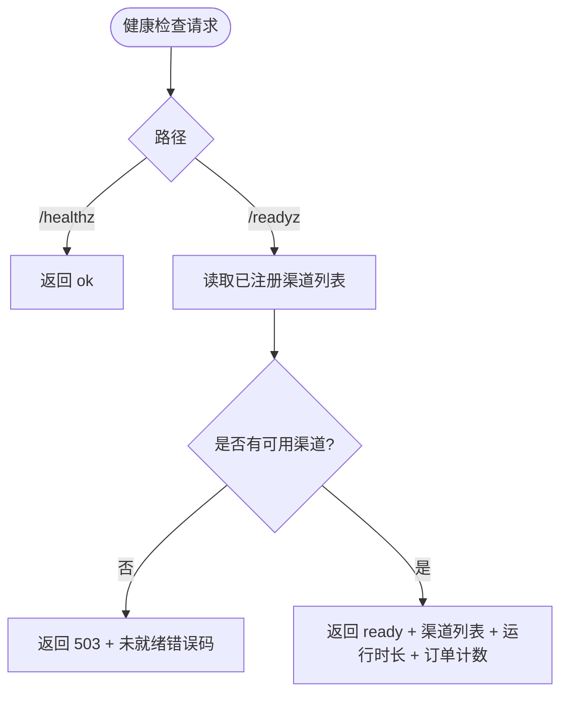
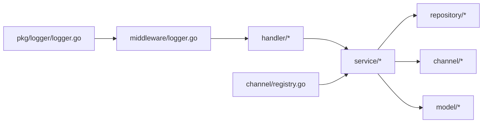

# 故障排查手册

<cite>
**本文引用的文件**   
- [README.md](file://README.md)
- [main.go](file://cmd/server/main.go)
- [config.yaml](file://configs/config.yaml)
- [config.go](file://internal/config/config.go)
- [logger.go](file://internal/pkg/logger/logger.go)
- [logger.go](file://internal/middleware/logger.go)
- [callback_handler.go](file://internal/handler/callback_handler.go)
- [health.go](file://internal/handler/health.go)
- [errcode.go](file://internal/errcode/errcode.go)
- [payment_service.go](file://internal/service/payment_service.go)
- [order_service.go](file://internal/service/order_service.go)
- [order.go](file://internal/model/order.go)
- [payment.go](file://internal/model/payment.go)
- [registry.go](file://internal/channel/registry.go)
- [memory_payment.go](file://internal/repository/memory_payment.go)
- [money.go](file://internal/pkg/money/money.go)
</cite>

## 目录
1. [引言](#引言)
2. [项目结构](#项目结构)
3. [核心组件](#核心组件)
4. [架构总览](#架构总览)
5. [详细组件分析](#详细组件分析)
6. [依赖关系分析](#依赖关系分析)
7. [性能注意事项](#性能注意事项)
8. [故障排查指南](#故障排查指南)
9. [结论](#结论)
10. [附录：错误码对照表与调试命令](#附录错误码对照表与调试命令)

## 引言
本手册面向支付服务在生产与联调环境中的故障定位与排障。内容覆盖四类常见问题（支付回调失败、订单状态不一致、证书验证错误、网络连接问题），并给出日志分析方法、性能问题定位技巧、健康检查端点排障、统一错误码对照以及常用调试命令。文档以代码仓库实现为依据，所有诊断建议均对应具体模块与流程。

## 项目结构
本项目采用分层架构：进程入口负责启动与优雅关闭；配置加载在启动期完成强校验；HTTP 接入层解析请求并调用业务服务；业务服务封装领域模型与渠道抽象；仓储提供内存实现；中间件提供结构化日志与健康探针。

图示来源
- [main.go:31-124](file://cmd/server/main.go#L31-L124)
- [config.go:118-154](file://internal/config/config.go#L118-L154)
- [callback_handler.go:47-86](file://internal/handler/callback_handler.go#L47-L86)
- [health.go:45-78](file://internal/handler/health.go#L45-L78)
- [logger.go:34-76](file://internal/middleware/logger.go#L34-L76)
- [payment_service.go:108-226](file://internal/service/payment_service.go#L108-L226)
- [order_service.go:72-109](file://internal/service/order_service.go#L72-L109)
- [order.go:20-68](file://internal/model/order.go#L20-L68)
- [payment.go:10-49](file://internal/model/payment.go#L10-L49)
- [registry.go:21-29](file://internal/channel/registry.go#L21-L29)
- [memory_payment.go:18-30](file://internal/repository/memory_payment.go#L18-L30)

章节来源
- [README.md:38-62](file://README.md#L38-L62)
- [main.go:31-124](file://cmd/server/main.go#L31-L124)

## 核心组件
- 进程入口：负责参数解析、配置加载、应用装配、HTTP 服务启动与优雅关闭。对支付回调场景特别强调优雅关闭，避免硬切断导致掉单。
- 配置系统：Viper 加载 yaml 与环境变量，启动期强校验模式、端口、超时、日志格式、回调地址与微信支付凭据完整性。APIv3 密钥仅允许环境变量注入。
- 日志系统：基于 zap 的结构化日志，通过 context 传递 request_id，中间件记录结构化访问日志，健康探针路径降为 debug 级别避免淹没业务日志。
- 回调处理：按渠道分发到支付服务，金额不一致与验签失败走 error 告警，其余错误走 warn，返回渠道规范应答体，避免微信持续重试。
- 健康检查：/healthz 不检查依赖；/readyz 检查可用渠道集合，无可用渠道时返回 503。
- 业务服务：下单、发起支付、处理回调、查询与主动查单兜底；严格金额校验与幂等处理；订单与支付流水状态机固化在领域层。
- 渠道抽象：Gateway 接口屏蔽渠道差异，Registry 并发安全地管理已注册渠道。
- 内存仓储：并发安全的 map + RWMutex，draft-copy-then-swap 写策略，对外返回副本。

章节来源
- [main.go:31-124](file://cmd/server/main.go#L31-L124)
- [config.go:118-154](file://internal/config/config.go#L118-L154)
- [logger.go:57-93](file://internal/pkg/logger/logger.go#L57-L93)
- [logger.go:34-76](file://internal/middleware/logger.go#L34-L76)
- [callback_handler.go:47-86](file://internal/handler/callback_handler.go#L47-L86)
- [health.go:45-78](file://internal/handler/health.go#L45-L78)
- [payment_service.go:258-379](file://internal/service/payment_service.go#L258-L379)
- [registry.go:21-29](file://internal/channel/registry.go#L21-L29)
- [memory_payment.go:18-30](file://internal/repository/memory_payment.go#L18-L30)

## 架构总览
下图展示一次「创建订单 → 发起支付 → 渠道回调 → 查询」的端到端流程，以及关键错误分支。

图示来源
- [order_service.go:72-109](file://internal/service/order_service.go#L72-L109)
- [payment_service.go:108-226](file://internal/service/payment_service.go#L108-L226)
- [payment_service.go:258-379](file://internal/service/payment_service.go#L258-L379)
- [callback_handler.go:47-86](file://internal/handler/callback_handler.go#L47-L86)
- [registry.go:63-73](file://internal/channel/registry.go#L63-L73)
- [memory_payment.go:34-53](file://internal/repository/memory_payment.go#L34-L53)
- [order.go:127-148](file://internal/model/order.go#L127-L148)
- [payment.go:106-137](file://internal/model/payment.go#L106-L137)

## 详细组件分析

### 支付回调处理链路
回调入口由 handler 接收，service 层先验签解密再进入统一处理逻辑。金额不一致与验签失败属于资金与安全事件，必须告警；其他错误走 warn 避免渠道重试刷满 error 日志。回调成功与幂等命中都返回渠道规范的 SUCCESS，防止渠道持续重投。

图示来源
- [callback_handler.go:47-86](file://internal/handler/callback_handler.go#L47-L86)
- [payment_service.go:258-379](file://internal/service/payment_service.go#L258-L379)

章节来源
- [callback_handler.go:47-86](file://internal/handler/callback_handler.go#L47-L86)
- [payment_service.go:258-379](file://internal/service/payment_service.go#L258-L379)

### 订单与支付状态机
订单与支付流水的状态流转全部收敛在领域模型中，非法流转直接报错。订单从 CREATED → PAYING → PAID/CLOSED/REFUNDED；支付流水从 INIT → PREPAID → SUCCESS/FAILED/CLOSED。业务服务只调用领域方法，避免分散判断导致状态不一致。

图示来源
- [order.go:20-68](file://internal/model/order.go#L20-L68)
- [order.go:127-148](file://internal/model/order.go#L127-L148)
- [payment.go:10-49](file://internal/model/payment.go#L10-L49)
- [payment.go:106-137](file://internal/model/payment.go#L106-L137)

章节来源
- [order.go:20-68](file://internal/model/order.go#L20-L68)
- [payment.go:10-49](file://internal/model/payment.go#L10-L49)

### 健康检查与就绪探针
- /healthz：存活探针，不检查任何依赖，只要进程能处理请求即返回成功。
- /readyz：就绪探针，检查可用渠道集合。无可用渠道时返回 503，并附带未就绪原因码。

图示来源
- [health.go:45-78](file://internal/handler/health.go#L45-L78)
- [registry.go:85-98](file://internal/channel/registry.go#L85-L98)

章节来源
- [health.go:45-78](file://internal/handler/health.go#L45-L78)

### 配置与证书校验
配置加载在启动期完成强校验：模式、端口、超时、日志格式、回调地址与微信支付凭据完整性。APIv3 密钥仅允许环境变量注入，yaml 中不存在对应字段。生产模式下强制回调地址为 HTTPS，并校验证书文件可读。

章节来源
- [config.go:118-154](file://internal/config/config.go#L118-L154)
- [config.go:226-321](file://internal/config/config.go#L226-L321)
- [config.yaml:9-61](file://configs/config.yaml#L9-L61)

## 依赖关系分析
- 耦合关系：handler 依赖 service；service 依赖 repository 接口与 channel.Gateway 抽象；model 独立于外部实现；registry 并发安全地暴露渠道能力。
- 外部依赖：Gin、zap、Viper、微信支付 SDK（预留）。
- 潜在循环：无直接循环导入；channel 抽象与 registry 解耦了 service 与具体渠道实现。

图示来源
- [callback_handler.go:1-12](file://internal/handler/callback_handler.go#L1-L12)
- [payment_service.go:1-16](file://internal/service/payment_service.go#L1-L16)
- [registry.go:1-9](file://internal/channel/registry.go#L1-L9)
- [logger.go:1-11](file://internal/pkg/logger/logger.go#L1-L11)
- [logger.go:1-11](file://internal/middleware/logger.go#L1-L11)

章节来源
- [registry.go:11-29](file://internal/channel/registry.go#L11-L29)
- [memory_payment.go:1-11](file://internal/repository/memory_payment.go#L1-L11)

## 性能注意事项
- 日志开销：中间件记录结构化字段但不记录请求体与响应体，避免回调报文与敏感信息放大日志体积。健康探针路径降级为 debug，减少 K8s 探测噪音。
- 内存仓储：使用 draft-copy-then-swap 与 Clone 返回快照，读多写少场景下 RWMutex 开销可忽略；但进程重启后数据丢失，不适合持久化要求。
- 金额计算：全程使用 int64「分」与字符串转换，避免 float64 精度损失；超大金额与乘法溢出有显式保护。
- 网络超时：HTTP Server 设置 read/write/shutdown 超时；回调应答体很小，write_timeout 15s 足够；readHeaderTimeout 单独收紧抵御慢速攻击。

章节来源
- [logger.go:34-76](file://internal/middleware/logger.go#L34-L76)
- [memory_payment.go:18-30](file://internal/repository/memory_payment.go#L18-L30)
- [money.go:39-105](file://internal/pkg/money/money.go#L39-L105)
- [main.go:61-67](file://cmd/server/main.go#L61-L67)

## 故障排查指南

### 一、支付回调失败
常见现象
- 微信持续重投通知，订单看似已支付但日志大量重复回调。
- 回调返回 FAIL，渠道继续重试。

诊断要点
- 确认回调是否返回渠道规范应答体：成功返回 {"code":"SUCCESS","message":"成功"}，失败返回 {"code":"FAIL","message":"..."}。若返回统一业务响应体，微信会判定通知失败并重试。
- 检查验签与解密：验签失败会触发安全告警，需优先核查证书/公钥、APIv3 密钥、签名头是否正确。
- 检查金额一致性：回调金额必须等于订单金额，否则拒绝并告警。
- 检查幂等：已支付订单应原样返回 SUCCESS，避免渠道无限重试。

快速步骤
1. 查看回调日志关键字段：channel、out_trade_no、trade_state、idempotent、errcode。
2. 若 errcode 为金额不一致或验签失败，立即告警并人工介入。
3. 核对渠道侧签名头与本地验签实现；核对 APIv3 密钥长度与来源（仅环境变量）。
4. 确认回调应答体符合渠道规范。

章节来源
- [callback_handler.go:14-26](file://internal/handler/callback_handler.go#L14-L26)
- [callback_handler.go:55-86](file://internal/handler/callback_handler.go#L55-L86)
- [payment_service.go:258-379](file://internal/service/payment_service.go#L258-L379)
- [config.go:289-298](file://internal/config/config.go#L289-L298)

### 二、订单状态不一致
常见现象
- 用户已扣款但订单仍显示 PAYING。
- 多次回调后订单状态异常或流水缺失。

诊断要点
- 使用 HandlePayload 统一路径处理回调与主动查单，确保两者结论一致。
- 检查金额校验是否在状态推进之前执行；不一致时必须拒绝。
- 检查并发幂等：锁外快速判断 + Mutate 内二次判断，并发回调应返回 idempotent=true。
- 检查支付流水匹配优先级：transaction_id 精确匹配 > 最新未终结流水 > 最后一条流水。

快速步骤
1. 用 out_trade_no 查询订单与流水，核对 order_status 与 payments[*].status。
2. 若存在未终结流水，检查 pickPayment 匹配逻辑与 transaction_id。
3. 若订单已支付但缺少流水，检查 markPaymentSuccess 的日志与仓储更新。
4. 必要时手动触发 SyncFromChannel 主动查单同步。

章节来源
- [payment_service.go:277-379](file://internal/service/payment_service.go#L277-L379)
- [payment_service.go:455-486](file://internal/service/payment_service.go#L455-L486)
- [payment_service.go:548-582](file://internal/service/payment_service.go#L548-L582)

### 三、证书验证错误
常见现象
- 启动时报错提示微信支付配置不完整或证书文件不可读。
- 回调验签失败，频繁重投。

诊断要点
- 确认 channels.wechatpay.enabled 与实际部署模式一致；release 下未启用 mock 路由。
- 确认证书模式与公钥模式二选一且凭据齐全：app_id、mch_id、private_key_path、public_key_id/public_key_path、notify_path。
- 确认 WECHATPAY_API_V3_KEY 仅通过环境变量注入，长度为 32 位。
- 生产模式下校验证书文件可读；本地开发可保持 debug 模式。

快速步骤
1. 检查 config.yaml 与对应环境变量映射。
2. 核对证书/公钥路径与文件名；确认容器挂载 certs 目录为只读。
3. 校验 APIv3 密钥长度与来源。
4. 若 release 模式，确认 notify_base_url 为 https 开头且域名备案。

章节来源
- [config.go:270-321](file://internal/config/config.go#L270-L321)
- [config.yaml:42-61](file://configs/config.yaml#L42-L61)
- [README.md:240-246](file://README.md#L240-L246)

### 四、网络连接问题
常见现象
- 发起支付时渠道调用失败，返回 502。
- 回调长时间未到达，订单停留在 PAYING。

诊断要点
- 渠道调用失败统一映射为 ErrChannelCallFailed（HTTP 502），需结合渠道侧日志与网络连通性排查。
- 检查 HTTP Server 的 read/write/shutdown 超时配置是否合理；回调应答体小，write_timeout 15s 足够。
- 检查回调地址公网可达性与 HTTPS 要求；release 模式强制 HTTPS。
- 使用 SyncFromChannel 作为掉单兜底，定时任务扫描 PAYING 超时订单批量同步。

快速步骤
1. 查看渠道调用失败日志，记录 channel、payment_no、errcode。
2. 检查网络连通、DNS、防火墙、证书链。
3. 核对 notify_base_url 与 notify_path 拼接后的完整回调地址。
4. 对长期 PAYING 订单执行主动查单同步。

章节来源
- [errcode.go:124-134](file://internal/errcode/errcode.go#L124-L134)
- [payment_service.go:153-177](file://internal/service/payment_service.go#L153-L177)
- [config.go:260-267](file://internal/config/config.go#L260-L267)
- [payment_service.go:548-582](file://internal/service/payment_service.go#L548-L582)

### 五、日志分析方法
关键日志字段
- request_id：贯穿一次请求的所有日志，便于串联排查。
- status/method/path/route/latency/client_ip/user_agent/query：访问层结构化字段。
- channel/out_trade_no/trade_state/idempotent/amount_fen/payer_amount_fen/transaction_id：支付业务关键字段。
- errcode：统一业务错误码，客户端据此做分支，不要匹配 message。

错误堆栈分析
- 日志库在 panic 及以上级别附带堆栈；内部错误会将原始 cause 挂入错误对象，便于定位底层原因。
- 金额不一致与验签失败会记录 error 级别告警；其他错误记 warn，避免渠道重试刷屏。

性能日志追踪
- 关注 latency 字段，结合 route 与 method 识别慢接口。
- 健康探针路径默认 debug，避免被 K8s 探测淹没业务日志。

章节来源
- [logger.go:121-154](file://internal/pkg/logger/logger.go#L121-L154)
- [logger.go:34-76](file://internal/middleware/logger.go#L34-L76)
- [errcode.go:20-41](file://internal/errcode/errcode.go#L20-L41)
- [callback_handler.go:55-86](file://internal/handler/callback_handler.go#L55-L86)

### 六、性能问题定位技巧
CPU 使用率过高
- 观察高延迟请求对应的 route 与 method，重点排查渠道调用与数据库操作。
- 检查是否存在大量重复回调或轮询导致的无效流量。

内存泄漏检测
- 内存仓储使用 map + RWMutex，注意避免持有长生命周期引用导致无法回收。
- 使用 Go 内置 pprof 采集 heap/goroutine，结合 request_id 定位异常 goroutine。

数据库连接池耗尽
- 当前为内存仓储，但若替换为 MySQL，需监控连接数、等待时间、慢查询。
- 将高频查询（如轮询）限制为本地缓存或低频主动查单。

支付接口超时
- 调整 server.read_timeout、server.write_timeout；回调应答体小，write_timeout 15s 足够。
- 针对渠道侧限流与重试策略，增加退避与熔断。

章节来源
- [logger.go:34-76](file://internal/middleware/logger.go#L34-L76)
- [main.go:61-67](file://cmd/server/main.go#L61-L67)
- [memory_payment.go:18-30](file://internal/repository/memory_payment.go#L18-L30)

### 七、健康检查故障排除
/healthz 与 /readyz 端点问题
- /healthz 始终返回 ok，若失败多为进程崩溃或网络不通。
- /readyz 返回 503 表示没有可用渠道；检查渠道注册与配置。

依赖服务不可用
- 就绪探针不检查数据库或渠道连通性，避免外部抖动引发全量重启。
- 若需要更细粒度依赖检查，可在就绪探针扩展轻量探测，但不要引入重型 IO。

资源不足告警
- 关注容器 OOM、磁盘空间、日志盘满；日志输出到 stderr，由运行时收集。
- 调整 shutdown_timeout，确保优雅关闭期间存量请求能完成。

章节来源
- [health.go:45-78](file://internal/handler/health.go#L45-L78)
- [logger.go:84-92](file://internal/pkg/logger/logger.go#L84-L92)
- [main.go:102-117](file://cmd/server/main.go#L102-L117)

## 结论
本服务的排障关键在于：回调应答体必须符合渠道规范；金额与验签两道资金防线不能绕过；订单与流水状态机必须通过领域方法变更；健康探针区分存活与就绪；日志以 request_id 串联并以结构化字段检索；配置在启动期强校验，避免带病上线。遇到异常时，优先根据 errcode 定位类别，再结合日志关键字段与状态机进行根因分析。

## 附录：错误码对照表与调试命令

### 统一错误码对照表
- 10001：请求参数不合法（HTTP 400）
- 10002：请求无法解析（HTTP 400）
- 10003：资源不存在（HTTP 404）
- 10004：服务内部错误（HTTP 500）
- 10005：当前环境不支持该操作（HTTP 403）
- 10006：请求方法不被允许（HTTP 405）
- 20001：订单不存在（HTTP 404）
- 20002：订单状态不允许该操作（HTTP 409）
- 20003：订单金额不合法（HTTP 400）
- 20004：订单已关闭（HTTP 409）
- 20005：订单已支付，重复支付被拒绝（HTTP 409）
- 30001：支付记录不存在（HTTP 404）
- 30002：支付金额与订单金额不一致（HTTP 400）
- 30003：缺少支付者 openid（HTTP 400）
- 30004：支付渠道未启用（HTTP 400）
- 40001：支付渠道未注册（HTTP 500）
- 40002：支付渠道调用失败（HTTP 502）
- 40003：支付回调校验失败（HTTP 400）
- 40004：支付渠道功能未实现（HTTP 501）

章节来源
- [errcode.go:78-134](file://internal/errcode/errcode.go#L78-L134)
- [README.md:136-160](file://README.md#L136-L160)

### 调试工具与命令
- 启动与构建
  - make build：编译到 bin/payment-server
  - make run：前台运行，Ctrl-C 触发优雅关闭
  - docker run -p 8080:8080 payment-server:latest：容器运行
- 健康检查
  - curl localhost:8080/healthz：存活探针
  - curl localhost:8080/readyz：就绪探针
- 业务流程
  - POST /api/v1/orders：创建订单
  - POST /api/v1/payments/prepay：发起支付
  - GET /api/v1/payments/:out_trade_no?sync=true：查询并主动查单
  - POST /api/v1/callbacks/wechatpay：渠道回调入口
  - POST /api/v1/mock/pay-success：模拟支付成功回调（非 release 模式）
- 日志与监控
  - 查看 stdout/stderr 获取结构化日志；生产建议使用 json 格式
  - 使用 request_id 过滤一次请求的全链路日志
  - 使用 pprof 采集 CPU/内存/Goroutine 指标

章节来源
- [README.md:13-36](file://README.md#L13-L36)
- [README.md:64-83](file://README.md#L64-L83)
- [README.md:85-134](file://README.md#L85-L134)
- [README.md:248-272](file://README.md#L248-L272)