# 构建脚本

<cite>
**本文引用的文件**   
- [Makefile](file://Makefile)
- [README.md](file://README.md)
- [go.mod](file://go.mod)
- [Dockerfile](file://Dockerfile)
</cite>

## 目录
1. [引言](#引言)
2. [工程结构与入口](#工程结构与入口)
3. [构建目标总览](#构建目标总览)
4. [核心命令详解](#核心命令详解)
5. [本地开发环境搭建指南](#本地开发环境搭建指南)
6. [CI/CD 集成示例](#cicd-集成示例)
7. [错误处理与调试方法](#错误处理与调试方法)
8. [依赖与工具链分析](#依赖与工具链分析)
9. [常见问题排查](#常见问题排查)
10. [结论](#结论)

## 引言
本文件面向支付服务的构建脚本，聚焦 `Makefile` 中的全部构建目标与工程化命令。目标是帮助开发者快速理解并正确使用 `check`、`build`、`test`、`cover`、`lint`、`fmt`、`vet`、`tidy`、`run`、`clean`、`docker-build` 等命令，同时提供本地环境搭建、CI/CD 集成、错误处理与调试建议。

该项目的构建脚本通过统一的 `GO` 与 `GOFMT` 变量调用 Go 工具链，避免本机 Go 未加入 PATH 导致的 `command not found`；并通过 `CGO_ENABLED=0` 启用静态编译，使产物可放入 Alpine 或更小的基础镜像中运行。

**章节来源**
- [Makefile:1-18](file://Makefile#L1-L18)
- [README.md:248-266](file://README.md#L248-L266)

## 工程结构与入口
从构建视角看，本项目的主要入口是 `cmd/server`，由 `Makefile` 中的 `MAIN` 指向该路径。构建产物默认输出到 `bin/payment-server`，容器镜像名为 `payment-server`。

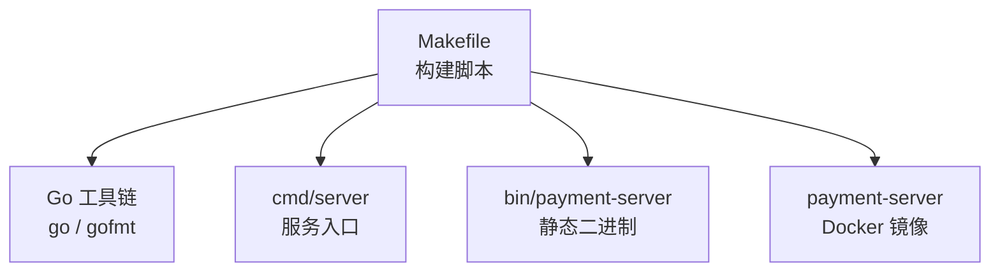

**图表来源**
- [Makefile:7-17](file://Makefile#L7-L17)
- [Makefile:50-69](file://Makefile#L50-L69)

**章节来源**
- [Makefile:10-17](file://Makefile#L10-L17)
- [README.md:38-62](file://README.md#L38-L62)

## 构建目标总览
下表汇总所有 `make` 目标及其用途：

| 目标 | 作用 | 典型使用场景 | 关键行为 |
|---|---|---|---|
| `help` | 列出可用目标 | 首次接触项目时查看命令 | 解析 `Makefile` 注释并打印 |
| `fmt` | 格式化源码 | 提交前统一代码风格 | 使用 `gofmt -w -s` 修改源码 |
| `fmt-check` | 检查格式不修改 | CI 或 pre-commit 检查 | 仅输出未格式化文件 |
| `vet` | Go 静态检查 | 提交前自检 | 执行 `go vet ./...` |
| `lint` | 代码规范检查 | 团队统一 lint 规则 | 若未安装 `golangci-lint` 则跳过 |
| `check` | 提交前综合自检 | 本地提交前验证 | 格式 + vet + 编译 |
| `tidy` | 整理依赖 | 增删 import 后同步模块 | 更新 `go.mod` / `go.sum` |
| `build` | 编译服务端二进制 | 本地联调或打包 | 静态编译到 `bin/payment-server` |
| `run` | 前台启动服务 | 本地开发调试 | 读取配置文件并启动 HTTP |
| `test` | 运行单元测试 | 本地测试或 CI 测试阶段 | 带竞态检测 |
| `cover` | 覆盖率测试 | 评估测试覆盖度 | 生成 `coverage.out` 并打印总体覆盖率 |
| `clean` | 清理构建产物 | 构建失败后恢复干净状态 | 删除 `bin/` 与 `coverage.out` |
| `docker-build` | 构建容器镜像 | 本地镜像测试或 CI 打包 | 基于仓库根目录的 `Dockerfile` |

**章节来源**
- [Makefile:21-69](file://Makefile#L21-L69)
- [README.md:248-266](file://README.md#L248-L266)

## 核心命令详解

### check：提交前自检
`check` 是本地提交前的推荐入口，它会依次执行格式检查、静态检查与编译验证。

执行流程如下：

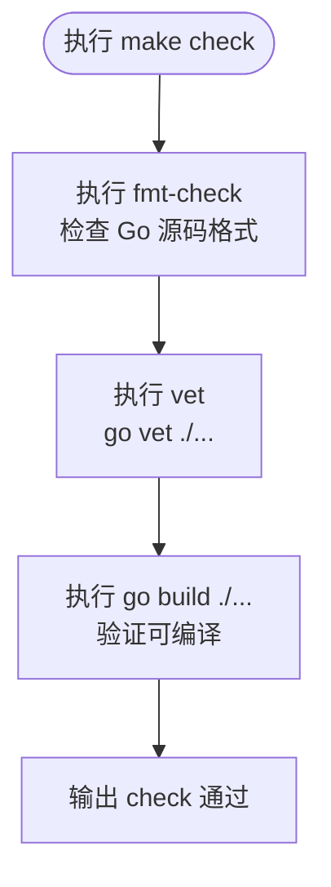

**图表来源**
- [Makefile:30-45](file://Makefile#L30-L45)

注意事项：
- `check` 不会自动修复格式问题，只报告差异。
- 如果 `go vet` 或 `go build` 失败，`check` 会直接报错，适合在 Git hook 或 CI 中使用。

**章节来源**
- [Makefile:30-45](file://Makefile#L30-L45)

### build：编译构建
`build` 负责将 `cmd/server` 编译为静态二进制文件，输出到 `bin/payment-server`。

关键点：
- 使用 `-trimpath` 去除本地路径信息。
- 使用 `-ldflags "-s -w"` 去掉符号表与调试信息，减小二进制体积。
- 通过 `CGO_ENABLED=0` 禁用 CGO，确保产物不依赖宿主 glibc。

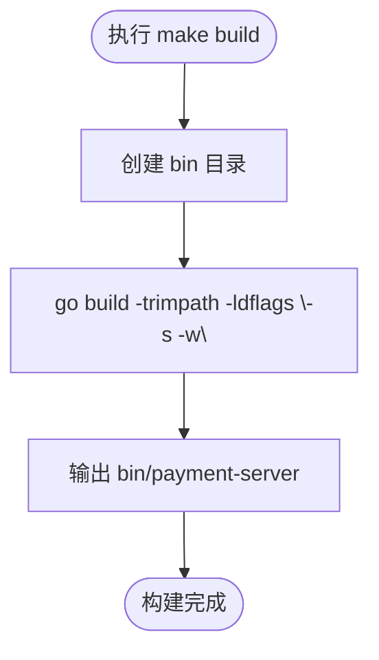

**图表来源**
- [Makefile:16-17](file://Makefile#L16-L17)
- [Makefile:50-53](file://Makefile#L50-L53)

适用场景：
- 本地联调运行。
- 生成可部署的二进制文件。
- 作为 Docker 多阶段构建的第一步。

**章节来源**
- [Makefile:16-17](file://Makefile#L16-L17)
- [Makefile:50-53](file://Makefile#L50-L53)

### test：单元测试
`test` 执行全部包的测试，并开启竞态检测。

特点：
- 使用 `./...` 递归测试所有包。
- 使用 `-race` 检测数据竞争，适合并发较多的支付链路。

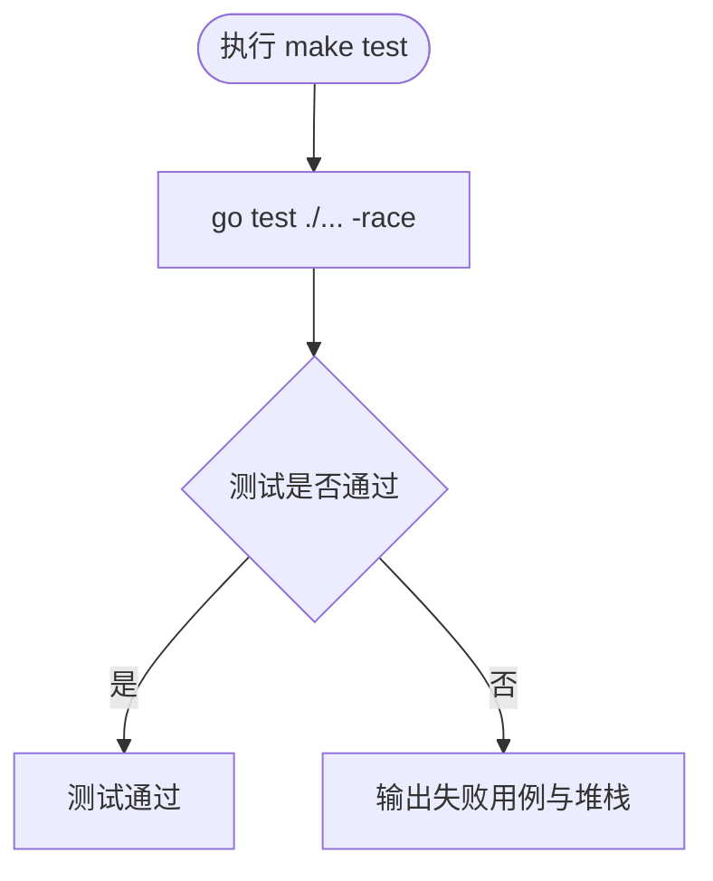

**图表来源**
- [Makefile:58-59](file://Makefile#L58-L59)

注意：
- 当前项目说明中明确“没有测试”，因此 `make test` 可能无实际测试用例可运行，但命令本身仍可用于后续补充测试。

**章节来源**
- [Makefile:58-59](file://Makefile#L58-L59)
- [README.md:286-288](file://README.md#L286-L288)

### cover：覆盖率测试
`cover` 会在运行测试的同时生成覆盖率文件，并打印总体覆盖率统计。

执行流程：

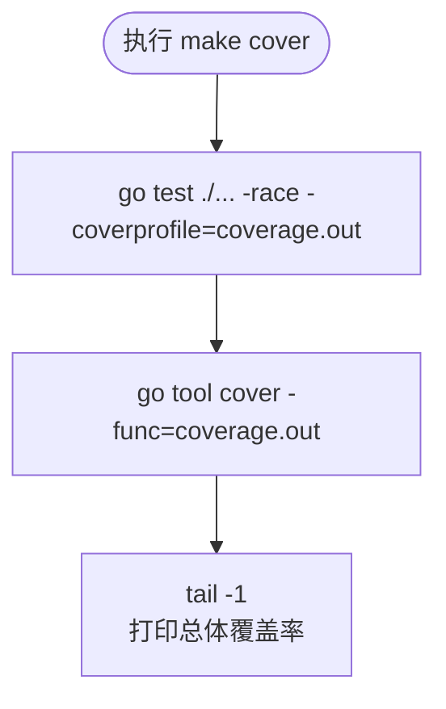

**图表来源**
- [Makefile:61-63](file://Makefile#L61-L63)

产出：
- `coverage.out`：原始覆盖率数据。
- 终端最后一行：整体函数覆盖率摘要。

**章节来源**
- [Makefile:61-63](file://Makefile#L61-L63)

### lint：代码规范检查
`lint` 尝试调用 `golangci-lint` 进行更严格的代码规范检查。

行为：
- 如果系统已安装 `golangci-lint`，则执行 `golangci-lint run ./...`。
- 如果未安装，则打印提示并跳过，不会让 `make` 失败。

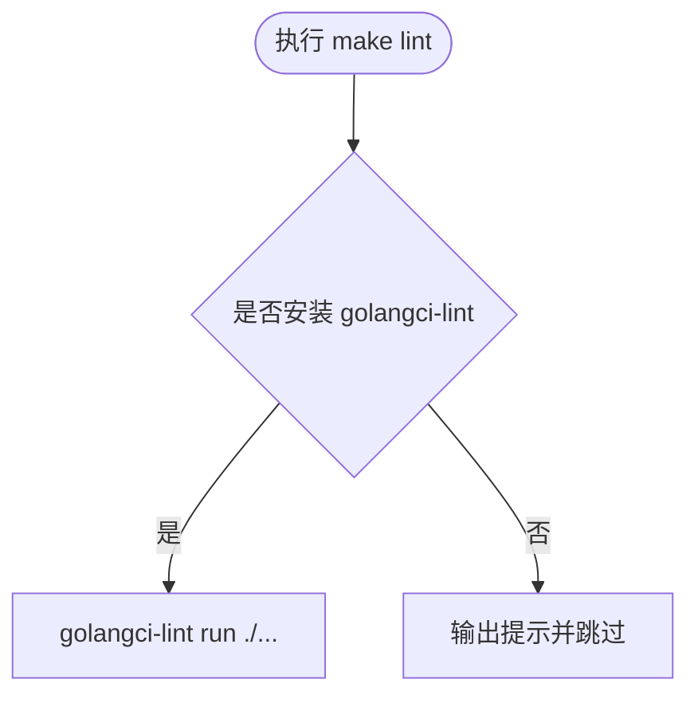

**图表来源**
- [Makefile:36-41](file://Makefile#L36-L41)

建议：
- 本地开发时可安装以提升代码质量。
- CI 中可选择强制安装并失败，以统一团队规范。

**章节来源**
- [Makefile:36-41](file://Makefile#L36-L41)
- [README.md:262-266](file://README.md#L262-L266)

### fmt 与 fmt-check：格式化与格式检查
- `fmt`：自动格式化所有 Go 源码。
- `fmt-check`：仅检查是否有未格式化的文件，常用于 CI。

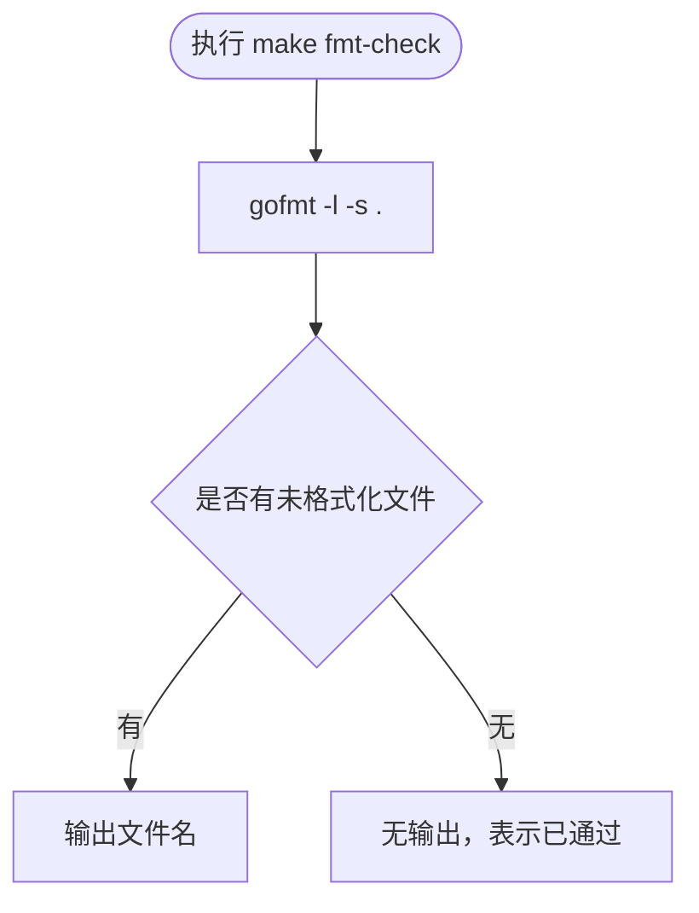

**图表来源**
- [Makefile:27-31](file://Makefile#L27-L31)

**章节来源**
- [Makefile:27-31](file://Makefile#L27-L31)

### vet：静态检查
`vet` 执行 `go vet ./...`，用于发现常见的 Go 代码问题，如误用 `printf` 参数、不可达代码等。

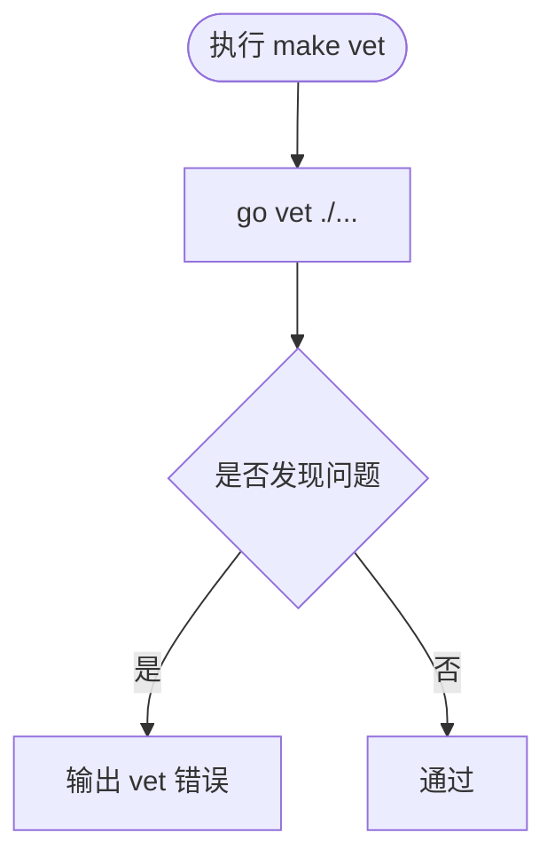

**图表来源**
- [Makefile:33-34](file://Makefile#L33-L34)

**章节来源**
- [Makefile:33-34](file://Makefile#L33-L34)

### tidy：依赖整理
`tidy` 会根据源码中的 import 调整 `go.mod` 和 `go.sum`，添加缺失依赖、移除未使用依赖。

适用场景：
- 新增第三方库后执行。
- 删除无用 import 后执行。
- CI 中可作为依赖一致性检查。

**章节来源**
- [Makefile:47-48](file://Makefile#L47-L48)

### run：本地运行
`run` 直接通过 `go run` 启动服务，便于本地快速调试。

行为：
- 读取配置文件路径。
- 前台运行，支持优雅关闭。

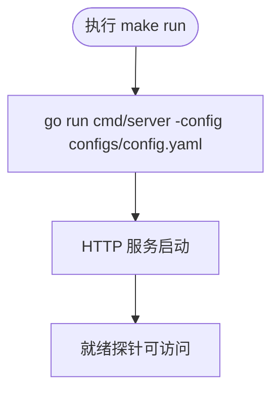

**图表来源**
- [Makefile:55-56](file://Makefile#L55-L56)
- [README.md:23-29](file://README.md#L23-L29)

**章节来源**
- [Makefile:55-56](file://Makefile#L55-L56)
- [README.md:13-36](file://README.md#L13-L36)

### clean：清理构建产物
`clean` 删除 `bin/` 目录与 `coverage.out`，用于恢复干净构建环境。

**章节来源**
- [Makefile:65-66](file://Makefile#L65-L66)

### docker-build：构建容器镜像
`docker-build` 调用 `docker build` 构建镜像，镜像标签为 `payment-server:latest`。

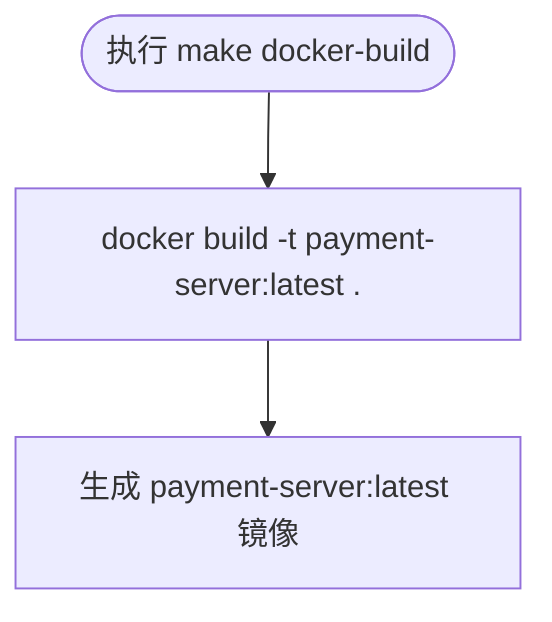

**图表来源**
- [Makefile:68-69](file://Makefile#L68-L69)

**章节来源**
- [Makefile:68-69](file://Makefile#L68-L69)
- [README.md:31-36](file://README.md#L31-L36)

## 本地开发环境搭建指南

### 前置条件
- 已安装 Go，且版本与 `go.mod` 一致。
- 可选：已安装 `golangci-lint`。
- 可选：已安装 Docker。

### 安装依赖
项目依赖定义在 `go.mod` 中，主要依赖包括 Gin、Viper、Zap 等。通常执行 `go mod download` 或 `make tidy` 即可拉取依赖。

**章节来源**
- [go.mod:1-10](file://go.mod#L1-L10)
- [Makefile:47-48](file://Makefile#L47-L48)

### 常用开发任务
- 查看帮助：`make help`
- 提交前自检：`make check`
- 格式化代码：`make fmt`
- 运行测试：`make test`
- 查看覆盖率：`make cover`
- 本地运行：`make run`
- 构建二进制：`make build`
- 构建镜像：`make docker-build`

**章节来源**
- [README.md:248-266](file://README.md#L248-L266)
- [Makefile:21-69](file://Makefile#L21-L69)

## CI/CD 集成示例

### GitHub Actions
以下是一个典型的 GitHub Actions 工作流片段，展示如何在 CI 中调用构建脚本的目标：

```yaml
name: Payment Service CI

on:
  push:
    branches: [main]
  pull_request:
    branches: [main]

jobs:
  build-and-test:
    runs-on: ubuntu-latest
    steps:
      - uses: actions/checkout@v4

      - name: 设置 Go 环境
        uses: actions/setup-go@v5
        with:
          go-version-file: go.mod

      - name: 缓存 Go 模块
        uses: actions/cache@v4
        with:
          path: |
            ~/go/pkg/mod
            ~/.cache/go-build
          key: ${{ runner.os }}-go-${{ hashFiles('go.sum') }}

      - name: 安装依赖
        run: go mod download

      - name: 代码检查
        run: make check

      - name: 单元测试
        run: make test

      - name: 覆盖率测试
        run: make cover

      - name: 构建二进制
        run: make build

      - name: 构建镜像
        run: make docker-build
```

说明：
- 使用 `go-version-file` 自动读取 `go.mod` 中的 Go 版本。
- 使用 `actions/cache` 缓存 Go 模块与构建缓存，提升 CI 速度。
- 按顺序执行 `make check`、`make test`、`make cover`、`make build`、`make docker-build`。

### GitLab CI
以下是一个 GitLab CI 配置示例：

```yaml
stages:
  - check
  - test
  - build
  - package

variables:
  GO_VERSION: "1.26"

check:
  stage: check
  image: golang:${GO_VERSION}-alpine
  script:
    - go mod download
    - make check

test:
  stage: test
  image: golang:${GO_VERSION}-alpine
  script:
    - go mod download
    - make test
    - make cover

build:
  stage: build
  image: golang:${GO_VERSION}-alpine
  script:
    - go mod download
    - make build

package:
  stage: package
  image: docker:latest
  services:
    - docker:dind
  script:
    - make docker-build
```

说明：
- 每个阶段对应一个 `make` 目标。
- `check` 阶段保证代码质量。
- `test` 阶段运行测试并生成覆盖率。
- `build` 阶段生成静态二进制。
- `package` 阶段构建 Docker 镜像。

**章节来源**
- [Makefile:21-69](file://Makefile#L21-L69)
- [README.md:248-266](file://README.md#L248-L266)

## 错误处理与调试方法

### 常见构建错误
- `command not found: go`：Go 未加入 PATH。可通过导出 PATH 或使用 `make help` 确认工具链路径。
- `golangci-lint: command not found`：未安装 `golangci-lint`。`make lint` 会跳过而不报错，可按 README 安装。
- `go: cannot find main module`：未正确初始化 Go 模块或未进入项目根目录。
- `CGO_ENABLED=0` 相关错误：某些依赖需要 CGO，但本项目通过静态编译避免此类问题。

### 调试建议
- 使用 `make fmt-check` 定位格式问题。
- 使用 `make vet` 定位静态检查问题。
- 使用 `make test` 运行测试并观察竞态检测结果。
- 使用 `make cover` 生成 `coverage.out`，结合 `go tool cover -html=coverage.out` 查看可视化覆盖率。
- 使用 `make run` 本地启动服务，配合日志与 `/healthz`、`/readyz` 探针判断服务状态。

**章节来源**
- [Makefile:27-63](file://Makefile#L27-L63)
- [README.md:248-266](file://README.md#L248-L266)

## 依赖与工具链分析

### Go 工具链选择
`Makefile` 通过 `command -v` 优先查找 PATH 中的 `go` 与 `gofmt`，否则回退到 `/usr/local/go/bin/go` 与 `/usr/local/go/bin/gofmt`。这种设计兼顾了本地未配置 PATH 的环境与 CI 容器中 PATH 正常的场景。

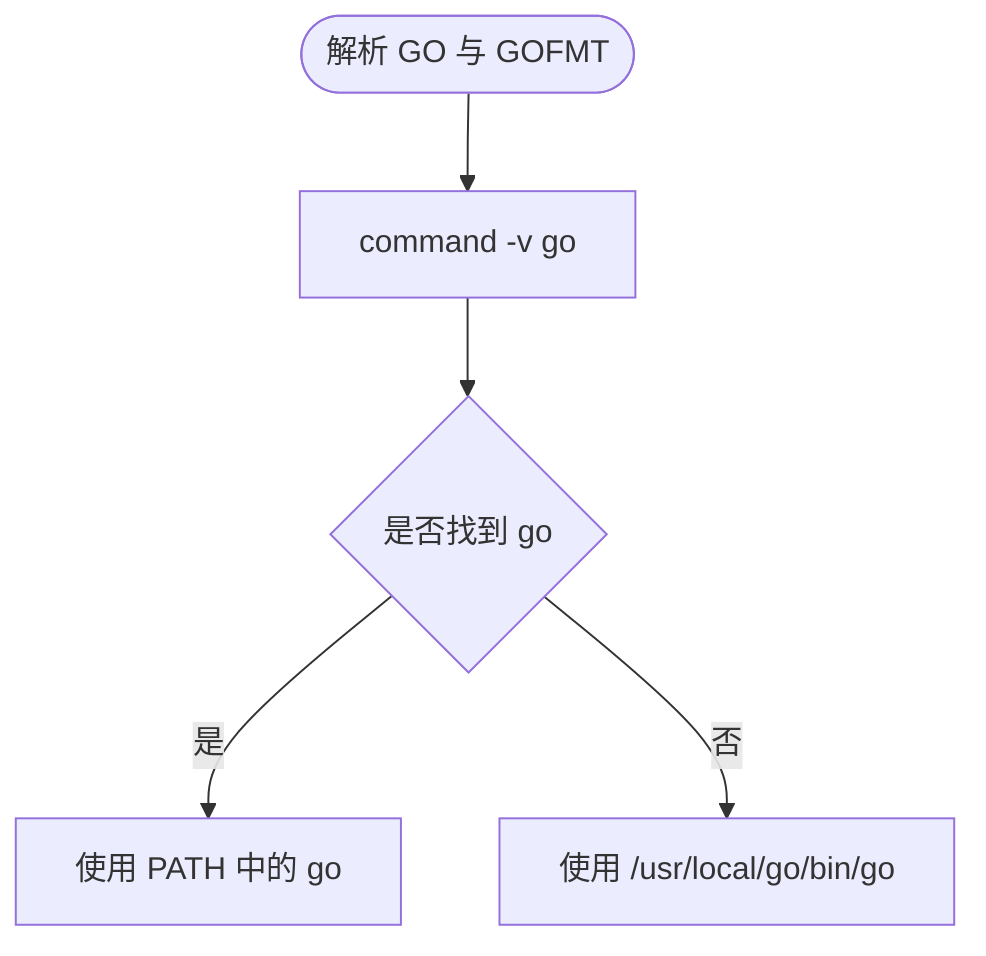

**图表来源**
- [Makefile:7-8](file://Makefile#L7-L8)

**章节来源**
- [Makefile:7-8](file://Makefile#L7-L8)

### 静态编译与镜像
- `CGO_ENABLED=0` 确保静态链接。
- `go build -trimpath -ldflags "-s -w"` 优化二进制大小。
- Docker 镜像使用多阶段构建，生产镜像不包含证书目录。

**章节来源**
- [Makefile:16-17](file://Makefile#L16-L17)
- [Makefile:50-53](file://Makefile#L50-L53)
- [README.md:268-272](file://README.md#L268-L272)

## 常见问题排查

### 为什么 `make lint` 不报错？
因为 `make lint` 在未安装 `golangci-lint` 时会跳过并输出提示。若希望在 CI 中强制检查，可在 CI 步骤中先安装 `golangci-lint`，再执行 `make lint`。

**章节来源**
- [Makefile:36-41](file://Makefile#L36-L41)
- [README.md:262-266](file://README.md#L262-L266)

### 为什么 `make test` 没有测试输出？
项目当前说明中明确指出“没有测试”。如需补充测试，请先安装测试框架依赖，再编写 `_test.go` 文件。

**章节来源**
- [README.md:286-288](file://README.md#L286-L288)

### 如何查看覆盖率详情？
执行 `make cover` 后会生成 `coverage.out`，可使用以下命令查看 HTML 报告：
```bash
go tool cover -html=coverage.out
```

**章节来源**
- [Makefile:61-63](file://Makefile#L61-L63)

### 为什么本地运行服务失败？
服务启动失败可能与配置有关，例如：
- `server.mode=release` 下 mock 渠道未注册。
- 微信支付凭据未配置完整。
- 回调地址不符合安全要求。

建议保持 `debug` 模式本地联调，并根据启动日志中的明确原因调整配置。

**章节来源**
- [README.md:5-11](file://README.md#L5-L11)
- [README.md:215-238](file://README.md#L215-L238)

## 结论
`Makefile` 提供了完整的构建脚本，涵盖代码检查、格式化、静态检查、依赖整理、测试、覆盖率、构建、运行与镜像打包。对于本地开发，推荐使用 `make check` 作为提交前自检入口；对于 CI/CD，可将各目标拆分为独立阶段，以保证代码质量、测试覆盖与构建产物的一致性。

在实际使用中，应结合项目当前的“无测试”“无持久化”“mock 渠道”等边界条件，逐步补充测试、持久化与真实渠道实现，使构建脚本发挥更大价值。