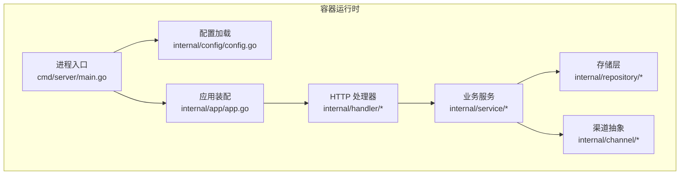
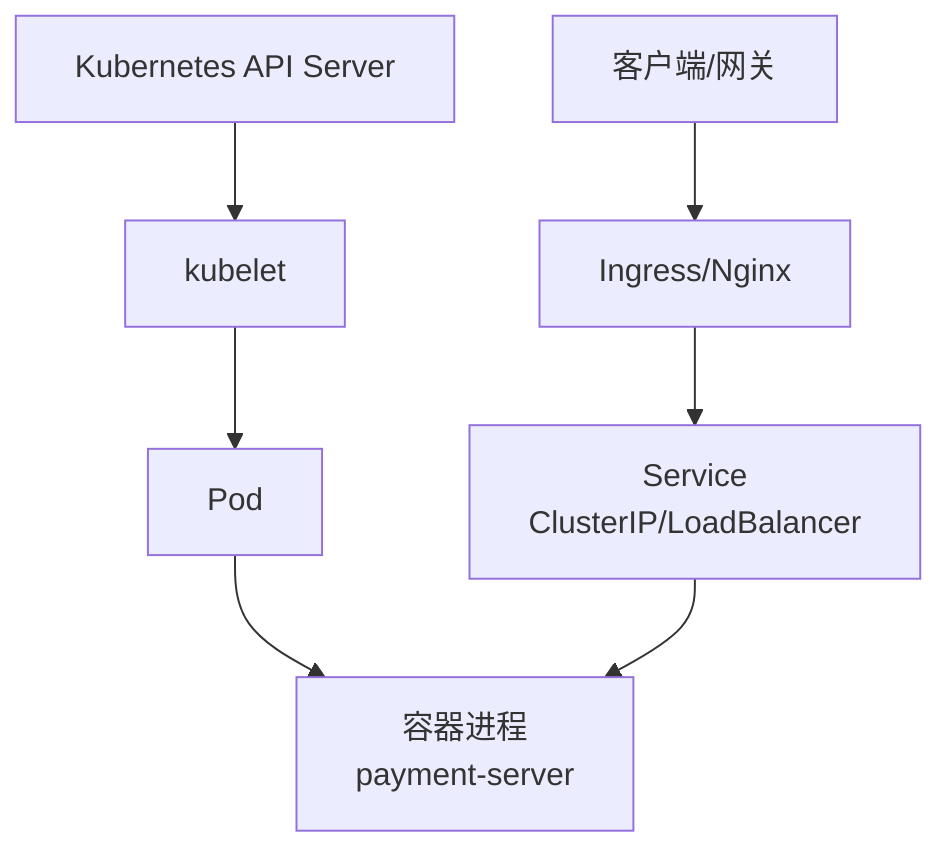
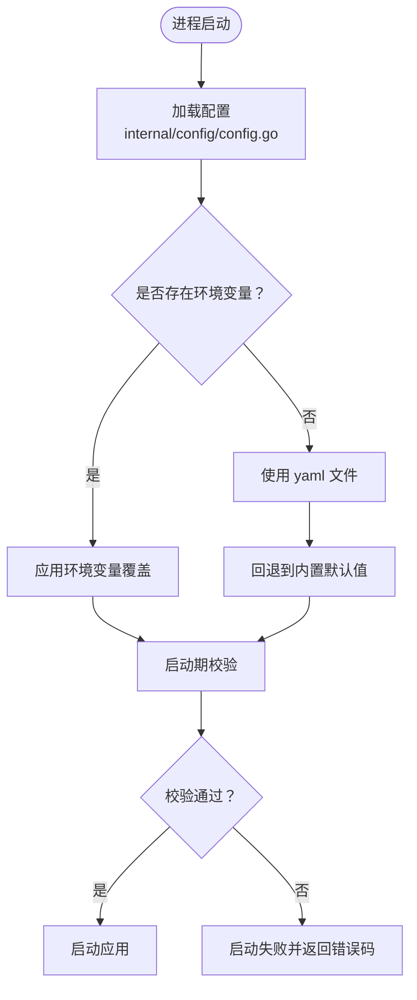
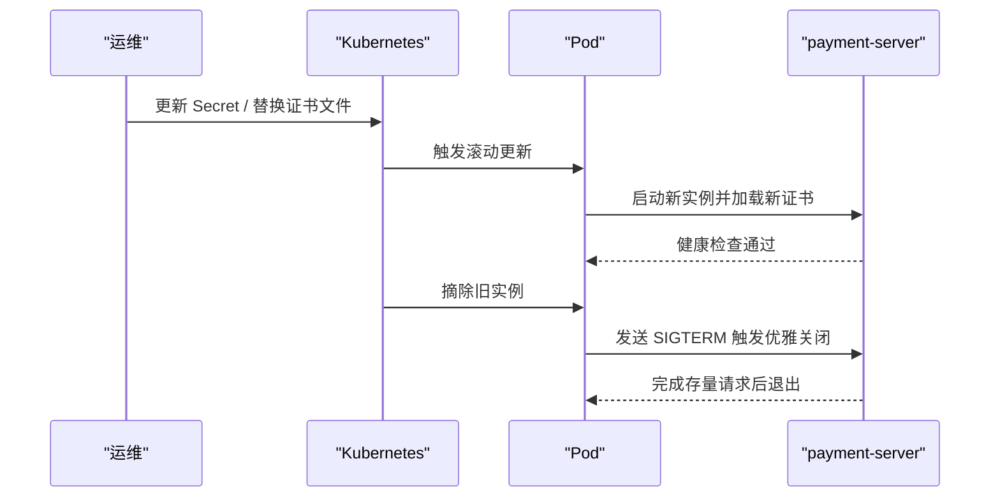
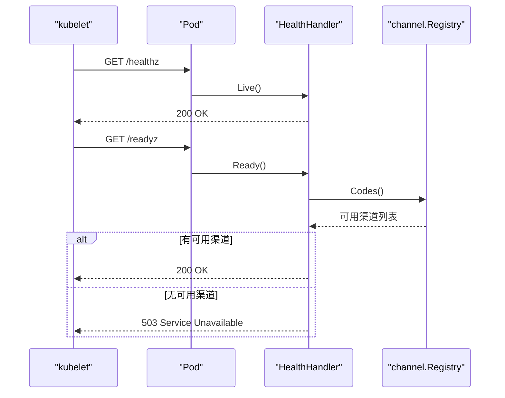
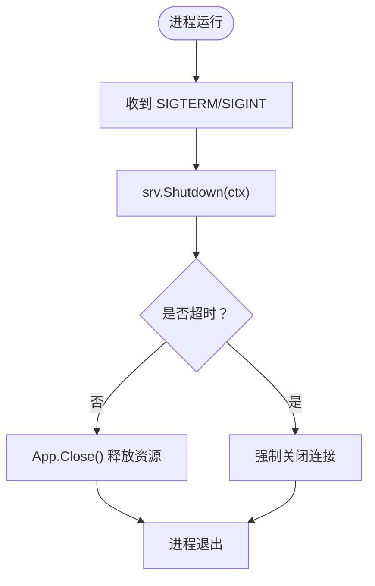
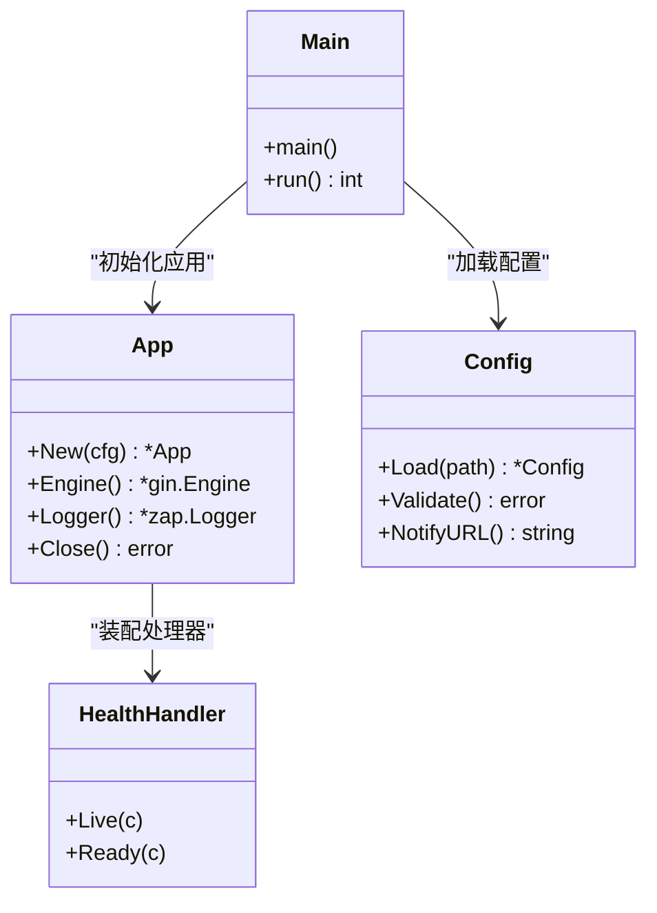

# 生产环境部署

<cite>
**本文引用的文件**   
- [README.md](file://README.md)
- [Dockerfile](file://Dockerfile)
- [cmd/server/main.go](file://cmd/server/main.go)
- [internal/config/config.go](file://internal/config/config.go)
- [configs/config.yaml](file://configs/config.yaml)
- [internal/app/app.go](file://internal/app/app.go)
- [internal/handler/health.go](file://internal/handler/health.go)
</cite>

## 目录
1. [引言](#引言)
2. [项目结构](#项目结构)
3. [核心组件](#核心组件)
4. [架构总览](#架构总览)
5. [详细组件分析](#详细组件分析)
6. [依赖关系分析](#依赖关系分析)
7. [性能调优建议](#性能调优建议)
8. [故障排查指南](#故障排查指南)
9. [结论](#结论)
10. [附录：Kubernetes 部署清单与证书管理](#附录kubernetes-部署清单与证书管理)

## 引言
本文面向生产环境，围绕支付服务的部署、配置注入、敏感信息保护、健康检查、优雅关闭、证书管理与性能调优展开。服务当前以内存仓储运行，默认使用 mock 渠道；release 模式下不注册 mock 路由，且微信支付渠道尚未实现，因此 release 模式会启动失败。本地联调请使用 debug 模式，并通过 `/readyz` 确认就绪状态。

**章节来源**
- [README.md:5-11](file://README.md#L5-L11)
- [README.md:29-36](file://README.md#L29-L36)

## 项目结构
本项目采用分层架构：进程入口负责生命周期，`internal/app` 负责装配，`internal/config` 负责配置加载与校验，`internal/handler` 暴露 HTTP 接口，`internal/service` 承载业务逻辑，`internal/repository` 提供存储抽象，`internal/channel` 抽象支付渠道差异。镜像构建使用多阶段构建，运行阶段以非 root 用户执行，并显式排除证书目录。

**图表来源**
- [cmd/server/main.go:31-124](file://cmd/server/main.go#L31-L124)
- [internal/app/app.go:39-106](file://internal/app/app.go#L39-L106)
- [internal/config/config.go:113-155](file://internal/config/config.go#L113-L155)

**章节来源**
- [README.md:38-62](file://README.md#L38-L62)
- [Dockerfile:9-55](file://Dockerfile#L9-L55)

## 核心组件
- 进程入口：解析参数、加载配置、装配应用、启动 HTTP 服务、监听退出信号并优雅关闭。
- 配置系统：Viper 加载 yaml + 环境变量覆盖，显式 `BindEnv` 映射，启动期强校验。
- 应用装配：按配置构造日志、渠道注册表、仓储、服务、handler、Gin 引擎。
- 健康检查：`/healthz` 存活探针，`/readyz` 就绪探针，就绪时要求至少一个可用渠道。
- Docker 镜像：多阶段构建、静态二进制、非 root 运行、HEALTHCHECK 指向 `/healthz`。

**章节来源**
- [cmd/server/main.go:31-124](file://cmd/server/main.go#L31-L124)
- [internal/config/config.go:113-155](file://internal/config/config.go#L113-L155)
- [internal/app/app.go:39-106](file://internal/app/app.go#L39-L106)
- [internal/handler/health.go:36-78](file://internal/handler/health.go#L36-L78)
- [Dockerfile:49-55](file://Dockerfile#L49-L55)

## 架构总览
下图展示从 K8s 到容器的关键交互：ConfigMap/Secret 挂载为文件或环境变量，容器内进程读取配置并启动 HTTP 服务，K8s 通过 Service 暴露端口，探针访问健康端点。

[本图为概念性架构图，不直接映射具体源码文件]

## 详细组件分析

### 环境变量注入策略
- 优先级：环境变量 > yaml 配置文件 > 代码默认值。
- 映射方式：通过显式 `BindEnv` 将配置键与环境变量一一绑定，避免 `AutomaticEnv` 的隐式行为导致意外覆盖。
- 敏感信息保护：微信支付 APIv3 密钥仅允许通过环境变量注入，yaml 中不存在对应字段；其他证书路径等敏感项由部署侧挂载文件并提供路径。
- 动态配置更新：当前实现为启动期加载并校验，不支持运行时热更新。若需动态更新，可在现有 `config.Config` 基础上增加“重载配置 + 重新校验”的能力，并在重启 HTTP 服务前完成连接池与缓存刷新。

**图表来源**
- [internal/config/config.go:113-155](file://internal/config/config.go#L113-L155)
- [internal/config/config.go:157-207](file://internal/config/config.go#L157-L207)
- [internal/config/config.go:226-268](file://internal/config/config.go#L226-L268)

**章节来源**
- [internal/config/config.go:1-7](file://internal/config/config.go#L1-L7)
- [internal/config/config.go:113-155](file://internal/config/config.go#L113-L155)
- [internal/config/config.go:178-207](file://internal/config/config.go#L178-L207)
- [internal/config/config.go:226-268](file://internal/config/config.go#L226-L268)
- [README.md:215-238](file://README.md#L215-L238)

### 证书管理方案
- 镜像安全：Dockerfile 刻意不 COPY `certs/`，防止商户私钥进入镜像历史层。
- 挂载方式：
  - Kubernetes Secret 挂载：将证书文件挂载到容器内的固定路径（例如 `/app/certs`），并在配置中指定 `private_key_path`、`public_key_path` 等路径。
  - Docker volume 挂载：通过 `-v "$PWD/certs:/app/certs:ro"` 只读挂载证书目录。
- 轮换策略：
  - 证书到期或平台轮换后，更新 K8s Secret 或宿主机证书文件。
  - 由于当前配置在启动期加载，建议在滚动更新 Pod 时触发新实例加载新证书；旧实例在优雅关闭期间继续处理存量请求。
  - 若需零停机轮换，可结合外部工具（如 cert-manager）自动更新 Secret，并配合 Sidecar 或 Operator 触发 Pod 滚动升级。

**图表来源**
- [Dockerfile:40-42](file://Dockerfile#L40-L42)
- [Dockerfile:49-55](file://Dockerfile#L49-L55)
- [cmd/server/main.go:69-124](file://cmd/server/main.go#L69-L124)

**章节来源**
- [Dockerfile:40-42](file://Dockerfile#L40-L42)
- [Dockerfile:49-55](file://Dockerfile#L49-L55)
- [README.md:268-272](file://README.md#L268-L272)
- [internal/config/config.go:300-319](file://internal/config/config.go#L300-L319)

### Kubernetes 部署清单说明
以下为部署所需资源类型与关键字段说明（示例以 YAML 形式描述，不包含具体敏感值）：
- Deployment：
  - 副本数：根据流量与资源限制设置。
  - 容器镜像：使用构建好的镜像。
  - 环境变量：注入 `PAYMENT_*` 与 `WECHATPAY_*` 相关配置。
  - 卷挂载：挂载 ConfigMap（配置文件）、Secret（证书）。
  - 探针：livenessProbe 与 readinessProbe。
  - 优雅关闭：`terminationGracePeriodSeconds` 应大于 `server.shutdown_timeout`。
- Service：
  - 暴露端口：与容器 EXPOSE 一致（默认 8080）。
  - 类型：ClusterIP 或 LoadBalancer，视 Ingress 策略而定。
- ConfigMap：
  - 包含 `configs/config.yaml` 的非敏感配置。
- Secret：
  - 包含证书文件（`apiclient_key.pem`、公钥文件等）与敏感环境变量（如 `WECHATPAY_API_V3_KEY`）。

注意：
- 证书文件必须只读挂载，避免容器内写入。
- 回调地址需公网可达且为 HTTPS，release 模式下强制校验。
- 所有敏感项优先通过 Secret 注入，不要硬编码在镜像或 ConfigMap 中。

[本节为部署清单说明，未直接引用具体源码文件]

### 健康检查与就绪探针
- 存活探针 `/healthz`：只要进程能处理请求即返回成功，不检查任何依赖，避免因外部抖动导致容器被重启。
- 就绪探针 `/readyz`：检查是否有可用支付渠道；若无可用渠道则返回 503，让 K8s 从 Service endpoints 中摘除该 Pod，但不会重启进程。
- Docker HEALTHCHECK：指向 `/healthz`，间隔、超时、重试次数已在 Dockerfile 中定义。

**图表来源**
- [internal/handler/health.go:36-78](file://internal/handler/health.go#L36-L78)
- [Dockerfile:49-52](file://Dockerfile#L49-L52)

**章节来源**
- [internal/handler/health.go:36-78](file://internal/handler/health.go#L36-L78)
- [Dockerfile:49-52](file://Dockerfile#L49-L52)
- [README.md:64-74](file://README.md#L64-L74)

### 优雅关闭机制
- 进程信号处理：监听 `SIGINT` 与 `SIGTERM`，收到信号后记录日志并开始优雅关闭。
- HTTP 服务关闭：调用 `srv.Shutdown(ctx)`，停止接收新连接，等待存量请求处理完成；若超时则强制断开。
- 应用资源清理：`App.Close()` 用于 flush 日志缓冲，确保最后几条关键日志不被丢弃。
- 配置关联：`server.shutdown_timeout` 必须小于编排系统的 `terminationGracePeriodSeconds`，否则优雅关闭形同虚设。

**图表来源**
- [cmd/server/main.go:69-124](file://cmd/server/main.go#L69-L124)
- [internal/app/app.go:189-199](file://internal/app/app.go#L189-L199)

**章节来源**
- [cmd/server/main.go:69-124](file://cmd/server/main.go#L69-L124)
- [internal/app/app.go:189-199](file://internal/app/app.go#L189-L199)
- [configs/config.yaml:20-22](file://configs/config.yaml#L20-L22)

## 依赖关系分析
- 进程入口依赖配置与应用装配。
- 应用装配依赖日志、渠道注册表、仓储、服务、handler、路由。
- 健康检查依赖渠道注册表与订单计数接口。
- 配置系统依赖 Viper 与系统环境变量。

**图表来源**
- [cmd/server/main.go:31-124](file://cmd/server/main.go#L31-L124)
- [internal/app/app.go:39-106](file://internal/app/app.go#L39-L106)
- [internal/config/config.go:113-155](file://internal/config/config.go#L113-L155)
- [internal/handler/health.go:24-78](file://internal/handler/health.go#L24-L78)

**章节来源**
- [cmd/server/main.go:31-124](file://cmd/server/main.go#L31-L124)
- [internal/app/app.go:39-106](file://internal/app/app.go#L39-L106)
- [internal/config/config.go:113-155](file://internal/config/config.go#L113-L155)
- [internal/handler/health.go:24-78](file://internal/handler/health.go#L24-L78)

## 性能调优建议
- 资源限制：
  - 在 Deployment 中设置 requests 与 limits，确保调度器合理分配 CPU 与内存。
  - 针对支付回调场景，适当提高 `read_timeout` 与 `write_timeout`，避免慢速攻击或大报文导致的连接堆积。
- 并发参数：
  - 调整 Gin 引擎的 goroutine 数量与连接池大小（若后续接入数据库）。
  - 对回调接口启用限流与鉴权（当前骨架未实现，需在接入层补充）。
- 内存优化：
  - 当前使用内存仓储，进程重启后数据丢失；生产环境应替换为持久化存储并优化连接池。
  - 日志格式建议使用 JSON，便于采集与解析，同时控制日志级别以减少 I/O 压力。
- 网络与安全：
  - 生产环境禁用跨域白名单中的通配符，明确 CORS 来源。
  - 回调地址必须为 HTTPS，release 模式下强制校验。

[本节为通用性能指导，未直接分析具体源码文件]

## 故障排查指南
- 启动失败：
  - 检查 `server.mode`、`server.port`、`log.format` 是否合法。
  - release 模式下 `payment.notify_base_url` 必须以 `https://` 开头。
  - 启用微信支付时需补齐凭据，包括 APIv3 密钥与证书/公钥路径。
- 就绪失败：
  - `/readyz` 返回 503 表示没有可用渠道；检查渠道注册与默认渠道配置。
- 优雅关闭异常：
  - 确认 `server.shutdown_timeout` 小于编排系统的 `terminationGracePeriodSeconds`。
  - 观察日志中是否出现“优雅关闭超时，强制断开存量连接”。

**章节来源**
- [internal/config/config.go:226-268](file://internal/config/config.go#L226-L268)
- [internal/handler/health.go:49-78](file://internal/handler/health.go#L49-L78)
- [cmd/server/main.go:102-124](file://cmd/server/main.go#L102-L124)

## 结论
本服务在生产环境部署时，应严格遵循环境变量注入策略与敏感信息保护原则，使用 K8s Secret 或 docker volume 挂载证书，并通过滚动更新实现证书轮换。健康检查与就绪探针需正确配置，确保 K8s 能准确判断容器状态。优雅关闭机制保障存量请求处理完成，避免掉单。性能调优需结合资源限制、并发参数与内存优化，逐步完善鉴权、限流与持久化能力。

[本节为总结性内容，未直接分析具体源码文件]

## 附录：Kubernetes 部署清单与证书管理

### 环境变量与配置优先级
- 环境变量命名规范：
  - `PAYMENT_SERVER_MODE`、`PAYMENT_SERVER_HOST`、`PAYMENT_SERVER_PORT`
  - `PAYMENT_SERVER_READ_TIMEOUT`、`PAYMENT_SERVER_WRITE_TIMEOUT`、`PAYMENT_SERVER_SHUTDOWN_TIMEOUT`
  - `PAYMENT_LOG_LEVEL`、`PAYMENT_LOG_FORMAT`
  - `PAYMENT_DEFAULT_CHANNEL`、`PAYMENT_NOTIFY_BASE_URL`
  - `WECHATPAY_ENABLED`、`WECHATPAY_APP_ID`、`WECHATPAY_MCH_ID`
  - `WECHATPAY_MCH_CERT_SERIAL_NO`、`WECHATPAY_PRIVATE_KEY_PATH`
  - `WECHATPAY_PUBLIC_KEY_ID`、`WECHATPAY_PUBLIC_KEY_PATH`
  - `WECHATPAY_NOTIFY_PATH`
  - `WECHATPAY_API_V3_KEY`（仅环境变量）
- 配置文件路径：
  - 可通过 `PAYMENT_CONFIG` 覆盖默认路径，默认值为 `configs/config.yaml`。

**章节来源**
- [internal/config/config.go:19-27](file://internal/config/config.go#L19-L27)
- [internal/config/config.go:178-207](file://internal/config/config.go#L178-L207)
- [configs/config.yaml:1-7](file://configs/config.yaml#L1-L7)

### 证书挂载与轮换
- 挂载路径：
  - 证书目录建议挂载至 `/app/certs`，并在配置中指定 `private_key_path`、`public_key_path`。
- 轮换步骤：
  - 更新 K8s Secret 或宿主机证书文件。
  - 触发 Pod 滚动更新，新实例加载新证书。
  - 旧实例在优雅关闭期间继续处理存量请求。

**章节来源**
- [Dockerfile:40-42](file://Dockerfile#L40-L42)
- [internal/config/config.go:300-319](file://internal/config/config.go#L300-L319)
- [README.md:268-272](file://README.md#L268-L272)

### 健康检查与就绪探针配置
- livenessProbe：
  - 路径：`/healthz`
  - 行为：只要进程能处理请求即返回成功。
- readinessProbe：
  - 路径：`/readyz`
  - 行为：检查可用渠道，若无可用渠道返回 503。

**章节来源**
- [internal/handler/health.go:36-78](file://internal/handler/health.go#L36-L78)
- [Dockerfile:49-52](file://Dockerfile#L49-L52)

### 优雅关闭机制
- 信号处理：
  - 监听 `SIGINT` 与 `SIGTERM`。
- 关闭流程：
  - 调用 `srv.Shutdown(ctx)`，等待存量请求处理完成。
  - 若超时则强制断开连接。
- 资源清理：
  - `App.Close()` 用于 flush 日志缓冲。

**章节来源**
- [cmd/server/main.go:69-124](file://cmd/server/main.go#L69-L124)
- [internal/app/app.go:189-199](file://internal/app/app.go#L189-L199)