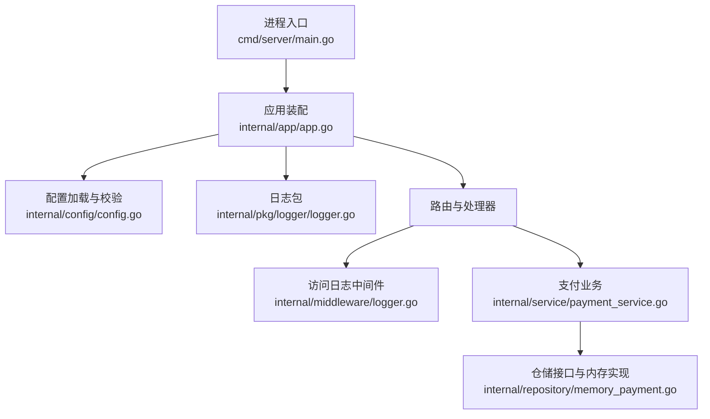
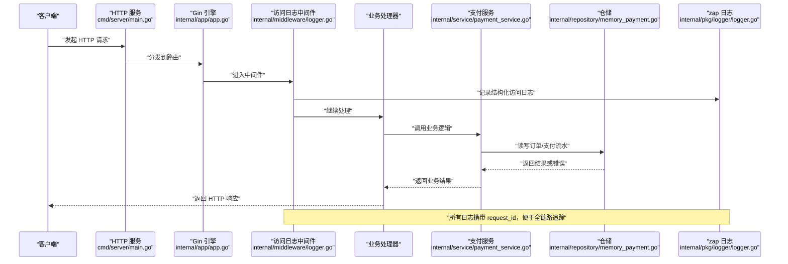
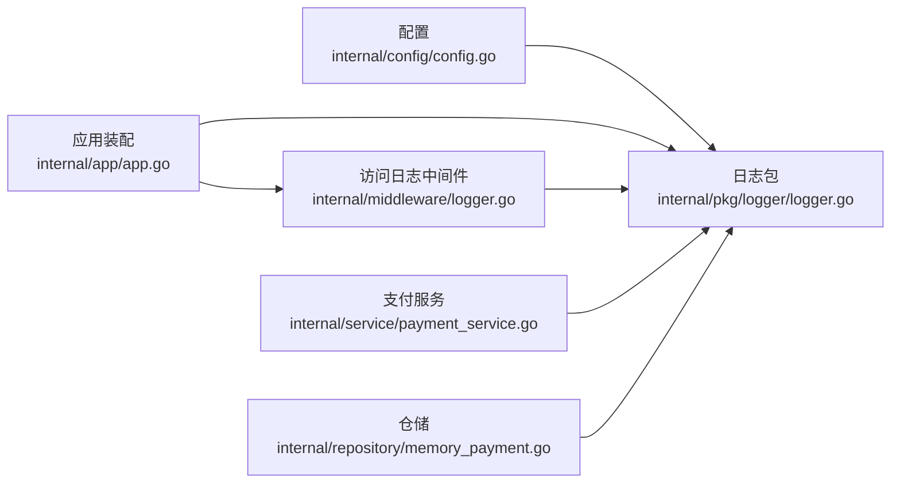

# 监控与告警

<cite>
**本文引用的文件**   
- [README.md](file://README.md)
- [main.go](file://cmd/server/main.go)
- [app.go](file://internal/app/app.go)
- [config.go](file://internal/config/config.go)
- [config.yaml](file://configs/config.yaml)
- [logger.go](file://internal/pkg/logger/logger.go)
- [logger.go](file://internal/middleware/logger.go)
- [payment_service.go](file://internal/service/payment_service.go)
- [memory_payment.go](file://internal/repository/memory_payment.go)
</cite>

## 目录
1. [引言](#引言)
2. [项目结构](#项目结构)
3. [核心组件](#核心组件)
4. [架构总览](#架构总览)
5. [详细组件分析](#详细组件分析)
6. [依赖关系分析](#依赖关系分析)
7. [性能监控最佳实践](#性能监控最佳实践)
8. [告警规则配置](#告警规则配置)
9. [日志分析方法](#日志分析方法)
10. [监控面板示例](#监控面板示例)
11. [故障排查指南](#故障排查指南)
12. [结论](#结论)

## 引言
本文面向支付服务的可观测性建设，围绕“日志采集、指标暴露、性能监控、告警规则、日志分析、监控面板”六个维度展开。当前代码库已实现结构化日志与请求级耗时记录，但尚未集成 Prometheus 指标收集；因此文档中“指标暴露”部分会明确区分“现有能力”和“建议扩展”，并给出可直接落地的接入方案。

## 项目结构
从可观测性视角，本项目相关代码主要分布在以下位置：
- 进程入口负责启动 HTTP 服务、优雅关闭与关键生命周期日志。
- 应用装配层负责初始化日志、渠道注册、仓储与服务，并在退出时刷新日志缓冲。
- 配置模块提供日志级别、格式等可观测性开关。
- 日志包基于 zap 提供结构化输出、request_id 注入与全局兜底 logger。
- 中间件提供结构化访问日志，包含状态码、方法、路径、耗时、客户端 IP、UA 与路由模板。
- 业务服务在支付回调、订单推进、流水更新等关键路径打点日志。
- 内存仓储为后续持久化与数据库监控预留接口。

**图表来源**
- [main.go:31-125](file://cmd/server/main.go#L31-L125)
- [app.go:39-106](file://internal/app/app.go#L39-L106)
- [config.go:113-155](file://internal/config/config.go#L113-L155)
- [logger.go](file://internal/pkg/logger/logger.go)
- [logger.go](file://internal/middleware/logger.go)
- [payment_service.go](file://internal/service/payment_service.go)
- [memory_payment.go](file://internal/repository/memory_payment.go)

**章节来源**
- [main.go:31-125](file://cmd/server/main.go#L31-L125)
- [app.go:39-106](file://internal/app/app.go#L39-L106)
- [config.go:113-155](file://internal/config/config.go#L113-L155)

## 核心组件
本节聚焦与监控告警直接相关的核心组件：日志系统、访问日志中间件、配置项、健康探针与业务关键路径。

### 日志系统
- 使用 zap 作为底层日志库。
- 支持 `console` 与 `json` 两种编码格式，生产环境建议使用 `json`，便于日志采集系统按字段检索。
- 通过 context 传递 request_id，使一次请求的所有日志可串联。
- 全局兜底 logger 使用原子指针保存，避免数据竞争；未初始化时返回 nop logger。
- 进程退出前调用 Sync 刷新缓冲，防止最后几条日志丢失。

**章节来源**
- [logger.go:1-183](file://internal/pkg/logger/logger.go#L1-L183)
- [app.go:50-55](file://internal/app/app.go#L50-L55)
- [app.go:194-198](file://internal/app/app.go#L194-L198)

### 访问日志中间件
- 替代 Gin 默认日志，输出结构化字段：状态码、方法、路径、查询参数、耗时、客户端 IP、UA、路由模板、错误信息。
- 对 `/healthz` 与 `/readyz` 探针路径降级为 debug 级别，避免探针日志淹没业务日志。
- 不记录请求体与响应体，遵循最小化原则，避免敏感信息与体积膨胀。
- 根据状态码选择 error/warn/info/debug 日志级别。

**章节来源**
- [logger.go:1-90](file://internal/middleware/logger.go#L1-L90)

### 配置项
- 日志级别：`log.level`，取值 `debug | info | warn | error`。
- 日志格式：`log.format`，取值 `console | json`。
- 服务器超时：`server.read_timeout`、`server.write_timeout`、`server.shutdown_timeout`。
- 模式：`server.mode`，影响 mock 路由、跨域、回调地址校验等。
- 微信支付相关配置仅用于渠道启用判断，与监控间接相关。

**章节来源**
- [config.yaml:24-28](file://configs/config.yaml#L24-L28)
- [config.go:63-67](file://internal/config/config.go#L63-L67)
- [config.go:157-176](file://internal/config/config.go#L157-L176)
- [config.go:226-268](file://internal/config/config.go#L226-L268)

### 健康探针
- `/healthz`：存活探针，不检查依赖。
- `/readyz`：就绪探针，无可用渠道时返回 503。
- 访问日志中间件将探针请求降级为 debug，避免干扰业务日志。

**章节来源**
- [README.md:64-75](file://README.md#L64-L75)
- [logger.go:13-20](file://internal/middleware/logger.go#L13-L20)

## 架构总览
下图展示从 HTTP 请求进入，到日志记录、业务处理、仓储访问的完整链路，以及监控相关的关键节点。

**图表来源**
- [main.go:61-87](file://cmd/server/main.go#L61-L87)
- [app.go:85-106](file://internal/app/app.go#L85-L106)
- [logger.go:34-76](file://internal/middleware/logger.go#L34-L76)
- [payment_service.go:342-379](file://internal/service/payment_service.go#L342-L379)
- [memory_payment.go:66-90](file://internal/repository/memory_payment.go#L66-L90)
- [logger.go:140-154](file://internal/pkg/logger/logger.go#L140-L154)

## 详细组件分析

### 日志采集方案
#### 结构化日志格式
- 日志编码器支持 console 与 json。
- JSON 模式下包含 time、level、logger、caller、msg、stacktrace 等标准字段。
- 通过 `logger.L(ctx)` 自动附加 request_id，保证一次请求日志可串联。
- 访问日志中间件输出 method、path、route、status、latency、client_ip、user_agent、query、errors 等字段。

**章节来源**
- [logger.go:57-93](file://internal/pkg/logger/logger.go#L57-L93)
- [logger.go:140-154](file://internal/pkg/logger/logger.go#L140-L154)
- [logger.go:45-75](file://internal/middleware/logger.go#L45-L75)

#### 日志级别配置
- 配置项 `log.level` 支持 debug、info、warn、error。
- 非法级别会在日志初始化时报错，避免静默回退导致排查困难。
- 访问日志中间件根据状态码动态选择日志级别：
  - 5xx：error
  - 4xx：warn
  - 2xx/3xx：info
  - 探针路径：debug

**章节来源**
- [config.yaml:24-28](file://configs/config.yaml#L24-L28)
- [config.go:250-254](file://internal/config/config.go#L250-L254)
- [logger.go:101-119](file://internal/pkg/logger/logger.go#L101-L119)
- [logger.go:66-75](file://internal/middleware/logger.go#L66-L75)

#### 日志轮转策略
- 当前实现直接写入 stderr，由容器运行时或 sidecar 收集 stdout/stderr。
- 不自行写文件，避免轮转、磁盘占满、sidecar 争抢等运维问题。
- 进程退出前调用 Sync 刷新缓冲，确保最后几条日志不丢失。

**章节来源**
- [logger.go:84-92](file://internal/pkg/logger/logger.go#L84-L92)
- [logger.go:172-182](file://internal/pkg/logger/logger.go#L172-L182)
- [app.go:194-198](file://internal/app/app.go#L194-L198)

### 指标暴露机制
当前代码库未引入 Prometheus 客户端，也未暴露 `/metrics` 端点。现有可观测性基础如下：
- 结构化日志可作为指标提取源：通过日志采集系统解析 status、method、path、latency、errors 等字段，聚合出 QPS、错误率、P95/P99 耗时等指标。
- 健康探针 `/healthz` 与 `/readyz` 可用于服务可用性监控。
- 业务错误码（如 40002 支付渠道调用失败）可通过日志中的 message 或 handler 错误字段识别。

建议扩展方向：
- 引入 Prometheus Go 客户端，暴露标准指标与自定义业务指标。
- 在中间件层统计 HTTP 请求计数、耗时直方图、错误计数。
- 在支付服务层统计渠道调用成功率、失败原因分布、回调幂等命中次数。
- 在仓储层统计数据库查询耗时与失败率（替换内存仓储后）。

**章节来源**
- [README.md:64-75](file://README.md#L64-L75)
- [logger.go:45-75](file://internal/middleware/logger.go#L45-L75)
- [payment_service.go:496-520](file://internal/service/payment_service.go#L496-L520)

### 性能监控最佳实践
#### 请求耗时统计
- 访问日志中间件已记录 latency 字段，可按 path/route 聚合 P50/P90/P95/P99。
- 建议结合 Prometheus histogram 暴露更细粒度的分桶指标。
- 对慢请求（如 >1s）单独标记 warn/error，便于快速定位。

**章节来源**
- [logger.go:34-76](file://internal/middleware/logger.go#L34-L76)

#### 数据库查询监控
- 当前为内存仓储，暂无数据库延迟。
- 替换为 MySQL 后，应在 repository 层记录查询耗时、失败次数、连接池状态。
- 建议暴露 SQL 执行时间直方图、慢查询计数、连接池等待时间。

**章节来源**
- [memory_payment.go:66-90](file://internal/repository/memory_payment.go#L66-L90)

#### 支付渠道响应时间跟踪
- 支付服务在调用渠道 Prepay、QueryOrder、ParseNotify 等路径应记录渠道名称、交易号、耗时、成功/失败。
- 针对微信渠道，需区分验签失败、网络超时、渠道限流、金额不一致等不同失败原因。
- 建议暴露渠道维度成功率、平均耗时、P99 耗时、重试次数。

**章节来源**
- [payment_service.go:342-379](file://internal/service/payment_service.go#L342-L379)
- [README.md:164-179](file://README.md#L164-L179)

## 依赖关系分析
监控相关组件之间的依赖关系如下：

**图表来源**
- [config.go:113-155](file://internal/config/config.go#L113-L155)
- [app.go:50-55](file://internal/app/app.go#L50-L55)
- [logger.go](file://internal/pkg/logger/logger.go)
- [logger.go](file://internal/middleware/logger.go)
- [payment_service.go](file://internal/service/payment_service.go)
- [memory_payment.go](file://internal/repository/memory_payment.go)

**章节来源**
- [config.go:113-155](file://internal/config/config.go#L113-L155)
- [app.go:50-55](file://internal/app/app.go#L50-L55)

## 性能监控最佳实践
本节给出可落地的监控实践清单，结合现有代码与支付场景特点。

- 请求级监控
  - 使用访问日志中间件的 latency、status、method、path、route 字段。
  - 对 5xx 错误单独告警，对 4xx 错误按业务码细分。
  - 对探针路径 `/healthz`、`/readyz` 单独监控可用性。

- 支付流程监控
  - 下单、预支付、回调、查单四个阶段分别埋点。
  - 记录 out_trade_no、payment_no、channel、trade_type、amount_fen。
  - 对幂等命中、并发回调、金额不一致等关键分支单独计数。

- 渠道侧监控
  - 记录渠道调用耗时、失败原因、重试次数。
  - 对微信渠道区分验签失败、网络异常、渠道限流、业务拒绝。
  - 对 mock 渠道与真实渠道分别统计，避免测试流量污染生产指标。

- 资源监控
  - 监控进程 CPU、内存、GC、goroutine 数。
  - 监控文件描述符、网络连接数、磁盘 IO。
  - 对容器环境监控 Pod 重启次数、OOM Kill 事件。

[本节为通用实践说明，不直接分析具体源码文件]

## 告警规则配置
本节给出三类告警规则的建议配置思路，结合现有日志与探针能力。

### 服务不可用告警
- 触发条件：
  - `/healthz` 连续多次失败。
  - `/readyz` 返回非 200。
  - 进程退出码非 0。
- 告警等级：critical。
- 通知渠道：短信、电话、IM。

**章节来源**
- [README.md:64-75](file://README.md#L64-L75)
- [main.go:98-117](file://cmd/server/main.go#L98-L117)

### 支付失败率告警
- 触发条件：
  - 单位时间内支付失败率超过阈值（如 5%）。
  - 渠道调用失败码 40002 频率突增。
  - 回调金额不一致错误 30002 出现。
- 告警等级：critical 或 warning，视失败率与持续时间而定。
- 通知渠道：IM、邮件、电话。

**章节来源**
- [README.md:136-158](file://README.md#L136-L158)
- [payment_service.go:496-520](file://internal/service/payment_service.go#L496-L520)

### 系统资源告警
- 触发条件：
  - CPU 使用率持续高于 80%。
  - 内存使用率持续高于 90%。
  - goroutine 数异常增长。
  - GC 暂停时间过长。
- 告警等级：warning 或 critical。
- 通知渠道：IM、邮件。

[本节为通用告警建议，不直接分析具体源码文件]

## 日志分析方法
### 常见错误模式识别
- 参数错误：10001、10002，通常来自前端传参错误或 JSON 解析失败。
- 资源不存在：10003、20001、30001，检查路由与订单/支付流水是否存在。
- 状态不允许操作：20002、20004、20005，检查订单状态机流转是否被绕过。
- 金额不一致：30002，重点排查回调报文与内部记录金额差异。
- 渠道调用失败：40002，重点排查网络、证书、验签、限流。

**章节来源**
- [README.md:136-158](file://README.md#L136-L158)

### 性能瓶颈定位
- 通过 latency 字段筛选慢请求，按 path/route 聚合 P95/P99。
- 对 5xx 错误请求关联 stacktrace，定位异常堆栈。
- 对渠道调用耗时高的请求，检查外部依赖响应时间与重试逻辑。
- 对高频查询接口，评估缓存命中率与数据库负载。

**章节来源**
- [logger.go:34-76](file://internal/middleware/logger.go#L34-L76)
- [logger.go:88-92](file://internal/pkg/logger/logger.go#L88-L92)

### 业务异常诊断
- 幂等命中：同一笔回调多次到达，确认是否因渠道重试或并发请求。
- 并发回调：多个请求同时推进订单状态，确认锁与二次判空是否生效。
- 金额不一致：对比回调报文金额与订单金额，必要时人工介入。
- 渠道验签失败：检查证书、公钥、APIv3 密钥配置是否正确。

**章节来源**
- [payment_service.go:342-379](file://internal/service/payment_service.go#L342-L379)
- [README.md:193-201](file://README.md#L193-L201)

## 监控面板示例
### Grafana 仪表盘配置
建议创建以下面板：
- 服务可用性：/healthz 与 /readyz 成功率。
- 请求量与错误率：按 method、path、status 聚合 QPS 与错误率。
- 请求耗时分布：P50/P90/P95/P99 折线图。
- 支付成功率：按 channel、trade_type、status 聚合成功率。
- 渠道调用耗时：按渠道维度统计平均耗时与 P99。
- 系统资源：CPU、内存、goroutine、GC。

数据来源建议：
- 若接入 Prometheus，直接从指标查询。
- 若仅使用日志，通过日志采集系统（如 Loki、ELK）解析结构化字段后聚合。

[本节为概念性面板设计，不直接映射具体源码文件]

## 故障排查指南
### 启动期问题
- 配置加载失败：检查配置文件路径、环境变量、密钥注入。
- 日志级别非法：检查 log.level 是否为 debug/info/warn/error。
- 日志格式非法：检查 log.format 是否为 console/json。
- 微信支付配置不完整：检查 enabled、AppID、MchID、私钥路径、APIv3 密钥。

**章节来源**
- [config.go:113-155](file://internal/config/config.go#L113-L155)
- [config.go:226-321](file://internal/config/config.go#L226-L321)

### 运行期问题
- 服务无法启动：检查端口占用、权限不足、回调地址 HTTPS 校验。
- 优雅关闭超时：检查 shutdown_timeout 是否小于容器 terminationGracePeriodSeconds。
- 日志缺失：检查进程是否正常退出，Sync 是否被调用。
- 探针失败：检查 /healthz 与 /readyz 返回值，确认渠道是否注册。

**章节来源**
- [main.go:98-117](file://cmd/server/main.go#L98-L117)
- [README.md:64-75](file://README.md#L64-L75)

### 支付流程问题
- 回调重复到达：确认幂等逻辑是否生效，检查并发回调处理。
- 金额不一致：对比回调报文与订单金额，必要时人工对账。
- 渠道调用失败：检查网络、证书、验签、限流、业务拒绝。
- 订单状态异常：检查状态机流转是否合法，是否有非法状态变更。

**章节来源**
- [payment_service.go:342-379](file://internal/service/payment_service.go#L342-L379)
- [README.md:193-201](file://README.md#L193-L201)

## 结论
当前支付服务已具备结构化日志、请求级耗时记录与健康探针能力，为监控与告警打下良好基础。下一步建议优先接入 Prometheus 指标收集，暴露 HTTP 与业务指标，并结合日志采集系统构建 Grafana 面板。告警规则应覆盖服务可用性、支付失败率与系统资源三大类，形成“发现—定位—恢复”的闭环。对于支付系统，可靠性与可追溯性优先于性能优化，任何监控与告警设计都应服务于资金安全与故障快速恢复。