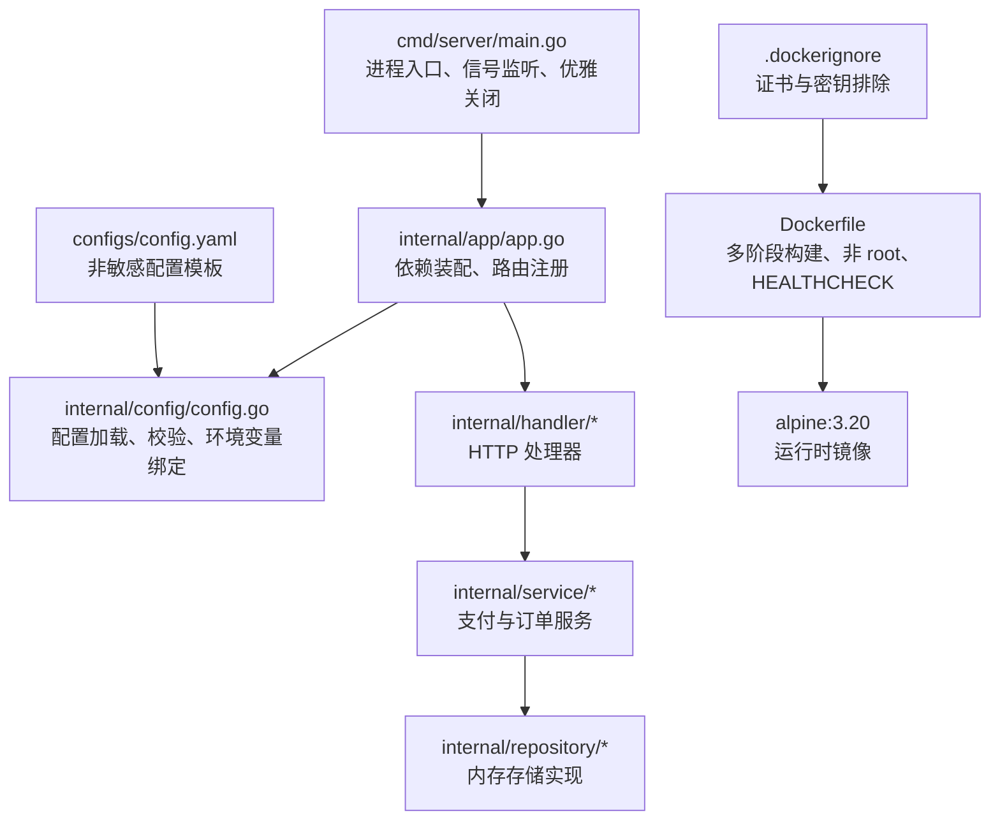
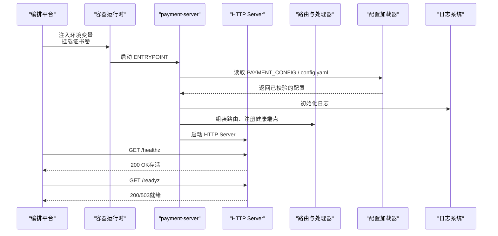
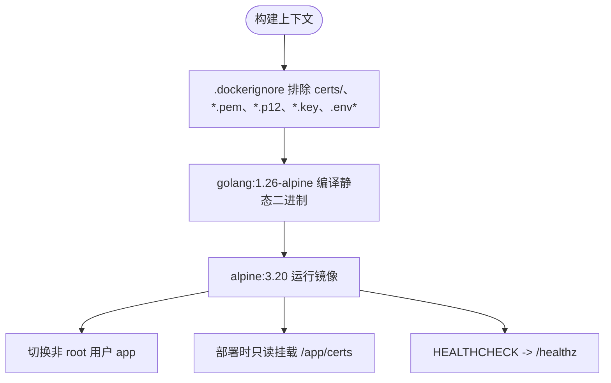
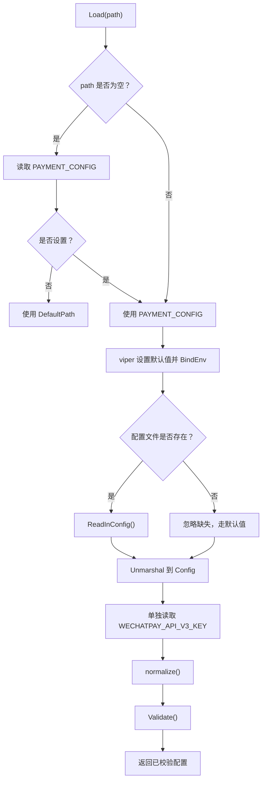
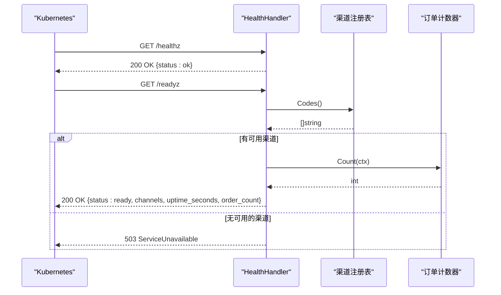
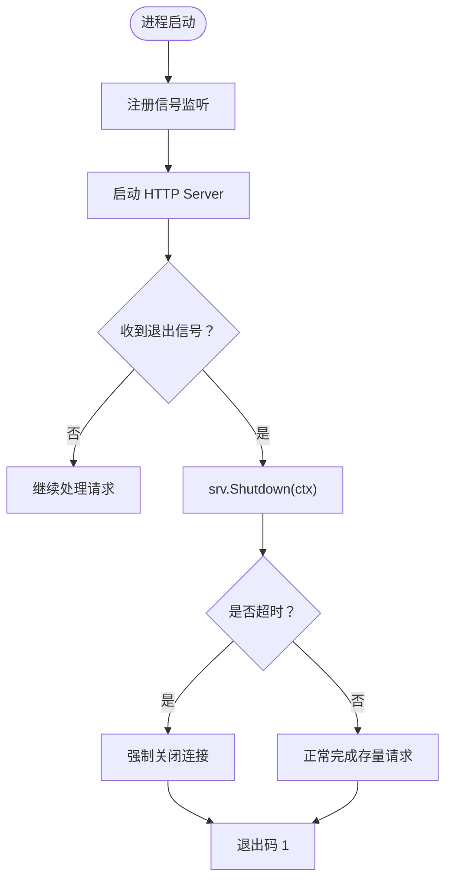
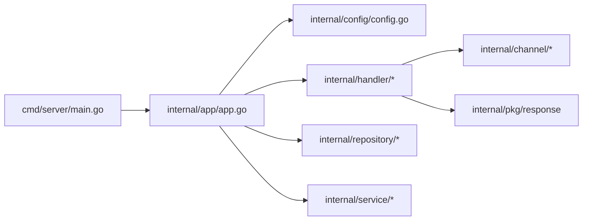

# 部署与运维

<cite>
**本文引用的文件**   
- [Dockerfile](file://Dockerfile)
- [Makefile](file://Makefile)
- [cmd/server/main.go](file://cmd/server/main.go)
- [internal/config/config.go](file://internal/config/config.go)
- [configs/config.yaml](file://configs/config.yaml)
- [internal/app/app.go](file://internal/app/app.go)
- [internal/handler/health.go](file://internal/handler/health.go)
- [.dockerignore](file://.dockerignore)
</cite>

## 目录
1. [引言](#引言)
2. [项目结构](#项目结构)
3. [核心组件](#核心组件)
4. [架构总览](#架构总览)
5. [详细组件分析](#详细组件分析)
6. [依赖关系分析](#依赖关系分析)
7. [性能与容量规划](#性能与容量规划)
8. [故障排查手册](#故障排查手册)
9. [结论](#结论)
10. [附录：环境变量与配置清单](#附录环境变量与配置清单)

## 引言
本文面向生产环境的部署、运维与安全加固，围绕以下目标展开：
- Docker 容器化方案：多阶段构建、非 root 运行、证书只读挂载。
- Makefile 工程化命令：check、build、test、cover、lint 等的使用场景。
- 生产部署指南：环境变量注入、证书管理、健康检查探针、优雅关闭。
- 监控与告警：日志采集、指标暴露、性能监控最佳实践。
- 安全约束：证书三层排除机制与敏感信息保护策略。
- 故障排查：常见问题诊断、日志分析方法、性能问题定位技巧。

## 项目结构
本项目采用 Go 分层架构：入口进程负责生命周期，业务逻辑下沉到 internal 下的 app、config、handler、service、repository 等包；配置文件集中在 configs，镜像构建由 Dockerfile 和 Makefile 驱动。

**图表来源**
- [cmd/server/main.go:31-124](file://cmd/server/main.go#L31-L124)
- [internal/app/app.go:39-106](file://internal/app/app.go#L39-L106)
- [internal/config/config.go:113-154](file://internal/config/config.go#L113-L154)
- [configs/config.yaml:9-60](file://configs/config.yaml#L9-L60)
- [Dockerfile:9-55](file://Dockerfile#L9-L55)
- [.dockerignore:1-38](file://.dockerignore#L1-L38)

**章节来源**
- [cmd/server/main.go:1-125](file://cmd/server/main.go#L1-L125)
- [internal/app/app.go:1-200](file://internal/app/app.go#L1-L200)
- [internal/config/config.go:1-322](file://internal/config/config.go#L1-L322)
- [configs/config.yaml:1-61](file://configs/config.yaml#L1-L61)
- [Dockerfile:1-56](file://Dockerfile#L1-L56)
- [.dockerignore:1-38](file://.dockerignore#L1-L38)

## 核心组件
- 进程入口与优雅关闭：解析启动参数、加载配置、初始化应用、启动 HTTP Server、监听 SIGINT/SIGTERM、在超时内完成优雅关闭。
- 配置系统：支持 YAML 与环境变量双重注入，严格校验模式、端口、超时、回调地址与微信支付凭据；APIv3 密钥仅允许通过环境变量注入。
- 健康检查：/healthz 存活探针不查依赖；/readyz 就绪探针检查渠道注册情况并返回当前订单计数与运行时长。
- 容器镜像：多阶段构建产出静态二进制，运行阶段使用 alpine 基础镜像，非 root 用户运行，内置 /healthz 的 HEALTHCHECK，且明确不将 certs/ 拷贝进镜像层。

**章节来源**
- [cmd/server/main.go:31-124](file://cmd/server/main.go#L31-L124)
- [internal/config/config.go:113-154](file://internal/config/config.go#L113-L154)
- [internal/handler/health.go:36-78](file://internal/handler/health.go#L36-L78)
- [Dockerfile:9-55](file://Dockerfile#L9-L55)

## 架构总览
下图展示从容器编排到应用内部的关键交互：Kubernetes 或 Docker 通过环境变量注入配置，通过卷挂载证书；应用启动后注册路由与健康端点；HTTP Server 接收请求并调用服务层与存储层。

**图表来源**
- [cmd/server/main.go:31-124](file://cmd/server/main.go#L31-L124)
- [internal/config/config.go:113-154](file://internal/config/config.go#L113-L154)
- [internal/handler/health.go:36-78](file://internal/handler/health.go#L36-L78)
- [Dockerfile:49-55](file://Dockerfile#L49-L55)

## 详细组件分析

### Docker 容器化方案
- 多阶段构建：构建阶段使用 golang:1.26-alpine，编译出静态二进制；运行阶段使用 alpine:3.20，不含任何构建工具链，减小攻击面。
- 非 root 运行：创建 app 用户组与用户，以非特权身份运行，降低容器逃逸后的权限风险。
- 证书只读挂载：Dockerfile 刻意不 COPY certs/，证书通过部署时挂载到 /app/certs；.dockerignore 对 certs/、*.pem、*.p12、*.key 进行三层排除，避免私钥进入镜像历史。
- 健康检查：HEALTHCHECK 指向 /healthz，间隔 30s、超时 3s、启动宽限 5s、重试 3 次，避免因外部依赖抖动导致不必要的重启。
- 时区与根证书：安装 ca-certificates 与 tzdata，保证 HTTPS 校验与时区日志正确。

**图表来源**
- [Dockerfile:9-55](file://Dockerfile#L9-L55)
- [.dockerignore:21-30](file://.dockerignore#L21-L30)

**章节来源**
- [Dockerfile:9-55](file://Dockerfile#L9-L55)
- [.dockerignore:1-38](file://.dockerignore#L1-L38)

### Makefile 工程化命令
- help：列出所有可用目标，便于快速了解工程能力。
- fmt / fmt-check：格式化源码与仅检查格式，建议配合 CI 门禁。
- vet：Go 静态检查，发现潜在错误。
- lint：可选的 golangci-lint 检查，未安装时跳过而不报错，适合本地开发环境。
- check：组合 fmt-check + vet + build，作为提交前自检。
- tidy：整理依赖，同步 go.mod 与 go.sum。
- build：编译服务端二进制到 bin/payment-server，启用 -trimpath 与 -s -w 优化体积。
- run：本地前台运行，Ctrl-C 触发优雅关闭。
- test：运行全部测试并开启竞态检测 -race。
- cover：生成 coverage.out 并输出覆盖率摘要。
- clean：清理构建产物与覆盖率文件。
- docker-build：构建容器镜像 payment-server:latest。

使用建议：
- 本地开发：run、test、cover、fmt-check。
- 提交前：check、lint。
- 发布流程：build、docker-build。

**章节来源**
- [Makefile:1-70](file://Makefile#L1-L70)

### 配置与环境变量注入
- 优先级：环境变量 > 配置文件 > 内置默认值。
- 配置文件路径：可通过 PAYMENT_CONFIG 覆盖，否则回退到 configs/config.yaml；若文件不存在则走默认值，确保容器只注入环境变量也能启动。
- 敏感信息保护：WECHATPAY_API_V3_KEY 仅通过环境变量注入，yaml 中无对应字段，从代码层面杜绝密钥落盘。
- 生产模式校验：release 模式下强制回调地址为 https://，并校验证书文件存在性；端口范围、超时、日志格式等均做严格校验。
- 微信支付凭据：证书模式与公钥模式二选一，至少提供一套验签凭据；enabled=false 时跳过微信支付校验，便于骨架阶段使用 mock。

**图表来源**
- [internal/config/config.go:113-154](file://internal/config/config.go#L113-L154)
- [internal/config/config.go:157-216](file://internal/config/config.go#L157-L216)
- [internal/config/config.go:226-321](file://internal/config/config.go#L226-L321)

**章节来源**
- [internal/config/config.go:113-154](file://internal/config/config.go#L113-L154)
- [configs/config.yaml:9-60](file://configs/config.yaml#L9-L60)

### 健康检查与就绪探针
- /healthz：存活探针，只要进程能处理请求即返回成功，不检查数据库、渠道连通性等外部依赖，避免部分不可用被放大为全站重启。
- /readyz：就绪探针，检查渠道注册情况；若无可用渠道返回 503，同时返回已注册渠道名称、运行时长与订单计数，便于编排平台摘流。

**图表来源**
- [internal/handler/health.go:36-78](file://internal/handler/health.go#L36-L78)

**章节来源**
- [internal/handler/health.go:1-79](file://internal/handler/health.go#L1-L79)

### 优雅关闭机制
- 信号监听：在启动 HTTP Server 之前注册 SIGINT/SIGTERM，避免窗口期内到达的信号直接杀死进程。
- 优雅关闭：收到退出信号后，基于配置的 shutdown_timeout 等待存量请求完成；超时则强制断开连接，防止支付回调中断导致掉单。
- 资源释放：应用 Close 方法会 flush 日志缓冲，确保关键日志不丢失。

**图表来源**
- [cmd/server/main.go:61-124](file://cmd/server/main.go#L61-L124)
- [internal/app/app.go:189-199](file://internal/app/app.go#L189-L199)

**章节来源**
- [cmd/server/main.go:61-124](file://cmd/server/main.go#L61-L124)
- [internal/app/app.go:189-199](file://internal/app/app.go#L189-L199)

## 依赖关系分析
- 入口进程依赖 app 装配器，app 装配器依赖 config、channel、handler、logger、repository、router、service。
- 健康处理器依赖渠道注册表与订单计数器接口，避免跨层直接依赖 repository。
- 配置模块依赖 viper，显式 BindEnv，避免自动推导带来的隐蔽行为。

**图表来源**
- [cmd/server/main.go:8-23](file://cmd/server/main.go#L8-L23)
- [internal/app/app.go:14-29](file://internal/app/app.go#L14-L29)
- [internal/handler/health.go:3-13](file://internal/handler/health.go#L3-L13)

**章节来源**
- [cmd/server/main.go:1-125](file://cmd/server/main.go#L1-L125)
- [internal/app/app.go:1-200](file://internal/app/app.go#L1-L200)
- [internal/handler/health.go:1-79](file://internal/handler/health.go#L1-L79)

## 性能与容量规划
- 请求头超时：额外设置 ReadHeaderTimeout 抵御 Slowloris 类慢速攻击，缩短连接占用时间。
- 读写超时：read_timeout 与 write_timeout 需结合业务响应时间与下游依赖延迟调优；支付回调应答体较小，write_timeout 不宜过大。
- 优雅关闭超时：shutdown_timeout 必须小于编排平台的 terminationGracePeriodSeconds，否则优雅关闭形同虚设。
- 日志格式：生产环境建议使用 json 格式，便于结构化采集与检索。
- 镜像体积：CGO_ENABLED=0、-trimpath、-s -w 可显著减小二进制体积，减少镜像传输与启动时间。

[本节为通用指导，不直接分析具体文件]

## 故障排查手册

### 常见问题诊断
- 启动失败：
  - 配置文件缺失：Load 允许缺失，但若需要自定义路径请设置 PAYMENT_CONFIG。
  - 配置校验失败：mode、port、log.format、release 下回调地址非 https、微信支付凭据不完整等都会导致启动失败。
  - 端口占用或权限不足：ListenAndServe 异常退出时会记录错误日志。
- 健康检查异常：
  - /healthz 始终返回 200，除非进程崩溃。
  - /readyz 返回 503 表示没有可用渠道，检查 channels.wechatpay.enabled 与默认渠道是否注册。
- 证书相关：
  - 私钥路径或公钥路径不可读：release 模式下 Validate 会检查文件存在性。
  - APIv3 密钥长度不为 32：环境变量 WECHATPAY_API_V3_KEY 长度校验失败。

**章节来源**
- [internal/config/config.go:226-321](file://internal/config/config.go#L226-L321)
- [internal/handler/health.go:36-78](file://internal/handler/health.go#L36-L78)
- [cmd/server/main.go:89-124](file://cmd/server/main.go#L89-L124)

### 日志分析方法
- 启动日志：关注 server.addr、server.mode、default_channel、shutdown_timeout。
- 优雅关闭日志：收到退出信号后记录 signal 与 shutdown_timeout；超时后会记录强制断开。
- 健康检查：/readyz 返回 channels、uptime_seconds、order_count，用于判断服务就绪状态与负载趋势。

**章节来源**
- [cmd/server/main.go:76-81](file://cmd/server/main.go#L76-L81)
- [cmd/server/main.go:98-123](file://cmd/server/main.go#L98-L123)
- [internal/handler/health.go:67-77](file://internal/handler/health.go#L67-L77)

### 性能问题定位技巧
- 慢请求：检查 read_timeout 与 write_timeout 是否过小导致频繁超时；观察日志中的错误堆栈。
- 连接耗尽：确认 ReadHeaderTimeout 是否合理，避免慢速攻击拖垮连接池。
- 优雅关闭超时：调整 shutdown_timeout 与编排平台 terminationGracePeriodSeconds 的关系，确保存量请求能完成。
- 镜像构建缓存：go mod download 前置利用缓存，减少依赖下载耗时。

**章节来源**
- [cmd/server/main.go:25-29](file://cmd/server/main.go#L25-L29)
- [cmd/server/main.go:102-117](file://cmd/server/main.go#L102-L117)
- [Dockerfile:14-17](file://Dockerfile#L14-L17)

## 结论
本项目的部署与运维设计强调“宁可启动失败，不可带病运行”的原则：
- 容器镜像最小化、非 root 运行、证书只读挂载，降低安全风险。
- 配置校验前置，敏感信息仅通过环境变量注入，避免密钥落盘。
- 健康检查分离存活与就绪，避免外部依赖抖动引发大规模重启。
- 优雅关闭保障支付回调完整性，防止掉单。
- Makefile 提供完整的工程化命令，便于本地开发与 CI 集成。

[本节为总结性内容，不直接分析具体文件]

## 附录：环境变量与配置清单

- 服务器配置
  - PAYMENT_SERVER_MODE：debug/release/test
  - PAYMENT_SERVER_HOST：监听主机
  - PAYMENT_SERVER_PORT：监听端口
  - PAYMENT_SERVER_READ_TIMEOUT：读取超时
  - PAYMENT_SERVER_WRITE_TIMEOUT：写入超时
  - PAYMENT_SERVER_SHUTDOWN_TIMEOUT：优雅关闭超时

- 日志配置
  - PAYMENT_LOG_LEVEL：日志级别
  - PAYMENT_LOG_FORMAT：console/json

- 支付通用配置
  - PAYMENT_DEFAULT_CHANNEL：默认渠道
  - PAYMENT_NOTIFY_BASE_URL：回调域名前缀（release 下必须 https://）
  - PAYMENT_OUT_TRADE_NO_PREFIX：商户订单号前缀
  - PAYMENT_PAYMENT_NO_PREFIX：支付流水号前缀

- 微信支付渠道
  - WECHATPAY_ENABLED：是否启用
  - WECHATPAY_APP_ID：公众号/小程序 AppID
  - WECHATPAY_MCH_ID：商户号
  - WECHATPAY_MCH_CERT_SERIAL_NO：证书序列号（证书模式）
  - WECHATPAY_PRIVATE_KEY_PATH：私钥路径
  - WECHATPAY_PUBLIC_KEY_ID：公钥 ID（公钥模式）
  - WECHATPAY_PUBLIC_KEY_PATH：公钥路径
  - WECHATPAY_NOTIFY_PATH：回调相对路径
  - WECHATPAY_API_V3_KEY：APIv3 密钥（仅环境变量）

- 配置文件路径
  - PAYMENT_CONFIG：自定义配置文件路径，留空则回退到 configs/config.yaml

**章节来源**
- [internal/config/config.go:178-206](file://internal/config/config.go#L178-L206)
- [configs/config.yaml:9-60](file://configs/config.yaml#L9-L60)