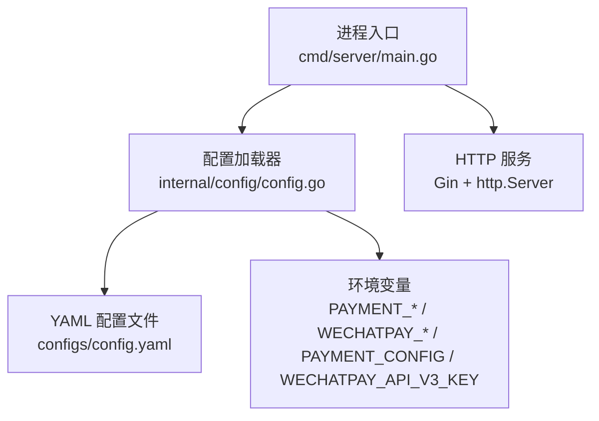
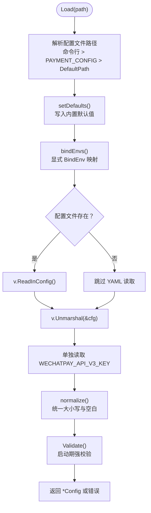
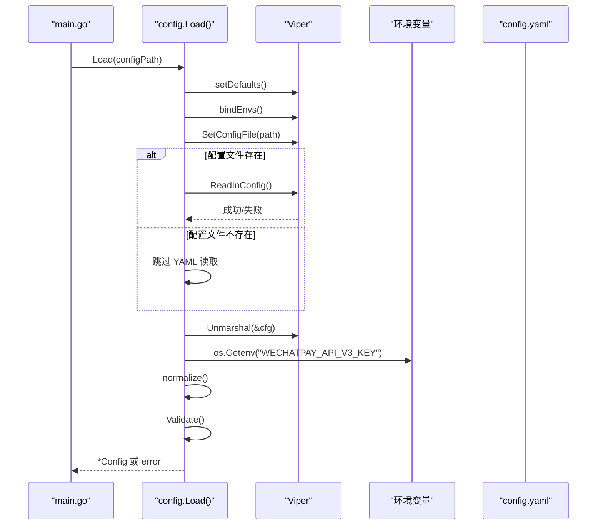
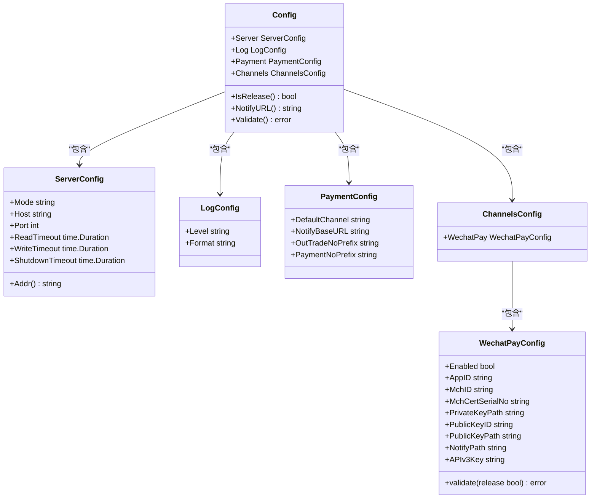

# 配置管理

<cite>
**本文引用的文件**   
- [configs/config.yaml](file://configs/config.yaml)
- [internal/config/config.go](file://internal/config/config.go)
- [cmd/server/main.go](file://cmd/server/main.go)
- [README.md](file://README.md)
</cite>

## 目录
1. [引言](#引言)
2. [项目结构与配置入口](#项目结构与配置入口)
3. [核心组件：Viper 配置加载器](#核心组件viper-配置加载器)
4. [架构总览：配置来源、优先级与安全边界](#架构总览配置来源优先级与安全边界)
5. [详细配置项说明](#详细配置项说明)
6. [生产环境关键配置](#生产环境关键配置)
7. [依赖与调用关系分析](#依赖与调用关系分析)
8. [性能与健壮性考虑](#性能与健壮性考虑)
9. [故障排查指南](#故障排查指南)
10. [配置最佳实践与安全注意事项](#配置最佳实践与安全注意事项)
11. [结论](#结论)

## 引言
本文聚焦支付服务的配置管理体系，围绕 Viper 的配置加载机制、环境变量覆盖策略、显式 `BindEnv` 的安全设计，以及启动期强校验展开。文档同时给出所有配置项的含义、默认值、环境变量映射和校验规则，并重点说明生产环境下的关键约束：`server.mode` 的环境控制、`payment.default_channel` 的渠道切换、以及 `WECHATPAY_API_V3_KEY` 只能通过环境变量注入的安全设计。最后提供配置文件完整示例和安全注意事项，帮助读者在本地开发、测试和生产环境中安全地部署服务。

## 项目结构与配置入口
项目的配置体系由以下部分组成：
- 配置文件模板：`configs/config.yaml`，包含非敏感配置项与注释说明。
- 配置加载器：`internal/config/config.go`，负责默认值、环境变量绑定、解析、归一化与校验。
- 进程入口：`cmd/server/main.go`，负责解析命令行参数、调用配置加载、启动 HTTP 服务与优雅关闭。
- 项目说明：`README.md`，补充了配置优先级、关键项与环境变量约定。

**图表来源**
- [cmd/server/main.go:31-50](file://cmd/server/main.go#L31-L50)
- [internal/config/config.go:113-155](file://internal/config/config.go#L113-L155)
- [configs/config.yaml:1-61](file://configs/config.yaml#L1-L61)

**章节来源**
- [cmd/server/main.go:31-50](file://cmd/server/main.go#L31-L50)
- [internal/config/config.go:113-155](file://internal/config/config.go#L113-L155)
- [configs/config.yaml:1-61](file://configs/config.yaml#L1-L61)
- [README.md:215-238](file://README.md#L215-L238)

## 核心组件：Viper 配置加载器
`internal/config/config.go` 是配置系统的核心实现，承担以下职责：
- 定义配置结构体：`Config`、`ServerConfig`、`LogConfig`、`PaymentConfig`、`ChannelsConfig`、`WechatPayConfig`。
- 设置内置默认值：通过 `setDefaults` 为各配置项提供默认值，保证配置文件缺失时仍可启动。
- 显式绑定环境变量：通过 `bindEnvs` 逐条声明配置键与环境变量的映射，避免 `AutomaticEnv` 的隐蔽行为。
- 加载 YAML 配置：优先使用命令行或环境变量指定的路径；若文件不存在则跳过读取，不报错。
- 单独读取敏感密钥：`WECHATPAY_API_V3_KEY` 直接通过 `os.Getenv` 读取，不经过 Viper，从代码层面杜绝从 YAML 读到密钥的可能。
- 归一化与校验：`normalize` 统一大小写与空白；`Validate` 在启动阶段执行严格校验，确保模式合法、端口有效、回调地址符合生产要求、微信支付凭据齐全。

**图表来源**
- [internal/config/config.go:113-155](file://internal/config/config.go#L113-L155)
- [internal/config/config.go:157-207](file://internal/config/config.go#L157-L207)
- [internal/config/config.go:209-268](file://internal/config/config.go#L209-L268)

**章节来源**
- [internal/config/config.go:39-111](file://internal/config/config.go#L39-L111)
- [internal/config/config.go:113-155](file://internal/config/config.go#L113-L155)
- [internal/config/config.go:157-207](file://internal/config/config.go#L157-L207)
- [internal/config/config.go:209-268](file://internal/config/config.go#L209-L268)

## 架构总览：配置来源、优先级与安全边界
配置来源优先级明确为：**环境变量 > YAML 配置文件 > 代码默认值**。这一顺序由 Viper 的行为决定：先设置默认值，再显式绑定环境变量，最后读取 YAML；当同一键在多个来源出现时，后设置的值会覆盖前者。

安全边界方面：
- 所有密钥类配置（如微信支付 APIv3 密钥）只允许通过环境变量注入，YAML 中不存在对应字段。
- 不使用 `AutomaticEnv`，而是逐条 `BindEnv`，使映射关系可审计、可控。
- 启动期强校验确保非法配置在服务运行前失败，避免“带病上线”。

**图表来源**
- [cmd/server/main.go:45-50](file://cmd/server/main.go#L45-L50)
- [internal/config/config.go:113-155](file://internal/config/config.go#L113-L155)
- [internal/config/config.go:157-207](file://internal/config/config.go#L157-L207)

**章节来源**
- [README.md:215-238](file://README.md#L215-L238)
- [internal/config/config.go:113-155](file://internal/config/config.go#L113-L155)

## 详细配置项说明
本节按模块梳理配置项含义、默认值、环境变量映射与校验规则。为避免泄露敏感信息，文中不展示具体密钥值，仅说明字段用途与约束。

### 服务器配置（server）
| 配置键 | 默认值 | 环境变量 | 含义与约束 |
|---|---|---|---|
| `server.mode` | `debug` | `PAYMENT_SERVER_MODE` | 服务模式：`debug`、`release`、`test`。生产环境应使用 `release`，此时 mock 路由不注册，回调地址必须 HTTPS。 |
| `server.host` | `0.0.0.0` | `PAYMENT_SERVER_HOST` | 监听主机地址。 |
| `server.port` | `8080` | `PAYMENT_SERVER_PORT` | 监听端口，必须在 1-65535 之间。 |
| `server.read_timeout` | `15s` | `PAYMENT_SERVER_READ_TIMEOUT` | 读取整个请求（含 body）的超时，必须大于 0。 |
| `server.write_timeout` | `15s` | `PAYMENT_SERVER_WRITE_TIMEOUT` | 写响应的超时，必须大于 0。 |
| `server.shutdown_timeout` | `10s` | — | 优雅关闭等待时间，必须大于 0；应小于容器编排的 `terminationGracePeriodSeconds`。 |

**章节来源**
- [internal/config/config.go:47-61](file://internal/config/config.go#L47-L61)
- [internal/config/config.go:157-176](file://internal/config/config.go#L157-L176)
- [internal/config/config.go:182-207](file://internal/config/config.go#L182-L207)
- [internal/config/config.go:230-248](file://internal/config/config.go#L230-L248)
- [configs/config.yaml:9-22](file://configs/config.yaml#L9-L22)

### 日志配置（log）
| 配置键 | 默认值 | 环境变量 | 含义与约束 |
|---|---|---|---|
| `log.level` | `info` | `PAYMENT_LOG_LEVEL` | 日志级别：`debug`、`info`、`warn`、`error`。 |
| `log.format` | `console` | `PAYMENT_LOG_FORMAT` | 日志格式：`console` 或 `json`。生产环境推荐 `json`。 |

**章节来源**
- [internal/config/config.go:63-67](file://internal/config/config.go#L63-L67)
- [internal/config/config.go:166-167](file://internal/config/config.go#L166-L167)
- [internal/config/config.go:250-254](file://internal/config/config.go#L250-L254)
- [configs/config.yaml:24-28](file://configs/config.yaml#L24-L28)

### 支付通用配置（payment）
| 配置键 | 默认值 | 环境变量 | 含义与约束 |
|---|---|---|---|
| `payment.default_channel` | `mock` | `PAYMENT_DEFAULT_CHANNEL` | 创建订单时未指定渠道所用的默认值。骨架阶段为 `mock`，接入微信支付后改为 `wechatpay`。 |
| `payment.notify_base_url` | 空字符串 | `PAYMENT_NOTIFY_BASE_URL` | 回调地址域名前缀，必须公网可达且为 HTTPS。生产模式下必须以 `https://` 开头。 |
| `payment.out_trade_no_prefix` | `ORD` | — | 商户订单号前缀。 |
| `payment.payment_no_prefix` | `PAY` | — | 支付流水号前缀。 |

**章节来源**
- [internal/config/config.go:69-79](file://internal/config/config.go#L69-L79)
- [internal/config/config.go:169-172](file://internal/config/config.go#L169-L172)
- [internal/config/config.go:256-265](file://internal/config/config.go#L256-L265)
- [configs/config.yaml:30-40](file://configs/config.yaml#L30-L40)

### 渠道配置（channels.wechatpay）
| 配置键 | 默认值 | 环境变量 | 含义与约束 |
|---|---|---|---|
| `channels.wechatpay.enabled` | `false` | `WECHATPAY_ENABLED` | 是否启用微信支付。骨架阶段保持关闭，仅注册 mock 渠道。 |
| `channels.wechatpay.app_id` | 空字符串 | `WECHATPAY_APP_ID` | 公众号/小程序 AppID，需与商户号完成绑定。 |
| `channels.wechatpay.mch_id` | 空字符串 | `WECHATPAY_MCH_ID` | 商户号。 |
| `channels.wechatpay.mch_cert_serial_no` | 空字符串 | `WECHATPAY_MCH_CERT_SERIAL_NO` | 商户 API 证书序列号（证书模式）。 |
| `channels.wechatpay.private_key_path` | 空字符串 | `WECHATPAY_PRIVATE_KEY_PATH` | 商户私钥文件路径，严禁提交进仓库。 |
| `channels.wechatpay.public_key_id` | 空字符串 | `WECHATPAY_PUBLIC_KEY_ID` | 公钥模式 ID（与证书模式二选一）。 |
| `channels.wechatpay.public_key_path` | 空字符串 | `WECHATPAY_PUBLIC_KEY_PATH` | 公钥模式文件路径（与证书模式二选一）。 |
| `channels.wechatpay.notify_path` | `/api/v1/callbacks/wechatpay` | `WECHATPAY_NOTIFY_PATH` | 回调相对路径，与 `payment.notify_base_url` 拼接成完整回调地址。 |
| `APIv3Key` | 空字符串 | `WECHATPAY_API_V3_KEY` | **仅通过环境变量注入**，长度必须为 32 位。YAML 中无此字段。 |

**章节来源**
- [internal/config/config.go:81-111](file://internal/config/config.go#L81-L111)
- [internal/config/config.go:174-176](file://internal/config/config.go#L174-L176)
- [internal/config/config.go:182-207](file://internal/config/config.go#L182-L207)
- [internal/config/config.go:270-321](file://internal/config/config.go#L270-L321)
- [configs/config.yaml:42-61](file://configs/config.yaml#L42-L61)

## 生产环境关键配置
### server.mode 的环境控制
- 生产环境应设置 `PAYMENT_SERVER_MODE=release`。
- `release` 模式下：
  - Gin 关闭调试输出。
  - 不注册 `/api/v1/mock/*` 调试接口。
  - 强制校验回调地址为 HTTPS。
  - 校验证书文件是否存在（仅在启用微信支付时）。
- 若未启用微信支付且处于 `release` 模式，服务可能因无可用渠道而启动失败，这是有意为之的设计，防止无业务能力的服务上线。

**章节来源**
- [internal/config/config.go:29-34](file://internal/config/config.go#L29-L34)
- [internal/config/config.go:218-224](file://internal/config/config.go#L218-L224)
- [internal/config/config.go:230-268](file://internal/config/config.go#L230-L268)
- [README.md:5-11](file://README.md#L5-L11)

### payment.default_channel 的渠道切换
- 骨架阶段默认值为 `mock`，适合本地联调。
- 接入微信支付后，应将 `PAYMENT_DEFAULT_CHANNEL=wechatpay`，并在 `internal/app/app.go` 中注册微信支付网关实现。
- 切换渠道后，需确保 `channels.wechatpay.enabled=true` 并完成所有凭据配置。

**章节来源**
- [internal/config/config.go:69-79](file://internal/config/config.go#L69-L79)
- [internal/config/config.go:169-172](file://internal/config/config.go#L169-L172)
- [README.md:274-284](file://README.md#L274-L284)

### WECHATPAY_API_V3_KEY 只能通过环境变量注入
- `WECHATPAY_API_V3_KEY` 是唯一不能出现在 YAML 中的配置项。
- 加载逻辑直接使用 `os.Getenv` 读取，不经过 Viper，从代码层面杜绝从配置文件读到密钥的可能。
- 校验阶段检查其长度是否为 32 位，否则启动失败。

**章节来源**
- [internal/config/config.go:25-27](file://internal/config/config.go#L25-L27)
- [internal/config/config.go:146-149](file://internal/config/config.go#L146-L149)
- [internal/config/config.go:289-298](file://internal/config/config.go#L289-L298)
- [configs/config.yaml:60-61](file://configs/config.yaml#L60-L61)

## 依赖与调用关系分析
配置系统的关键依赖关系如下：
- `main.go` 调用 `config.Load` 获取配置对象。
- `config.Load` 依赖 Viper 进行默认值设置、环境变量绑定与 YAML 解析。
- `config.Validate` 依赖 `IsRelease` 判断生产模式，并对回调地址与微信支付凭据进行校验。
- `WechatPayConfig.validate` 根据是否启用微信支付，检查必要字段与文件可读性。

**图表来源**
- [internal/config/config.go:39-111](file://internal/config/config.go#L39-L111)
- [internal/config/config.go:221-224](file://internal/config/config.go#L221-L224)
- [internal/config/config.go:226-268](file://internal/config/config.go#L226-L268)
- [internal/config/config.go:270-321](file://internal/config/config.go#L270-L321)

**章节来源**
- [cmd/server/main.go:45-50](file://cmd/server/main.go#L45-L50)
- [internal/config/config.go:39-111](file://internal/config/config.go#L39-L111)
- [internal/config/config.go:221-268](file://internal/config/config.go#L221-L268)
- [internal/config/config.go:270-321](file://internal/config/config.go#L270-L321)

## 性能与健壮性考虑
- 配置加载发生在进程启动阶段，失败即退出，避免运行时才暴露配置错误。
- `readHeaderTimeout` 在 `main.go` 中单独设置为 10 秒，用于抵御 Slowloris 等慢速攻击，与 `server.read_timeout` 形成互补。
- 优雅关闭使用 `srv.Shutdown` 并配合 `shutdown_timeout`，确保存量请求处理完成后再退出，避免掉单。
- 配置文件缺失不会导致启动失败，因为所有配置都有默认值，且密钥类配置只走环境变量。

**章节来源**
- [cmd/server/main.go:25-29](file://cmd/server/main.go#L25-L29)
- [cmd/server/main.go:61-67](file://cmd/server/main.go#L61-L67)
- [cmd/server/main.go:98-117](file://cmd/server/main.go#L98-L117)
- [internal/config/config.go:113-155](file://internal/config/config.go#L113-L155)

## 故障排查指南
常见配置问题及排查建议：
- **启动时报错 “server.mode 非法”**：检查 `PAYMENT_SERVER_MODE` 或 `server.mode` 是否为 `debug`、`release` 或 `test`。
- **启动时报错 “server.port 非法”**：确认端口在 1-65535 之间，且未被占用。
- **启动时报错 “release 模式下 payment.notify_base_url 必须是 https:// 开头的公网地址”**：生产环境必须配置 HTTPS 回调域名。
- **启动时报错 “微信支付已启用但配置不完整”**：检查 `app_id`、`mch_id`、`private_key_path`、`WECHATPAY_API_V3_KEY` 是否齐全。
- **启动时报错 “APIv3Key 长度必须为 32 位”**：确认 `WECHATPAY_API_V3_KEY` 长度为 32 位。
- **证书文件不可读**：生产环境需挂载证书文件到指定路径，并确保权限正确。

**章节来源**
- [internal/config/config.go:230-268](file://internal/config/config.go#L230-L268)
- [internal/config/config.go:270-321](file://internal/config/config.go#L270-L321)

## 配置最佳实践与安全注意事项
### 敏感信息管理
- 所有密钥（如 `WECHATPAY_API_V3_KEY`、商户私钥路径、证书序列号）只通过环境变量注入，不写入 YAML。
- `certs/` 目录被 `.gitignore`、`.dockerignore`、`Dockerfile` 三层排除，避免密钥进入代码仓库或镜像层。
- 日志中不得打印密钥、证书内容与完整回调报文。

### 不同环境的配置策略
- 本地开发：使用 `server.mode=debug`，默认渠道为 `mock`，无需真实微信配置。
- 测试环境：可开启 `channels.wechatpay.enabled=true`，但回调地址仍需公网可达。
- 生产环境：必须使用 `server.mode=release`，回调地址为 HTTPS，渠道切换为 `wechatpay`，并挂载证书文件。

### 启动期强校验的重要性
- 非法模式、端口、日志格式会在启动阶段立即失败，避免“带病上线”。
- 生产环境下对回调地址与微信支付凭据的校验，能提前发现部署配置错误。
- 宁可启动失败，不可带病运行，是支付系统的基本安全原则。

### 配置文件完整示例
以下为 `configs/config.yaml` 的完整结构说明（不含真实密钥）：
- `server`：服务监听地址、端口、超时与模式。
- `log`：日志级别与格式。
- `payment`：默认渠道、回调域名前缀、订单号与流水号前缀。
- `channels.wechatpay`：微信支付开关、AppID、商户号、证书或公钥模式、回调路径。
- 注意：`api_v3_key` 不在本文件中配置，只能通过环境变量 `WECHATPAY_API_V3_KEY` 注入。

**章节来源**
- [configs/config.yaml:1-61](file://configs/config.yaml#L1-L61)
- [README.md:240-247](file://README.md#L240-L247)

## 结论
本项目的配置管理系统以 Viper 为基础，采用“环境变量 > YAML > 默认值”的优先级策略，并通过显式 `BindEnv` 与启动期强校验确保安全与健壮性。生产环境的关键约束包括：`server.mode` 的环境控制、`payment.default_channel` 的渠道切换、以及 `WECHATPAY_API_V3_KEY` 只能通过环境变量注入。遵循本文的最佳实践与安全注意事项，可有效避免敏感信息泄露、配置错误上线与资金风险。