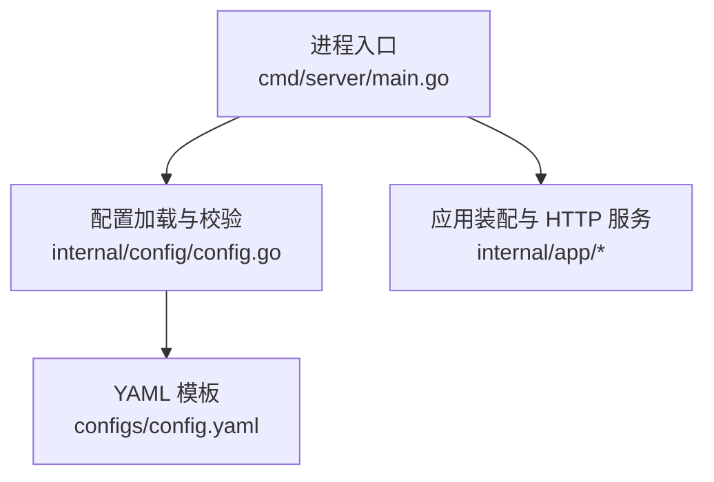
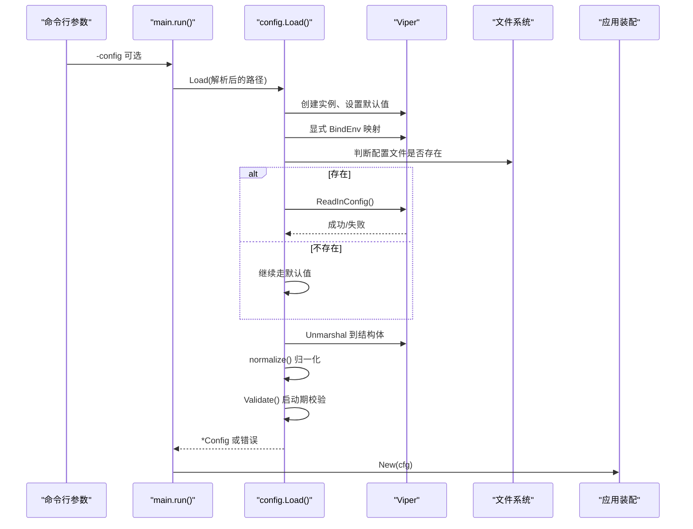
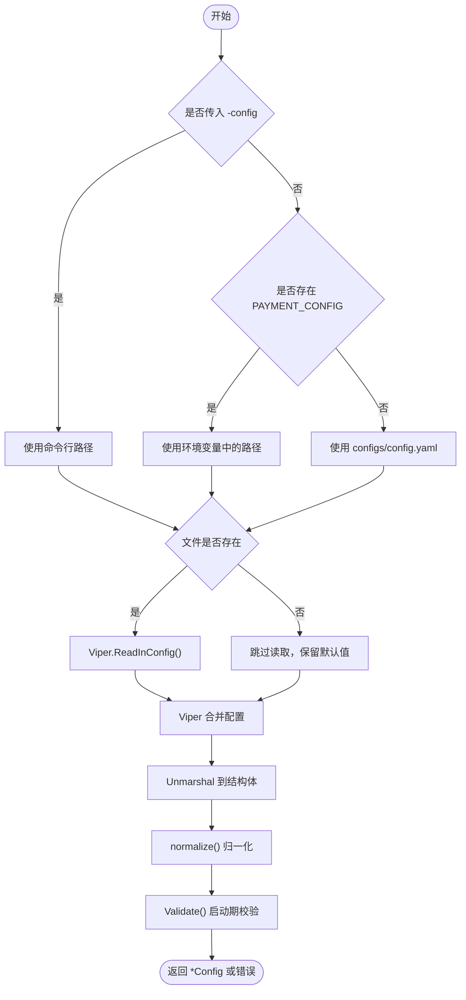
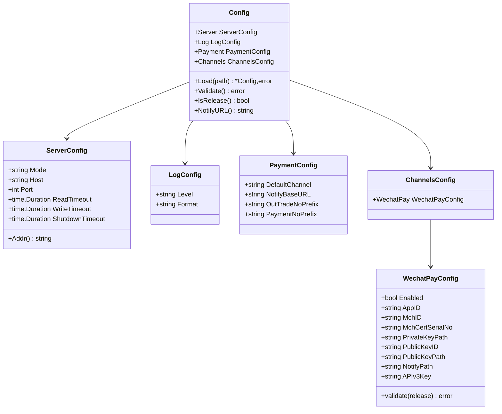
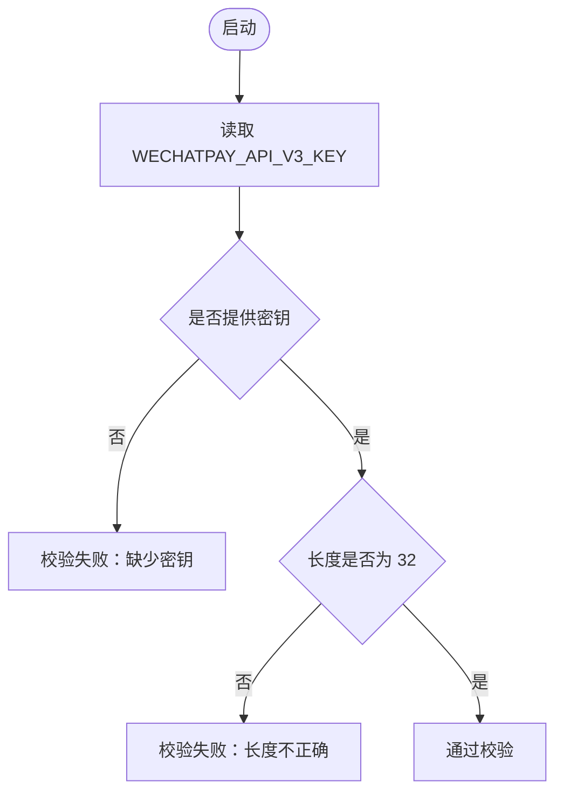
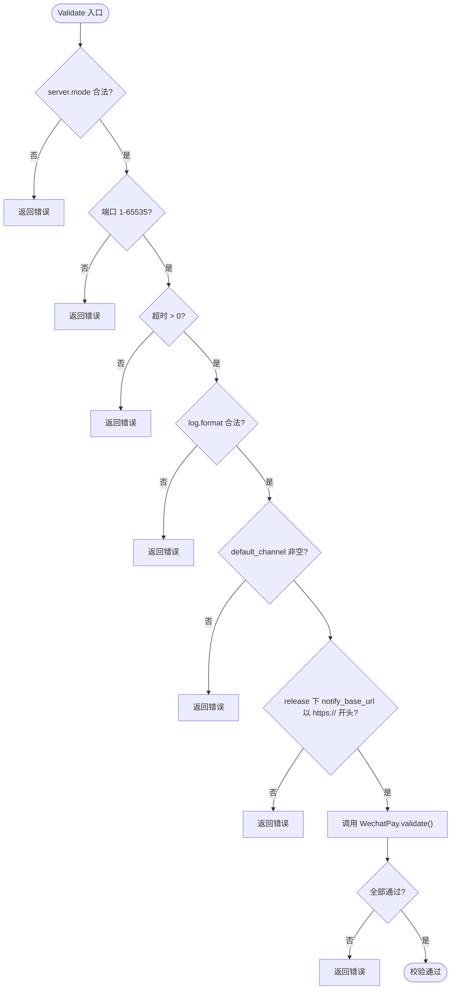
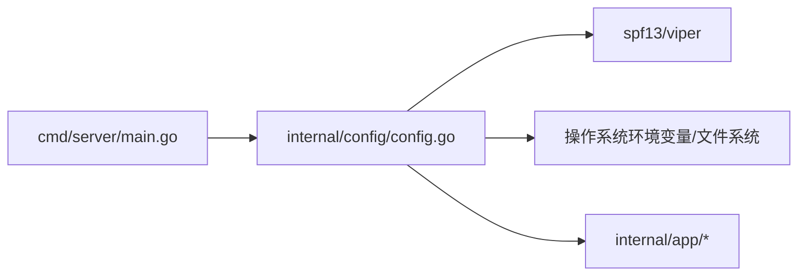

# 配置管理

<cite>
**本文引用的文件**   
- [internal/config/config.go](file://internal/config/config.go)
- [configs/config.yaml](file://configs/config.yaml)
- [cmd/server/main.go](file://cmd/server/main.go)
</cite>

## 目录
1. [简介](#简介)
2. [项目结构](#项目结构)
3. [核心组件](#核心组件)
4. [架构总览](#架构总览)
5. [详细组件分析](#详细组件分析)
6. [依赖关系分析](#依赖关系分析)
7. [性能与行为特征](#性能与行为特征)
8. [故障排查指南](#故障排查指南)
9. [结论](#结论)
10. [附录：配置项清单与环境变量映射](#附录配置项清单与环境变量映射)

## 简介
本文件面向支付服务的配置管理子系统，基于 Viper 实现“环境变量 > YAML 配置文件 > 代码默认值”的优先级模型。文档重点说明：
- 配置加载流程、优先级与环境变量绑定机制；
- 敏感配置（特别是微信支付 APIv3 密钥）的安全设计；
- 启动期配置校验策略；
- 不同环境的配置示例与最佳实践；
- 动态热重载的支持现状与限制。

## 项目结构
配置相关代码集中在 `internal/config`，YAML 模板位于 `configs/config.yaml`，服务入口在 `cmd/server/main.go`。整体组织方式采用分层职责清晰的结构：进程入口负责生命周期，配置模块负责加载与校验，业务层消费已校验的配置对象。

**图表来源**
- [cmd/server/main.go:31-56](file://cmd/server/main.go#L31-L56)
- [internal/config/config.go:113-155](file://internal/config/config.go#L113-L155)
- [configs/config.yaml:1-61](file://configs/config.yaml#L1-L61)

**章节来源**
- [cmd/server/main.go:1-125](file://cmd/server/main.go#L1-L125)
- [internal/config/config.go:1-322](file://internal/config/config.go#L1-L322)
- [configs/config.yaml:1-61](file://configs/config.yaml#L1-L61)

## 核心组件
- 配置结构体：统一描述 Server、Log、Payment、Channels 等配置域。
- 加载器：封装 Viper 初始化、默认值注入、环境变量绑定、YAML 读取、反序列化、归一化与校验。
- 安全约束：APIv3 密钥仅从环境变量注入，不在 YAML 中出现。
- 校验器：在进程启动阶段拦截非法配置，避免带病运行。

**章节来源**
- [internal/config/config.go:39-111](file://internal/config/config.go#L39-L111)
- [internal/config/config.go:113-155](file://internal/config/config.go#L113-L155)
- [internal/config/config.go:226-321](file://internal/config/config.go#L226-L321)

## 架构总览
下图展示配置加载的生命周期：命令行参数决定配置文件路径，Viper 按优先级合并配置，随后进行归一化和严格校验，最终返回给应用使用。

**图表来源**
- [cmd/server/main.go:31-56](file://cmd/server/main.go#L31-L56)
- [internal/config/config.go:113-155](file://internal/config/config.go#L113-L155)

## 详细组件分析

### 配置加载与优先级
- 优先级顺序：环境变量 > YAML 配置文件 > 代码默认值。
- 配置文件路径选择：优先使用 `-config` 传入的路径；为空时尝试环境变量 `PAYMENT_CONFIG`；再为空则使用默认路径 `configs/config.yaml`。
- 配置文件缺失不报错：因为密钥类配置只走环境变量，其余字段均有默认值，允许容器只通过环境变量启动。
- 默认值集中定义在 `setDefaults`，保证最小可用配置即可启动。
- 环境变量通过 `bindEnvs` 显式绑定，避免自动推导带来的不确定性。

**图表来源**
- [internal/config/config.go:113-155](file://internal/config/config.go#L113-L155)
- [internal/config/config.go:157-176](file://internal/config/config.go#L157-L176)
- [internal/config/config.go:178-207](file://internal/config/config.go#L178-L207)

**章节来源**
- [internal/config/config.go:19-27](file://internal/config/config.go#L19-L27)
- [internal/config/config.go:113-155](file://internal/config/config.go#L113-L155)
- [internal/config/config.go:157-176](file://internal/config/config.go#L157-L176)
- [internal/config/config.go:178-207](file://internal/config/config.go#L178-L207)

### bindEnvs 映射机制与显式绑定
- 不使用 `AutomaticEnv`：自动推导规则隐蔽，层级变化可能静默失效，对资金相关配置风险过高。
- 逐条 `BindEnv`：将每个配置键明确映射到一个环境变量名，便于审计和变更影响评估。
- 所有非敏感配置均可被对应环境变量覆盖，避免 YAML 意外覆盖或遗漏。

**图表来源**
- [internal/config/config.go:39-111](file://internal/config/config.go#L39-L111)
- [internal/config/config.go:226-321](file://internal/config/config.go#L226-L321)

**章节来源**
- [internal/config/config.go:178-207](file://internal/config/config.go#L178-L207)

### 敏感配置安全处理：WECHATPAY_API_V3_KEY
- 设计原则：所有密钥类配置只允许通过环境变量注入，不在 YAML 中暴露。
- 实现方式：APIv3 密钥直接从 `os.Getenv("WECHATPAY_API_V3_KEY")` 读取并赋值到结构体字段，不经过 Viper。
- 校验逻辑：启用微信支付时必须提供该密钥，且长度必须为固定位数；否则启动失败。
- 原因：避免密钥被误提交进仓库、日志泄露或被配置中心不当缓存；审计时可一目了然地看到密钥来源。

**图表来源**
- [internal/config/config.go:146-148](file://internal/config/config.go#L146-L148)
- [internal/config/config.go:289-298](file://internal/config/config.go#L289-L298)

**章节来源**
- [internal/config/config.go:25-27](file://internal/config/config.go#L25-L27)
- [internal/config/config.go:146-148](file://internal/config/config.go#L146-L148)
- [internal/config/config.go:289-298](file://internal/config/config.go#L289-L298)

### 启动期配置校验机制
- 模式校验：仅允许 debug/release/test。
- 端口范围：必须在 1-65535。
- 超时参数：读、写、关闭超时必须大于 0。
- 日志格式：仅允许 console/json。
- 默认渠道：不能为空。
- 生产模式回调地址：必须是 HTTPS 开头。
- 微信支付校验：
  - 未启用时跳过；
  - 启用时必须提供 AppID、MchID、私钥路径、APIv3 密钥；
  - APIv3 密钥长度必须为 32；
  - 证书模式与公钥模式二选一；
  - 生产模式下检查密钥文件可读性。

**图表来源**
- [internal/config/config.go:226-268](file://internal/config/config.go#L226-L268)
- [internal/config/config.go:270-321](file://internal/config/config.go#L270-L321)

**章节来源**
- [internal/config/config.go:226-321](file://internal/config/config.go#L226-L321)

### 不同环境配置示例
以下为各环境的推荐配置要点（不直接粘贴具体值，仅给出结构与注意事项）：

- 开发环境
  - server.mode: debug
  - log.level: info 或 debug
  - log.format: console
  - payment.default_channel: mock
  - channels.wechatpay.enabled: false
  - 无需提供 APIv3 密钥与证书文件

- 测试环境
  - server.mode: test
  - log.level: info
  - log.format: console 或 json
  - payment.default_channel: mock 或 wechatpay（视联调需要）
  - channels.wechatpay.enabled: true（如需接入真实沙箱）
  - 提供必要的测试凭据（如沙箱 AppID、商户号），但不提交真实密钥

- 生产环境
  - server.mode: release
  - log.level: info
  - log.format: json
  - payment.notify_base_url: 必须以 https:// 开头且公网可达
  - channels.wechatpay.enabled: true
  - 提供证书模式或公钥模式的完整验签凭据
  - WECHATPAY_API_V3_KEY 仅通过环境变量注入，不得出现在 YAML 中
  - 私钥与公钥文件路径指向部署挂载的真实文件，并确保可读

**章节来源**
- [configs/config.yaml:9-61](file://configs/config.yaml#L9-L61)
- [internal/config/config.go:157-176](file://internal/config/config.go#L157-L176)
- [internal/config/config.go:260-265](file://internal/config/config.go#L260-L265)

### 动态配置热重载
- 当前实现不支持运行时热重载。
- 配置在进程启动时一次性加载、校验并固化到结构体；后续不会监听文件或环境变量变化。
- 若需支持热重载，应引入文件监听与配置版本切换机制，并在切换前完成新配置的校验与原子替换，同时考虑并发访问与状态一致性。

[本节为概念性说明，不直接分析具体文件]

## 依赖关系分析
- main 依赖 config.Load 获取已校验配置；
- config 依赖 Viper 进行配置合并与反序列化；
- config 依赖操作系统环境变量与文件系统；
- config 内部结构体之间存在组合关系，微信支付配置包含独立校验逻辑。

**图表来源**
- [cmd/server/main.go:31-56](file://cmd/server/main.go#L31-L56)
- [internal/config/config.go:113-155](file://internal/config/config.go#L113-L155)

**章节来源**
- [cmd/server/main.go:1-125](file://cmd/server/main.go#L1-L125)
- [internal/config/config.go:1-322](file://internal/config/config.go#L1-L322)

## 性能与行为特征
- 配置加载开销极低：仅在进程启动时执行一次。
- 默认值与显式绑定减少运行时分支判断。
- 启动期校验提前暴露问题，避免请求阶段异常导致的资损风险。
- 优雅关闭由 main 层根据 shutdown_timeout 控制，确保支付回调处理完成。

[本节为通用性能讨论，不直接分析具体文件]

## 故障排查指南
常见启动失败原因及定位方法：
- 配置文件路径错误：检查 `-config`、`PAYMENT_CONFIG` 与默认路径是否正确。
- 环境变量未设置：核对 `bindEnvs` 中各键对应的环境变量是否已注入。
- APIv3 密钥缺失或长度错误：确认 `WECHATPAY_API_V3_KEY` 已设置且长度为 32。
- 生产模式回调地址非 HTTPS：修改 `payment.notify_base_url` 为 HTTPS。
- 微信支付凭据不完整：检查 AppID、MchID、私钥路径、证书序列号或公钥 ID/路径。
- 密钥文件不可读：在生产环境确认证书文件路径正确且权限允许读取。

**章节来源**
- [internal/config/config.go:113-155](file://internal/config/config.go#L113-L155)
- [internal/config/config.go:226-321](file://internal/config/config.go#L226-L321)

## 结论
该配置系统通过 Viper 实现了清晰的优先级模型与严格的启动期校验，结合显式环境变量绑定与密钥隔离策略，有效降低配置错误与敏感信息泄露的风险。建议在生产环境中坚持“密钥不入仓、回调必 HTTPS、凭据完备、文件可读写”的原则，并通过 CI 与部署平台统一管理环境变量与证书文件。

[本节为总结性内容，不直接分析具体文件]

## 附录：配置项清单与环境变量映射
以下列出主要配置项、默认值、环境变量名与关键验证规则（不包含敏感值）。

- server.mode
  - 类型：字符串
  - 默认值：debug
  - 环境变量：PAYMENT_SERVER_MODE
  - 校验：仅允许 debug/release/test

- server.host
  - 类型：字符串
  - 默认值：0.0.0.0
  - 环境变量：PAYMENT_SERVER_HOST

- server.port
  - 类型：整数
  - 默认值：8080
  - 环境变量：PAYMENT_SERVER_PORT
  - 校验：1-65535

- server.read_timeout
  - 类型：Go duration 字符串
  - 默认值：15s
  - 环境变量：PAYMENT_SERVER_READ_TIMEOUT
  - 校验：必须大于 0

- server.write_timeout
  - 类型：Go duration 字符串
  - 默认值：15s
  - 环境变量：PAYMENT_SERVER_WRITE_TIMEOUT
  - 校验：必须大于 0

- server.shutdown_timeout
  - 类型：Go duration 字符串
  - 默认值：10s
  - 环境变量：PAYMENT_SERVER_SHUTDOWN_TIMEOUT
  - 校验：必须大于 0

- log.level
  - 类型：字符串
  - 默认值：info
  - 环境变量：PAYMENT_LOG_LEVEL

- log.format
  - 类型：字符串
  - 默认值：console
  - 环境变量：PAYMENT_LOG_FORMAT
  - 校验：仅允许 console/json

- payment.default_channel
  - 类型：字符串
  - 默认值：mock
  - 环境变量：PAYMENT_DEFAULT_CHANNEL
  - 校验：不能为空

- payment.notify_base_url
  - 类型：字符串
  - 默认值：空
  - 环境变量：PAYMENT_NOTIFY_BASE_URL
  - 校验：release 模式下必须以 https:// 开头

- payment.out_trade_no_prefix
  - 类型：字符串
  - 默认值：ORD
  - 环境变量：无（可通过 YAML 或代码默认值）

- payment.payment_no_prefix
  - 类型：字符串
  - 默认值：PAY
  - 环境变量：无（可通过 YAML 或代码默认值）

- channels.wechatpay.enabled
  - 类型：布尔
  - 默认值：false
  - 环境变量：WECHATPAY_ENABLED

- channels.wechatpay.app_id
  - 类型：字符串
  - 默认值：空
  - 环境变量：WECHATPAY_APP_ID
  - 校验：启用时必须非空

- channels.wechatpay.mch_id
  - 类型：字符串
  - 默认值：空
  - 环境变量：WECHATPAY_MCH_ID
  - 校验：启用时必须非空

- channels.wechatpay.mch_cert_serial_no
  - 类型：字符串
  - 默认值：空
  - 环境变量：WECHATPAY_MCH_CERT_SERIAL_NO
  - 校验：证书模式时需填写

- channels.wechatpay.private_key_path
  - 类型：字符串
  - 默认值：空
  - 环境变量：WECHATPAY_PRIVATE_KEY_PATH
  - 校验：启用时必须非空；生产模式需文件可读

- channels.wechatpay.public_key_id
  - 类型：字符串
  - 默认值：空
  - 环境变量：WECHATPAY_PUBLIC_KEY_ID
  - 校验：公钥模式时需与 public_key_path 一起填写

- channels.wechatpay.public_key_path
  - 类型：字符串
  - 默认值：空
  - 环境变量：WECHATPAY_PUBLIC_KEY_PATH
  - 校验：公钥模式时需与 public_key_id 一起填写；生产模式需文件可读

- channels.wechatpay.notify_path
  - 类型：字符串
  - 默认值：/api/v1/callbacks/wechatpay
  - 环境变量：WECHATPAY_NOTIFY_PATH

- channels.wechatpay.api_v3_key
  - 类型：字符串
  - 默认值：空
  - 环境变量：WECHATPAY_API_V3_KEY
  - 校验：启用时必须提供且长度为 32；仅从环境变量注入，不出现在 YAML

**章节来源**
- [internal/config/config.go:157-176](file://internal/config/config.go#L157-L176)
- [internal/config/config.go:178-207](file://internal/config/config.go#L178-L207)
- [internal/config/config.go:226-321](file://internal/config/config.go#L226-L321)
- [configs/config.yaml:9-61](file://configs/config.yaml#L9-L61)