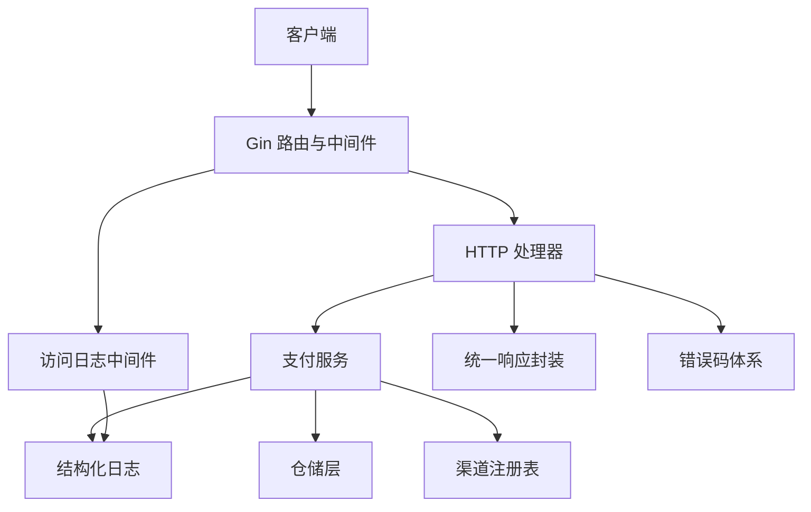
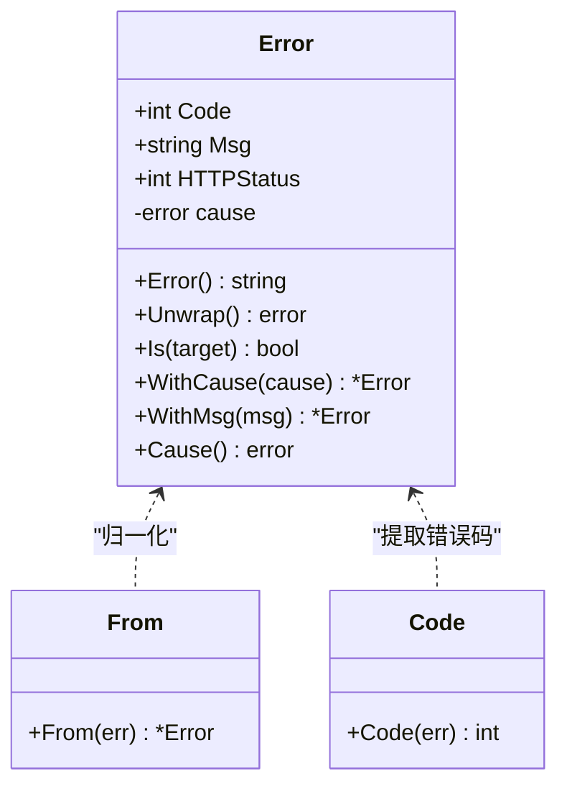
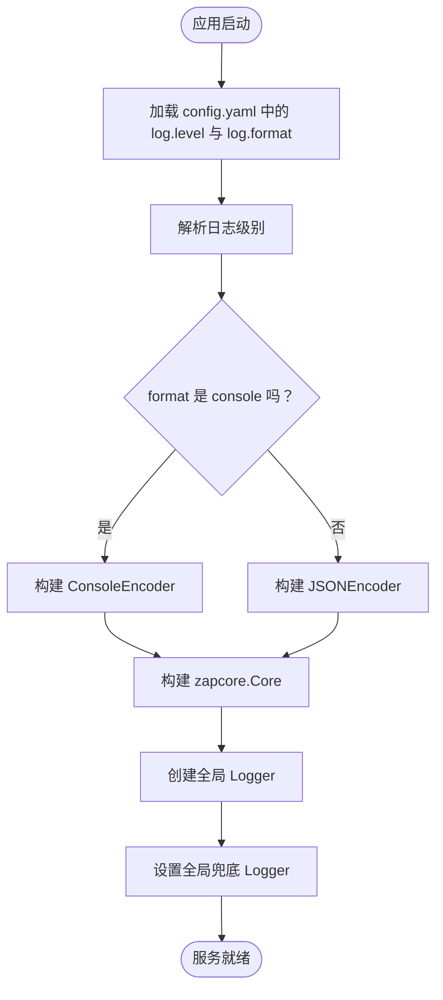
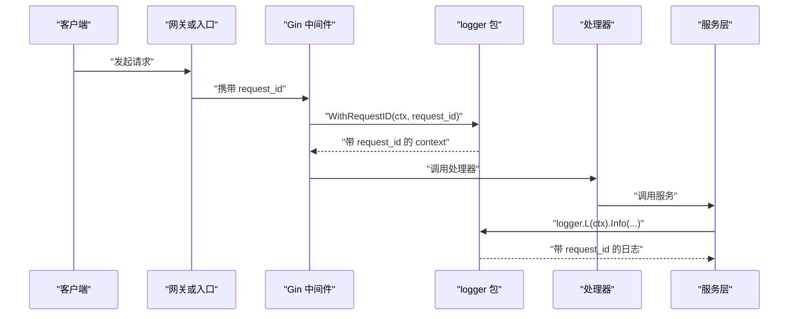
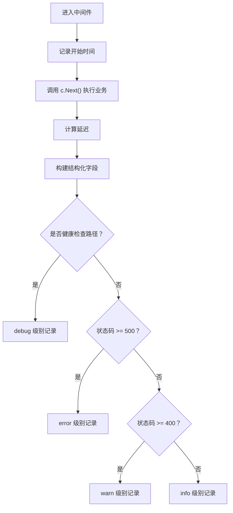
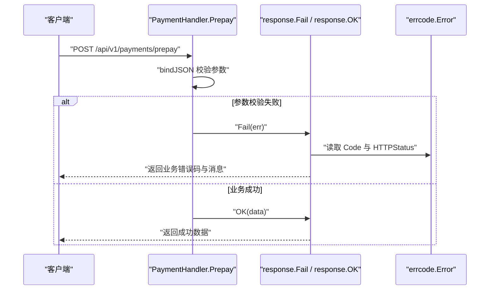
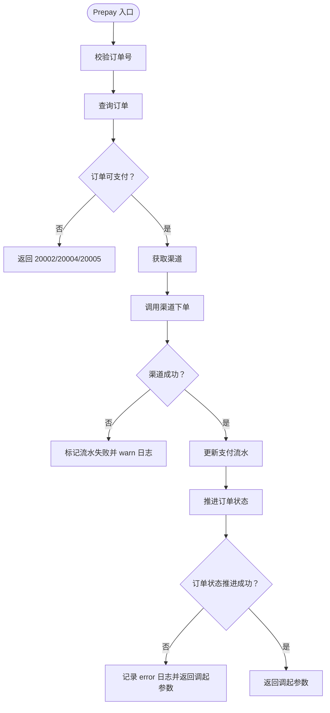
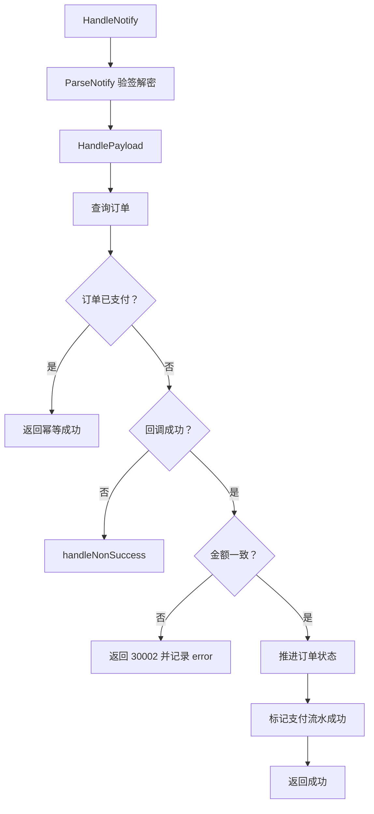
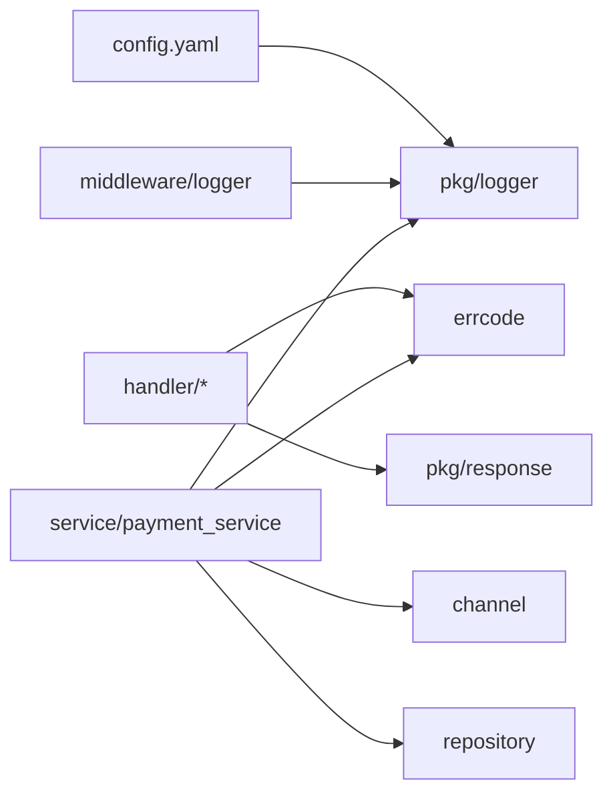

# 错误处理与日志

<cite>
**本文引用的文件**   
- [errcode.go](file://internal/errcode/errcode.go)
- [logger.go](file://internal/pkg/logger/logger.go)
- [logger.go](file://internal/middleware/logger.go)
- [handler.go](file://internal/handler/handler.go)
- [callback_handler.go](file://internal/handler/callback_handler.go)
- [payment_handler.go](file://internal/handler/payment_handler.go)
- [payment_service.go](file://internal/service/payment_service.go)
- [config.yaml](file://configs/config.yaml)
</cite>

## 目录
1. [引言](#引言)
2. [项目结构中与错误和日志相关的模块](#项目结构中与错误和日志相关的模块)
3. [统一错误码体系](#统一错误码体系)
4. [错误码与 HTTP 状态码的对应关系](#错误码与-http-状态码的对应关系)
5. [客户端如何根据 code 分支处理](#客户端如何根据-code-分支处理)
6. [结构化日志系统](#结构化日志系统)
7. [中间件层的错误处理与访问日志](#中间件层的错误处理与访问日志)
8. [关键流程中的错误与日志行为](#关键流程中的错误与日志行为)
9. [依赖关系分析](#依赖关系分析)
10. [性能与可观测性建议](#性能与可观测性建议)
11. [故障排查指南](#故障排查指南)
12. [结论](#结论)

## 引言
本文面向支付服务的开发者、测试人员和运维人员，系统化说明本项目的错误处理与日志体系。重点包括：
- 业务错误码、支付相关错误码、渠道相关错误码的分类与含义。
- 错误码与 HTTP 状态码的映射关系。
- 客户端应如何根据返回的 `code` 做分支处理。
- 基于 Zap 的结构化日志配置、`request_id` 全链路追踪机制、日志级别使用规范。
- 中间件层对异常捕获、访问日志和统一响应体的作用。
- 面向生产环境的日志分析方法与常见故障定位技巧。

## 项目结构中与错误和日志相关的模块
本项目将错误定义、日志封装、HTTP 接入层、服务层和中间件分层组织：
- `internal/errcode`：集中定义业务错误码、HTTP 状态码映射、错误包装与归一化工具。
- `internal/pkg/logger`：基于 Zap 的日志封装，提供全局 Logger、请求级 `request_id` 注入、结构化字段导出。
- `internal/middleware/logger.go`：Gin 访问日志中间件，替代默认彩色文本输出，输出结构化访问日志。
- `internal/handler`：HTTP 接入层，负责参数绑定、校验、调用服务层，并通过统一响应体返回结果。
- `internal/service/payment_service.go`：支付核心业务逻辑，包含下单、回调处理、状态查询与主动查单兜底。
- `configs/config.yaml`：日志级别、格式等运行期配置。

**图表来源**
- [logger.go:34-76](file://internal/middleware/logger.go#L34-L76)
- [handler.go:29-55](file://internal/handler/handler.go#L29-L55)
- [payment_service.go:99-226](file://internal/service/payment_service.go#L99-L226)
- [errcode.go:20-76](file://internal/errcode/errcode.go#L20-L76)

**章节来源**
- [errcode.go:1-12](file://internal/errcode/errcode.go#L1-L12)
- [logger.go:1-9](file://internal/pkg/logger/logger.go#L1-L9)
- [logger.go:25-34](file://internal/middleware/logger.go#L25-L34)
- [config.yaml:24-28](file://configs/config.yaml#L24-L28)

## 统一错误码体系
错误码采用分段设计，便于按领域快速定位问题：
- `0`：成功。
- `10xxx`：通用错误，如参数不合法、请求无法解析、资源不存在、内部错误、不支持的操作、方法不允许。
- `20xxx`：订单相关错误。
- `30xxx`：支付相关错误。
- `40xxx`：支付渠道相关错误。

### 业务错误码（20001-20005）
| 错误码 | 含义 | 典型场景 |
|---|---|---|
| 20001 | 订单不存在 | 查询或操作一个不存在的商户订单号。 |
| 20002 | 订单当前状态不允许执行该操作 | 在非法状态下发起支付、关闭、退款等操作。 |
| 20003 | 订单金额不合法 | 金额为非正数、超过上限、精度超限等。 |
| 20004 | 订单已关闭 | 用户关闭订单后仍尝试支付。 |
| 20005 | 订单已支付 | 重复发起支付，订单已经处于已支付状态。 |

这些错误码用于区分“找不到订单”“状态机不允许流转”“金额校验失败”“订单已关闭”“重复支付”等不同语义，避免把多种订单问题笼统返回成同一个错误。

**章节来源**
- [errcode.go:98-110](file://internal/errcode/errcode.go#L98-L110)
- [payment_service.go:228-244](file://internal/service/payment_service.go#L228-L244)

### 支付相关错误码（30001-30004）
| 错误码 | 含义 | 典型场景 |
|---|---|---|
| 30001 | 支付流水不存在 | 订单存在但找不到对应的支付记录。 |
| 30002 | 支付金额与订单金额不一致 | 回调金额与本地订单金额不同，属于资金安全事件。 |
| 30003 | 缺少支付者 openid | JSAPI 交易必须提供 openid。 |
| 30004 | 支付渠道未启用 | 渠道未在配置中启用。 |

其中 30002 是高风险错误，通常意味着篡改、串单或严重配置问题；30003 是前端或授权流程缺失导致的参数错误。

**章节来源**
- [errcode.go:112-122](file://internal/errcode/errcode.go#L112-L122)
- [payment_service.go:141-145](file://internal/service/payment_service.go#L141-L145)
- [payment_service.go:320-333](file://internal/service/payment_service.go#L320-L333)
- [payment_service.go:463-470](file://internal/service/payment_service.go#L463-L470)

### 渠道相关错误码（40001-40004）
| 错误码 | 含义 | 典型场景 |
|---|---|---|
| 40001 | 支付渠道未注册 | 请求的渠道没有对应实现。 |
| 40002 | 支付渠道调用失败 | 网络、超时、渠道返回错误等。 |
| 40003 | 支付回调校验失败 | 验签或解密失败。 |
| 40004 | 支付渠道功能未实现 | 渠道方法尚未实现，例如 mock 渠道退款。 |

这类错误通常由渠道网关、SDK 或外部依赖引起，上层一般不应直接暴露底层细节，而应通过统一错误码 + 结构化日志对外呈现稳定语义。

**章节来源**
- [errcode.go:124-134](file://internal/errcode/errcode.go#L124-L134)

### 错误类型与工具方法
`errcode.Error` 是一个带业务语义的错误类型，包含：
- `Code`：业务错误码。
- `Msg`：对外暴露的消息文案。
- `HTTPStatus`：对应的 HTTP 状态码。
- `cause`：底层原因，仅用于日志和调试，不直接暴露给客户端。

常用工具方法：
- `WithCause`：复制错误并挂上底层原因，避免并发修改共享错误变量。
- `WithMsg`：复制错误并替换对外消息，用于补充上下文。
- `From`：把任意 error 归一为 `*Error`，非业务错误统一映射为内部错误并保留原始原因。
- `Code`：从任意 error 中提取业务错误码，nil 错误返回 0。

**图表来源**
- [errcode.go:20-76](file://internal/errcode/errcode.go#L20-L76)
- [errcode.go:136-157](file://internal/errcode/errcode.go#L136-L157)

**章节来源**
- [errcode.go:20-76](file://internal/errcode/errcode.go#L20-L76)
- [errcode.go:136-157](file://internal/errcode/errcode.go#L136-L157)

## 错误码与 HTTP 状态码的对应关系
每个业务错误码都绑定一个 HTTP 状态码，使客户端既能拿到业务语义，也能按 HTTP 语义做基础分流：

| 错误码范围 | 示例错误码 | HTTP 状态码 | 语义说明 |
|---|---|---|---|
| 10xxx | 10001、10002 | 400 | 参数不合法、请求无法解析。 |
| 10xxx | 10003 | 404 | 资源不存在。 |
| 10xxx | 10004 | 500 | 服务内部错误。 |
| 10xxx | 10005 | 403 | 当前环境不支持该操作。 |
| 10xxx | 10006 | 405 | 请求方法不被允许。 |
| 20xxx | 20001 | 404 | 订单不存在。 |
| 20xxx | 20002、20004、20005 | 409 | 订单状态冲突，如不允许操作、已关闭、已支付。 |
| 20xxx | 20003 | 400 | 订单金额不合法。 |
| 30xxx | 30001 | 404 | 支付记录不存在。 |
| 30xxx | 30002、30003、30004 | 400 | 金额不一致、缺少 openid、渠道未启用。 |
| 40xxx | 40001 | 500 | 渠道未注册。 |
| 40xxx | 40002 | 502 | 渠道调用失败。 |
| 40xxx | 40003 | 400 | 回调校验失败。 |
| 40xxx | 40004 | 501 | 渠道功能未实现。 |

注意：
- 业务错误码不是 HTTP 状态码本身，而是更细粒度的业务分类。
- 同一 HTTP 状态码下可能对应多个业务错误码，例如 409 可能表示“订单状态不允许操作”“订单已关闭”或“订单已支付”。
- 渠道回调接口有独立应答约定，不走统一响应体，详见回调处理器部分。

**章节来源**
- [errcode.go:78-96](file://internal/errcode/errcode.go#L78-L96)
- [errcode.go:98-134](file://internal/errcode/errcode.go#L98-L134)

## 客户端如何根据 code 分支处理
客户端应优先根据 HTTP 状态码做粗粒度判断，再根据业务 `code` 做精细分支：

1. **HTTP 2xx**：请求成功，继续读取业务数据。
2. **HTTP 4xx**：通常是客户端问题，应提示用户修正输入、检查参数、确认订单状态。
   - 若 `code` 为 10001、10002、20003、30002、30003、30004、40003，应提示具体参数或配置问题。
   - 若 `code` 为 20004、20005，应引导用户查看订单是否已关闭或已支付。
3. **HTTP 404**：资源不存在，可能是订单号或支付流水号无效。
4. **HTTP 405**：请求方法不被允许，应检查接口路径与方法。
5. **HTTP 409**：状态冲突，应提示用户刷新订单状态或重新进入收银台。
6. **HTTP 5xx**：服务端或渠道异常，应提示稍后重试，不要立即让用户重复下单。
   - 若 `code` 为 40002，通常是渠道侧临时失败，适合重试。
   - 若 `code` 为 40001、40004，通常是平台配置或能力缺失，应提示联系运营或升级。
7. **渠道回调接口**：不使用本服务的统一响应体，而是按渠道规范返回 `SUCCESS` 或 `FAIL`。

推荐分支策略：
- 先判断 HTTP 状态码是否为 2xx。
- 若非 2xx，再判断 `code` 是否属于可重试错误。
- 对于金额不一致、验签失败等安全类错误，不应自动重试，应告警并人工介入。
- 对于“订单已支付”“订单已关闭”，应跳转到结果页或引导重新下单，而不是无限重试。

**章节来源**
- [errcode.go:78-134](file://internal/errcode/errcode.go#L78-L134)
- [callback_handler.go:14-26](file://internal/handler/callback_handler.go#L14-L26)

## 结构化日志系统
日志系统基于 Zap，提供两个核心能力：
- 按配置构造 Logger，支持日志级别和 console/json 两种编码。
- 通过 context 传递 `request_id`，让一次请求的所有日志可串联。

### 日志配置
配置文件位于 `configs/config.yaml`，关键字段：
- `log.level`：可选 `debug`、`info`、`warn`、`error`。
- `log.format`：可选 `console`、`json`。生产环境建议使用 `json`，便于日志采集系统解析结构化字段。

Zap 配置特点：
- 时间使用 ISO8601 格式。
- 级别使用小写。
- 输出到标准错误流，容器环境下由运行时收集 stdout/stderr。
- panic 及以上级别附带堆栈，便于定位支付流程中的异常中断。
- 进程退出前需调用 Sync，避免最后几条日志丢失。

**图表来源**
- [logger.go:36-93](file://internal/pkg/logger/logger.go#L36-L93)
- [config.yaml:24-28](file://configs/config.yaml#L24-L28)

**章节来源**
- [logger.go:36-93](file://internal/pkg/logger/logger.go#L36-L93)
- [logger.go:101-119](file://internal/pkg/logger/logger.go#L101-L119)
- [logger.go:172-182](file://internal/pkg/logger/logger.go#L172-L182)
- [config.yaml:24-28](file://configs/config.yaml#L24-L28)

### request_id 全链路追踪机制
`request_id` 是排查跨层问题的关键标识：
- 中间件或上游网关应为每次请求生成唯一 `request_id`。
- 通过 `logger.WithRequestID(ctx, requestID)` 注入到 context。
- 业务代码通过 `logger.L(ctx)` 获取带 `request_id` 的 Logger。
- 所有后续日志都会携带相同 `request_id`，便于在日志系统中聚合一次请求的完整轨迹。

**图表来源**
- [logger.go:121-154](file://internal/pkg/logger/logger.go#L121-L154)

**章节来源**
- [logger.go:121-154](file://internal/pkg/logger/logger.go#L121-L154)

### 日志级别使用规范
- **Debug**：仅用于开发调试、详细流程跟踪，生产环境默认关闭。
- **Info**：正常业务流程的关键节点，如发起支付成功、回调处理完成。
- **Warn**：可恢复异常或需要关注的情况，如渠道下单失败、主动查单失败、幂等命中。
- **Error**：不可恢复异常、资金安全事件、需要人工介入的问题，如金额不一致、验签失败。
- **Panic**：程序崩溃，Zap 会附带堆栈。

建议：
- 不要在 handler 层打印过多 debug 日志，避免污染主流程。
- 不要把敏感信息直接写入日志，如完整请求体、加密报文、openid、私钥。
- 对高频健康检查探针单独降级为 debug，避免淹没真实业务日志。

**章节来源**
- [logger.go:36-42](file://internal/pkg/logger/logger.go#L36-L42)
- [logger.go:88-92](file://internal/pkg/logger/logger.go#L88-L92)
- [logger.go:101-119](file://internal/pkg/logger/logger.go#L101-L119)
- [logger.go:172-182](file://internal/pkg/logger/logger.go#L172-L182)

## 中间件层的错误处理与访问日志
### 访问日志中间件
中间件 `middleware.Logger()` 替代 Gin 默认的彩色文本日志，输出结构化访问日志，记录：
- HTTP 状态码。
- 请求方法。
- 路径。
- 延迟。
- 客户端 IP。
- 用户代理（截断）。
- 查询参数。
- 路由模板。
- Gin 错误列表。

健康检查路径 `/healthz`、`/readyz` 被识别为探针路径，日志级别降级为 debug，避免 K8s 频繁探测淹没业务日志。

**图表来源**
- [logger.go:34-76](file://internal/middleware/logger.go#L34-L76)

**章节来源**
- [logger.go:13-33](file://internal/middleware/logger.go#L13-L33)
- [logger.go:34-76](file://internal/middleware/logger.go#L34-L76)
- [logger.go:79-89](file://internal/middleware/logger.go#L79-L89)

### 统一响应体封装
HTTP 处理器通过 `response.Fail(c, err)` 和 `response.OK(c, data)` 返回统一响应体。虽然 `pkg/response` 的具体实现文件在当前仓库结构中为空，但从调用方式可以明确其职责：
- `response.Fail`：接收 `errcode.Error`，将其转换为 HTTP 状态码和业务错误码。
- `response.OK`：封装成功数据。
- 渠道回调接口不走统一响应体，而是按渠道规范返回 `SUCCESS` 或 `FAIL`。

**图表来源**
- [payment_handler.go:32-51](file://internal/handler/payment_handler.go#L32-L51)
- [handler.go:29-55](file://internal/handler/handler.go#L29-L55)

**章节来源**
- [payment_handler.go:32-51](file://internal/handler/payment_handler.go#L32-L51)
- [handler.go:29-55](file://internal/handler/handler.go#L29-L55)

## 关键流程中的错误与日志行为
### 发起支付流程
发起支付时，服务层会：
1. 校验订单号。
2. 查询订单。
3. 校验订单是否可支付。
4. 选择渠道并调用渠道下单。
5. 更新支付流水状态。
6. 推进订单状态。
7. 返回前端调起支付所需参数。

关键错误点：
- 订单不可支付：返回 20002、20004、20005。
- JSAPI 缺少 openid：返回 30003。
- 渠道下单失败：记录 warn 日志，流水标记失败。
- 订单状态推进失败：记录 error 日志，但仍返回调起参数，由回调兜底。

**图表来源**
- [payment_service.go:99-226](file://internal/service/payment_service.go#L99-L226)

**章节来源**
- [payment_service.go:99-226](file://internal/service/payment_service.go#L99-L226)

### 渠道回调处理流程
渠道回调处理分为：
1. 解析渠道通知。
2. 查找订单。
3. 幂等判断：已支付订单直接返回成功。
4. 非成功状态：关闭订单或标记流水失败。
5. 成功状态：校验金额。
6. 金额一致：推进订单和流水状态。
7. 金额不一致：返回 30002，触发告警。

**图表来源**
- [payment_service.go:258-379](file://internal/service/payment_service.go#L258-L379)
- [callback_handler.go:55-86](file://internal/handler/callback_handler.go#L55-L86)

**章节来源**
- [payment_service.go:258-379](file://internal/service/payment_service.go#L258-L379)
- [callback_handler.go:55-86](file://internal/handler/callback_handler.go#L55-L86)

### 参数绑定与校验
handler 层将三类失败区分开：
- 请求体为空或 JSON 语法错误：返回 10002。
- 字段类型不匹配：返回 10002。
- 校验规则不通过：返回 10001，并带上可读的中文提示。

这有助于前端给出有效提示，而不是笼统返回“参数错误”。

**章节来源**
- [handler.go:29-55](file://internal/handler/handler.go#L29-L55)
- [handler.go:57-98](file://internal/handler/handler.go#L57-L98)
- [handler.go:100-129](file://internal/handler/handler.go#L100-L129)

## 依赖关系分析
错误处理与日志系统的依赖关系如下：
- handler 依赖 `errcode` 和 `response`。
- service 依赖 `errcode`、`logger`、`channel`、`repository`。
- middleware 依赖 `logger`。
- logger 包提供全局 Logger 和 `request_id` 注入。
- config.yaml 控制日志级别和格式。

**图表来源**
- [errcode.go:1-12](file://internal/errcode/errcode.go#L1-L12)
- [logger.go:1-9](file://internal/pkg/logger/logger.go#L1-L9)
- [logger.go:34-76](file://internal/middleware/logger.go#L34-L76)
- [payment_service.go:1-16](file://internal/service/payment_service.go#L1-L16)
- [config.yaml:24-28](file://configs/config.yaml#L24-L28)

**章节来源**
- [errcode.go:1-12](file://internal/errcode/errcode.go#L1-L12)
- [logger.go:1-9](file://internal/pkg/logger/logger.go#L1-L9)
- [logger.go:34-76](file://internal/middleware/logger.go#L34-L76)
- [payment_service.go:1-16](file://internal/service/payment_service.go#L1-L16)
- [config.yaml:24-28](file://configs/config.yaml#L24-L28)

## 性能与可观测性建议
- 生产环境使用 json 日志格式，便于 ELK、Loki 等系统解析结构化字段。
- 健康检查探针日志降级为 debug，避免日志噪声。
- 不要记录完整请求体和响应体，避免日志体积膨胀和敏感信息泄露。
- 对高频轮询接口，优先读本地状态，必要时再同步渠道。
- 对渠道调用失败，结合业务错误码决定是否重试。
- 对金额不一致、验签失败等安全事件，使用 error 级别并配合告警。
- 进程退出前调用日志 Sync，确保最后几条日志不丢失。

[本节为通用建议，不直接分析具体文件]

## 故障排查指南
### 快速定位一次请求
1. 从网关或客户端获取 `request_id`。
2. 在日志系统中按 `request_id` 过滤所有日志。
3. 观察中间件访问日志中的 HTTP 状态码、method、path、latency。
4. 观察 handler 层的参数绑定错误和业务错误码。
5. 观察 service 层的渠道调用、订单状态变更、流水状态变更。
6. 若涉及渠道回调，关注 channel、out_trade_no、trade_state、amount_fen 等字段。

### 常见问题定位
- **客户端一直收到 400**：检查 `code` 是否为 10001、10002、20003、30002、30003、30004、40003，并对照参数校验提示。
- **订单显示已支付但前端仍在加载中**：检查是否出现 20005，或回调未正确返回 SUCCESS。
- **渠道持续重试回调**：检查回调接口是否正确返回 SUCCESS；若返回 FAIL，渠道会按策略重试。
- **金额不一致告警**：立即核查是否存在篡改、串单或配置错误，不要自动重试。
- **渠道调用失败**：检查 40002，结合网络、超时、渠道限流等因素排查。
- **健康检查日志过多**：确认中间件是否将 `/healthz`、`/readyz` 降级为 debug。

### 日志分析技巧
- 使用 `request_id` 聚合单次请求。
- 使用 `out_trade_no`、`payment_no`、`channel`、`trade_state` 聚合单笔交易。
- 使用 `errcode` 统计业务错误分布。
- 使用 HTTP 状态码统计整体成功率与失败率。
- 对 error 级别日志建立告警规则，重点关注 30002、40003、40002。

**章节来源**
- [logger.go:121-154](file://internal/pkg/logger/logger.go#L121-L154)
- [logger.go:34-76](file://internal/middleware/logger.go#L34-L76)
- [callback_handler.go:55-86](file://internal/handler/callback_handler.go#L55-L86)
- [payment_service.go:320-333](file://internal/service/payment_service.go#L320-L333)

## 结论
本项目的错误处理与日志体系以 `errcode` 为核心，将业务语义、HTTP 语义和结构化日志有机结合：
- 错误码按领域分段，便于快速定位订单、支付、渠道问题。
- 每个错误码绑定明确的 HTTP 状态码，客户端可据此做粗粒度分流。
- 结构化日志通过 Zap 和 `request_id` 实现全链路追踪，便于生产环境排障。
- 中间件层提供访问日志和健康检查降噪。
- 服务层对关键流程有清晰的错误分支和日志分级，兼顾用户体验与资金安全。

在实际运维中，建议以 `request_id` 为主线、以 `errcode` 为维度、以 HTTP 状态码为边界，形成统一的故障定位与告警策略。

[本节为总结性内容，不直接分析具体文件]