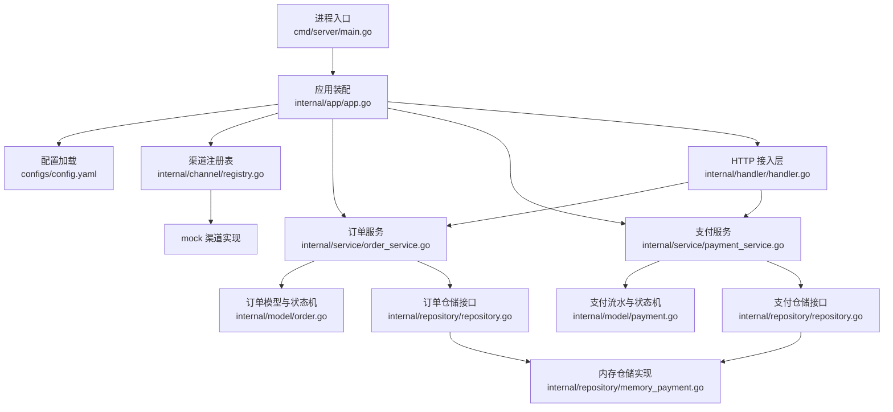
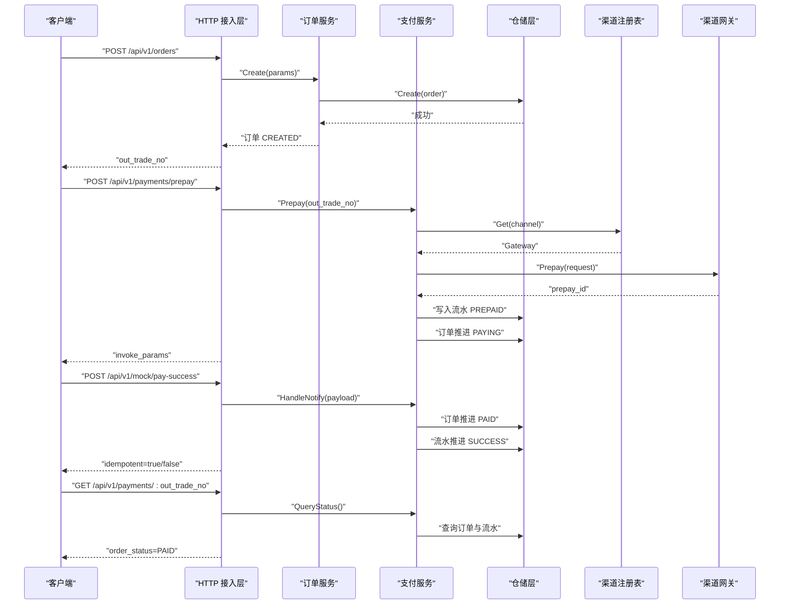
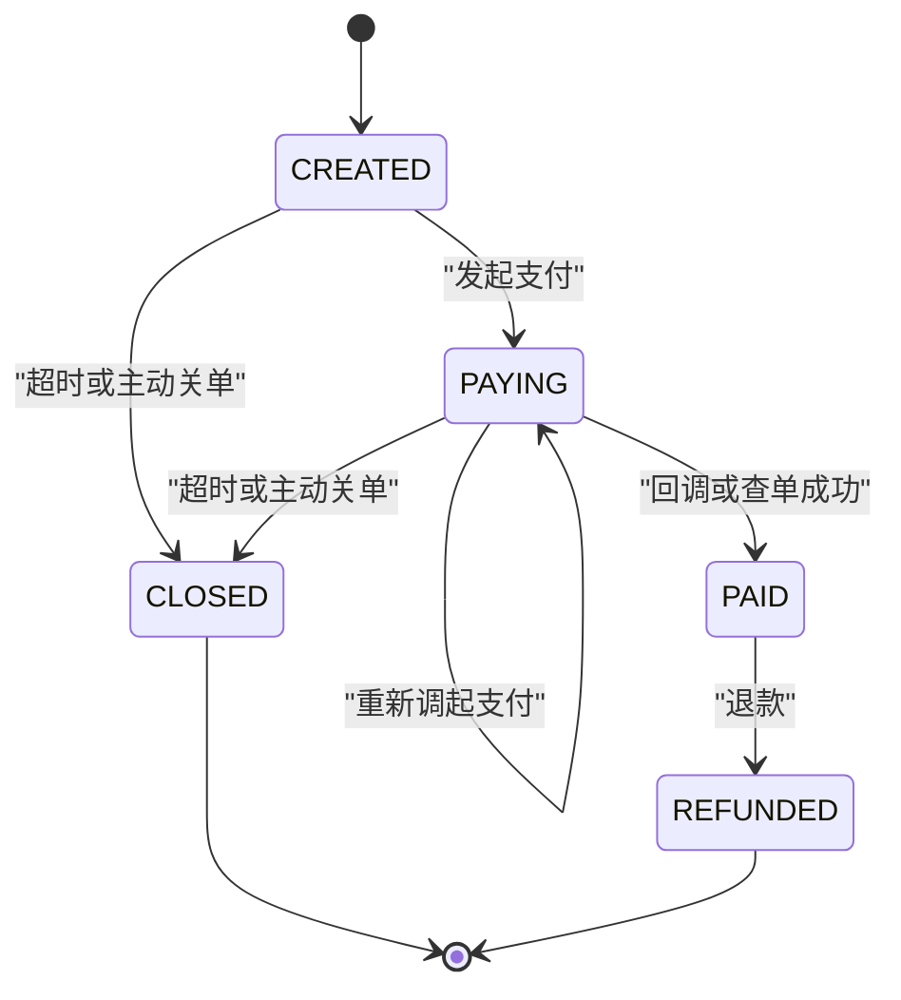
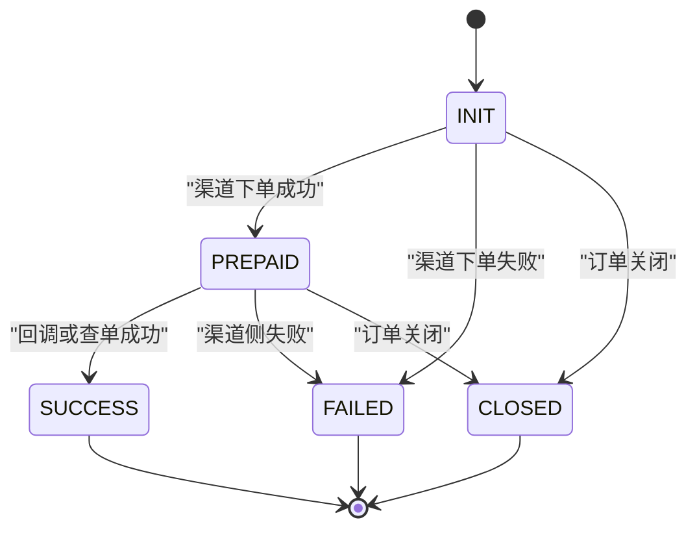
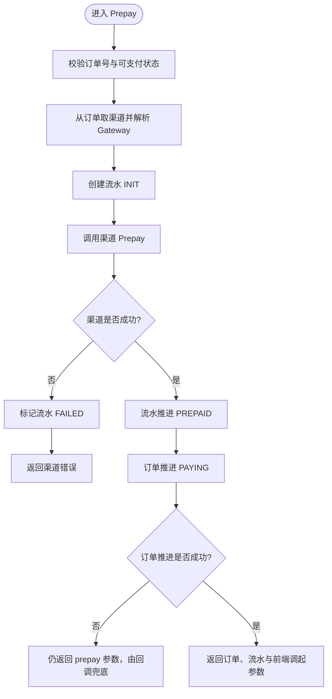
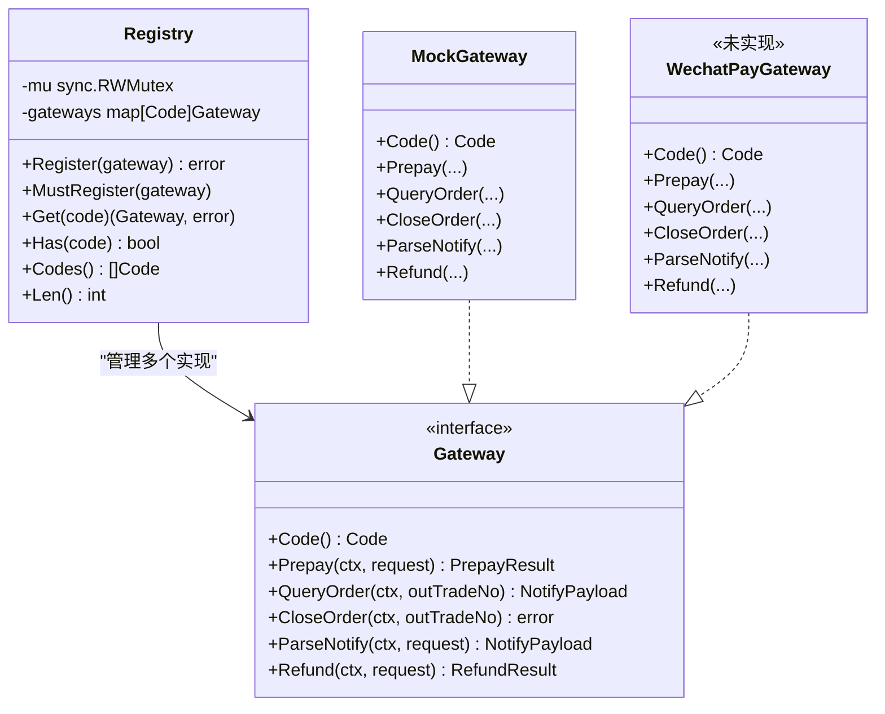

# 项目概述

<cite>
**本文引用的文件**   
- [README.md](file://README.md)
- [go.mod](file://go.mod)
- [Makefile](file://Makefile)
- [cmd/server/main.go](file://cmd/server/main.go)
- [internal/app/app.go](file://internal/app/app.go)
- [configs/config.yaml](file://configs/config.yaml)
- [internal/channel/registry.go](file://internal/channel/registry.go)
- [internal/model/order.go](file://internal/model/order.go)
- [internal/model/payment.go](file://internal/model/payment.go)
- [internal/repository/repository.go](file://internal/repository/repository.go)
- [internal/repository/memory_payment.go](file://internal/repository/memory_payment.go)
- [internal/service/order_service.go](file://internal/service/order_service.go)
- [internal/service/payment_service.go](file://internal/service/payment_service.go)
- [internal/handler/handler.go](file://internal/handler/handler.go)
</cite>

## 目录
1. [引言](#引言)
2. [项目结构](#项目结构)
3. [核心组件](#核心组件)
4. [架构总览](#架构总览)
5. [关键流程与状态机](#关键流程与状态机)
6. [渠道抽象层设计](#渠道抽象层设计)
7. [依赖装配与运行方式](#依赖装配与运行方式)
8. [配置与安全约束](#配置与安全约束)
9. [性能与并发特性](#性能与并发特性)
10. [未完成事项与接入建议](#未完成事项与接入建议)
11. [故障排查指南](#故障排查指南)
12. [结论](#结论)

## 引言
这是一个 Go + Gin 的支付服务骨架，目标是跑通「下单 → 发起支付 → 渠道回调 → 查单」完整链路，并通过 `channel.Gateway` 抽象层统一接入不同支付服务商。当前版本以内存仓储和 mock 渠道运行，为后续接入微信支付 JSAPI 预留了清晰的扩展点。

项目的核心设计哲学是：**通过接口抽象隔离支付渠道差异，让业务层专注于订单与支付流程控制**。HTTP 层只负责解析请求、调用服务、封装响应；service 层不感知 HTTP 与具体 SDK；model 层集中定义领域状态机；repository 层屏蔽存储实现；channel 层屏蔽渠道差异。

**章节来源**
- [README.md:1-11](file://README.md#L1-L11)

## 项目结构
仓库采用经典分层：进程入口在 `cmd/server`，应用装配在 `internal/app`，业务逻辑在 `internal/service`，HTTP 接入在 `internal/handler`，领域模型在 `internal/model`，存储接口与内存实现在 `internal/repository`，渠道抽象与 mock 在 `internal/channel`，配置加载在 `internal/config`，路由表在 `internal/router`。



**图表来源**
- [cmd/server/main.go:31-124](file://cmd/server/main.go#L31-L124)
- [internal/app/app.go:45-105](file://internal/app/app.go#L45-L105)
- [configs/config.yaml:9-60](file://configs/config.yaml#L9-L60)
- [internal/channel/registry.go:21-51](file://internal/channel/registry.go#L21-L51)
- [internal/service/order_service.go:21-50](file://internal/service/order_service.go#L21-L50)
- [internal/service/payment_service.go:34-73](file://internal/service/payment_service.go#L34-L73)
- [internal/handler/handler.go:1-24](file://internal/handler/handler.go#L1-L24)
- [internal/model/order.go:20-50](file://internal/model/order.go#L20-L50)
- [internal/model/payment.go:10-33](file://internal/model/payment.go#L10-L33)
- [internal/repository/repository.go:27-64](file://internal/repository/repository.go#L27-L64)
- [internal/repository/memory_payment.go:18-32](file://internal/repository/memory_payment.go#L18-L32)

**章节来源**
- [README.md:38-62](file://README.md#L38-L62)
- [cmd/server/main.go:1-23](file://cmd/server/main.go#L1-L23)
- [internal/app/app.go:1-12](file://internal/app/app.go#L1-L12)

## 核心组件
本项目由以下核心组件构成：

| 组件 | 职责 | 关键设计点 |
|---|---|---|
| 进程入口 | 解析参数、加载配置、启动 HTTP、优雅关闭 | 单独设置请求头读取超时，监听 SIGINT/SIGTERM，按 `shutdown_timeout` 等待存量请求 |
| 应用装配 | 构造日志、渠道注册表、仓储、服务、handler、Gin 引擎 | 手工装配，失败即启动失败，不降级 |
| 渠道抽象层 | 定义 `Gateway` 接口与渠道注册表 | 运行时按编码选择实现，mock 仅非 release 模式注册 |
| 领域模型 | 订单与支付流水的状态机 | 所有状态变更必须经过私有 `transit`，禁止外部直接赋值 |
| 仓储层 | 订单与支付流水的持久化接口 | 提供 `Mutate` 原子更新，对外返回副本 |
| 内存仓储 | 基于 map + RWMutex 的实现 | draft-copy-then-swap，排序保证查询稳定 |
| 订单服务 | 创建订单、查询订单 | 金额校验、默认渠道、渠道可用性检查 |
| 支付服务 | 发起支付、处理回调、查单、主动同步 | 幂等、金额一致性、回调与查单共用处理路径 |
| HTTP 接入层 | 绑定 JSON、校验参数、封装响应 | 区分空体、JSON 语法错误、字段校验失败 |

**章节来源**
- [cmd/server/main.go:25-124](file://cmd/server/main.go#L25-L124)
- [internal/app/app.go:31-105](file://internal/app/app.go#L31-L105)
- [internal/channel/registry.go:11-51](file://internal/channel/registry.go#L11-L51)
- [internal/model/order.go:20-184](file://internal/model/order.go#L20-L184)
- [internal/model/payment.go:10-160](file://internal/model/payment.go#L10-L160)
- [internal/repository/repository.go:1-19](file://internal/repository/repository.go#L1-L19)
- [internal/repository/memory_payment.go:13-32](file://internal/repository/memory_payment.go#L13-L32)
- [internal/service/order_service.go:21-125](file://internal/service/order_service.go#L21-L125)
- [internal/service/payment_service.go:34-73](file://internal/service/payment_service.go#L34-L73)
- [internal/handler/handler.go:1-24](file://internal/handler/handler.go#L1-L24)

## 架构总览
下图展示一次典型「下单 → 发起支付 → 模拟回调 → 查单」的请求链路与组件交互。



**图表来源**
- [internal/handler/handler.go:29-55](file://internal/handler/handler.go#L29-L55)
- [internal/service/order_service.go:67-109](file://internal/service/order_service.go#L67-L109)
- [internal/service/payment_service.go:99-226](file://internal/service/payment_service.go#L99-L226)
- [internal/service/payment_service.go:258-379](file://internal/service/payment_service.go#L258-L379)
- [internal/service/payment_service.go:528-546](file://internal/service/payment_service.go#L528-L546)
- [internal/channel/registry.go:63-74](file://internal/channel/registry.go#L63-L74)

## 关键流程与状态机
### 订单状态机
订单状态集中在 `model.Order`，合法流转由 `orderTransitions` 显式定义：



**图表来源**
- [internal/model/order.go:20-50](file://internal/model/order.go#L20-L50)
- [internal/model/order.go:122-153](file://internal/model/order.go#L122-L153)

### 支付流水状态机
支付流水记录每次支付尝试，允许一个订单对应多条流水：



**图表来源**
- [internal/model/payment.go:10-33](file://internal/model/payment.go#L10-L33)
- [internal/model/payment.go:106-137](file://internal/model/payment.go#L106-L137)

### 发起支付流程
`PaymentService.Prepay` 是整条链路中最需要小心的方法：它既要调用渠道，又要推进本地状态，还要处理渠道成功但本地状态推进失败的边界情况。



**图表来源**
- [internal/service/payment_service.go:99-226](file://internal/service/payment_service.go#L99-L226)

**章节来源**
- [internal/model/order.go:20-184](file://internal/model/order.go#L20-L184)
- [internal/model/payment.go:10-160](file://internal/model/payment.go#L10-L160)
- [internal/service/payment_service.go:99-226](file://internal/service/payment_service.go#L99-L226)

## 渠道抽象层设计
渠道抽象层是整个项目的核心接缝。业务层只依赖 `channel.Gateway` 接口，不依赖任何具体支付 SDK。当前已实现 mock 渠道，微信支付仅在占位文档中说明接入方式。



**图表来源**
- [internal/channel/registry.go:21-106](file://internal/channel/registry.go#L21-L106)
- [internal/app/app.go:108-151](file://internal/app/app.go#L108-L151)

**章节来源**
- [internal/channel/registry.go:1-107](file://internal/channel/registry.go#L1-L107)
- [internal/app/app.go:108-151](file://internal/app/app.go#L108-L151)
- [README.md:162-179](file://README.md#L162-L179)

## 依赖装配与运行方式
### 技术栈
| 技术 | 用途 | 优势 |
|---|---|---|
| Go 1.26.4 | 语言与工具链 | 现代 Go 生态，配合静态编译适合容器部署 |
| Gin | HTTP 框架 | 轻量、高性能、路由清晰 |
| Viper | 配置加载 | 支持 yaml、环境变量覆盖、启动期强校验 |
| Zap | 结构化日志 | 高性能日志，便于生产采集 |
| go-playground/validator | 请求参数校验 | 将 JSON tag 与校验规则解耦，错误信息可读 |

**章节来源**
- [go.mod:1-10](file://go.mod#L1-L10)
- [README.md:248-260](file://README.md#L248-L260)

### 快速启动
推荐使用 Makefile 提供的目标：

| 命令 | 行为 |
|---|---|
| `make build` | 静态编译到 `bin/payment-server` |
| `make run` | 前台运行，Ctrl-C 触发优雅关闭 |
| `make docker-build` | 构建 Docker 镜像 |
| `make check` | 提交前自检：格式化、vet、编译 |
| `make test` | 运行测试（当前仓库暂无 `_test.go`） |

默认使用 `configs/config.yaml`，mode 为 `debug`，默认渠道为 `mock`。启动成功后可通过 `/readyz` 确认就绪。

**章节来源**
- [Makefile:23-69](file://Makefile#L23-L69)
- [README.md:13-36](file://README.md#L13-L36)
- [configs/config.yaml:9-15](file://configs/config.yaml#L9-L15)

### Docker 运行
Dockerfile 使用多阶段构建，产物以非 root 用户运行，不包含 `certs/`，证书通过只读挂载注入。

```bash
make docker-build
docker run -p 8080:8080 payment-server:latest
```

生产环境推荐通过环境变量注入敏感配置，并把证书目录以只读方式挂载。

**章节来源**
- [README.md:268-272](file://README.md#L268-L272)

## 配置与安全约束
### 配置优先级
配置来源优先级为：**环境变量 > yaml 文件 > 代码默认值**。关键字段包括 `server.mode`、`server.port`、`payment.default_channel`、`payment.notify_base_url`、`channels.wechatpay.*`。

`WECHATPAY_API_V3_KEY` 是唯一只能来自环境变量的配置项，yaml 中没有对应字段，这是刻意避免把 APIv3 密钥写进配置文件。

**章节来源**
- [README.md:215-238](file://README.md#L215-L238)
- [configs/config.yaml:42-60](file://configs/config.yaml#L42-L60)

### 安全约束
- `certs/` 被 `.gitignore`、`.dockerignore`、`Dockerfile` 三层排除，商户私钥泄漏等同于账户密码泄漏。
- mock 路由 `/api/v1/mock/pay-success` 不在 release 模式注册，否则任意订单可被改成已支付。
- 真实渠道回调必须在 `ParseNotify` 中完成验签与解密，失败应返回错误而不是交给业务层。
- 回调报文金额优先于内部记录金额，防止绕过「回调金额与订单金额不一致」的资金防线。
- 日志不得打印密钥、证书内容与完整回调报文。

**章节来源**
- [README.md:240-246](file://README.md#L240-L246)

## 性能与并发特性
### 内存仓储的并发安全
内存仓储使用 `sync.RWMutex` + map，写操作一律走 **draft-copy-then-swap**：读锁内拷贝副本，修改副本，再用写锁替换。对外返回的也是 `Clone()` 副本，调用方无法绕过领域状态机修改仓储数据。

### 回调幂等
微信的重试策略意味着同一笔通知可能并发到达。处理策略：
1. 锁外先判断订单是否已支付，命中则直接返回 `idempotent=true`。
2. `orders.Mutate` 回调内再检查一次，命中则返回哨兵错误 `errAlreadyPaidConcurrently`。
3. 幂等命中同样应答成功，避免渠道无限重试。

### 金额精度
金额全程使用 `int64` 表示「分」，对外响应同时提供元字符串与分整数。`money` 包基于字符串与 `math/big`，不经过 `float64`，避免浮点精度丢失导致资金事故。

**章节来源**
- [internal/repository/memory_payment.go:92-112](file://internal/repository/memory_payment.go#L92-L112)
- [internal/repository/repository.go:6-19](file://internal/repository/repository.go#L6-L19)
- [README.md:193-213](file://README.md#L193-L213)
- [internal/service/payment_service.go:282-379](file://internal/service/payment_service.go#L282-L379)

## 未完成事项与接入建议
### 当前已完成
- 分层结构：cmd、app、handler、service、model、repository、channel、config、router。
- 领域状态机：订单与支付流水的状态流转集中在 model 层。
- 内存仓储：提供并发安全的订单与支付流水存储。
- 渠道抽象层与 mock 实现：可跑通全链路。
- 业务幂等与金额校验：回调重复、金额不一致、JSAPI openid 校验。
- HTTP 接入层：统一响应体、参数校验、健康探针。
- 依赖装配与工程化脚本：Makefile、Dockerfile、配置模板。

### 当前未完成
- 真实微信支付对接：`internal/channel/wechatpay` 只有占位文档。
- 数据库持久化：当前只有内存实现，进程重启后数据丢失。
- 单元与集成测试：仓库中暂无 `_test.go`。
- 鉴权与限流：未实现。
- 定时调度：`SyncFromChannel` 已提供主动查单能力，但缺少扫描超时订单的调度任务。
- 退款接口：`Gateway.Refund` 已定义，mock 返回未实现，HTTP 层未暴露。

### 接入微信支付建议
接入时改动应集中在三处：
1. 新增 `internal/channel/wechatpay/gateway.go`，实现 `channel.Gateway` 的 6 个方法。
2. 在 `internal/app/app.go` 的 `buildRegistry` 中按配置注册微信支付实现。
3. 引入微信支付 SDK，并将 `payment.default_channel` 改为 `wechatpay`。

接入前需完成商户资质、AppID 绑定、JSAPI 产品开通、支付授权目录、API 证书、验签模式、APIv3 密钥、公网 HTTPS 回调域名、openid 获取链路等准备工作。

**章节来源**
- [README.md:5-11](file://README.md#L5-L11)
- [README.md:274-284](file://README.md#L274-L284)
- [README.md:286-294](file://README.md#L286-L294)
- [internal/app/app.go:123-131](file://internal/app/app.go#L123-L131)

## 故障排查指南
### 常见启动问题
- **release 模式下没有可用渠道**：当前 release 模式不注册 mock，而微信支付尚未实现，因此会直接启动失败。本地联调请使用 `debug` 模式。
- **默认渠道未注册**：`payment.default_channel` 对应的渠道必须在 `buildRegistry` 中注册。
- **微信支付 enabled 但未实现**：配置声明启用但代码未实现时，启动直接报错，提示接入位置。

### 常见业务问题
- **回调金额与订单金额不一致**：属于资金红线，拒绝推进已支付，需人工介入核对。
- **JSAPI 缺少 openid**：提前拦截，避免无谓的渠道调用。
- **订单已支付却再次发起支付**：返回订单已支付错误，客户端应跳转支付成功页。
- **订单已关闭**：引导用户重新下单。

### 排查手段
- 使用 `request_id` 贯穿日志，定位一次请求的全链路日志。
- 通过 `/healthz` 与 `/readyz` 判断服务存活与就绪状态。
- 通过错误码分支处理，不要对 `message` 做字符串匹配。
- 通过 `SyncFromChannel` 主动查单，作为掉单兜底。

**章节来源**
- [internal/app/app.go:134-149](file://internal/app/app.go#L134-L149)
- [internal/service/payment_service.go:320-333](file://internal/service/payment_service.go#L320-L333)
- [internal/service/payment_service.go:548-582](file://internal/service/payment_service.go#L548-L582)
- [README.md:136-160](file://README.md#L136-L160)

## 结论
这个支付服务骨架已经具备清晰的领域建模、稳定的状态机、可插拔的渠道抽象层、并发安全的内存仓储以及完整的「下单 → 发起支付 → 回调 → 查单」演示链路。它的价值不在于一次性实现所有支付场景，而在于用接口抽象把渠道差异隔离在 `channel.Gateway` 之后，让后续接入微信支付或其他服务商时，业务层、HTTP 层与路由层无需大改。

下一步重点应是：实现真实微信支付渠道、补充数据库持久化、补齐测试、接入定时调度以兜底掉单，并在上线前严格遵循安全约束，确保密钥、证书与回调验签不出错。