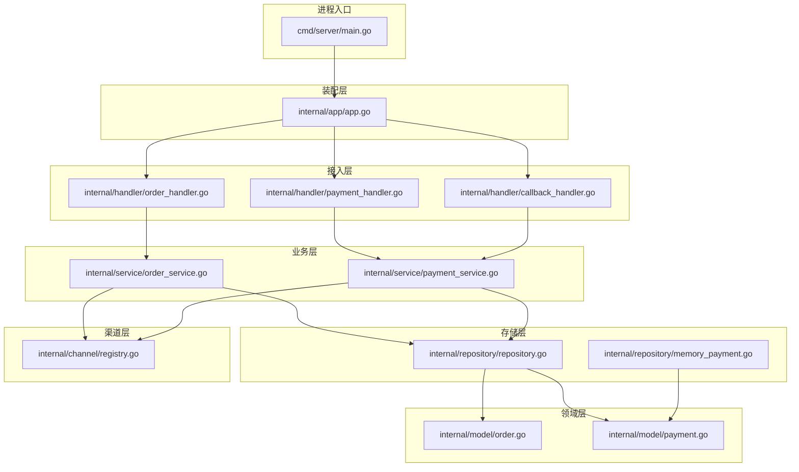
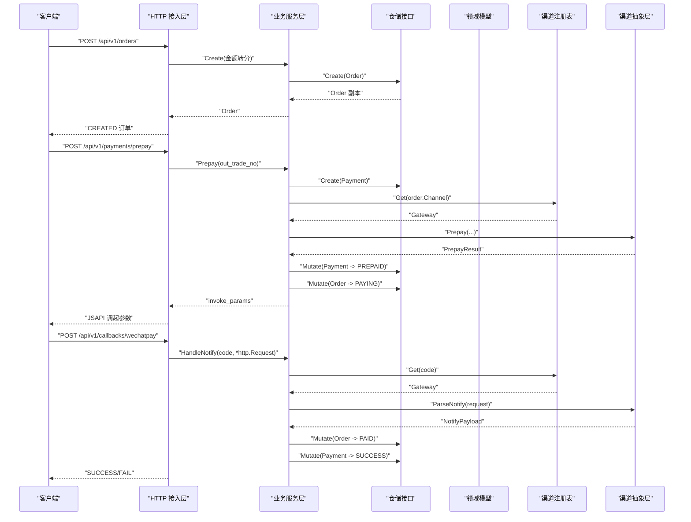
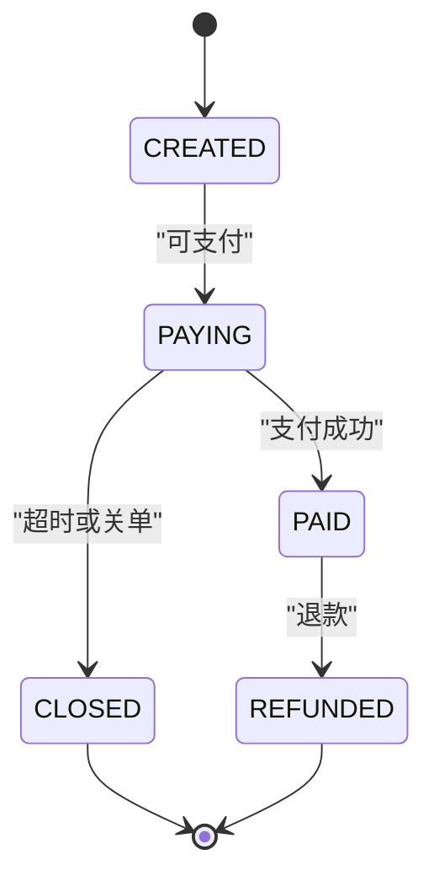
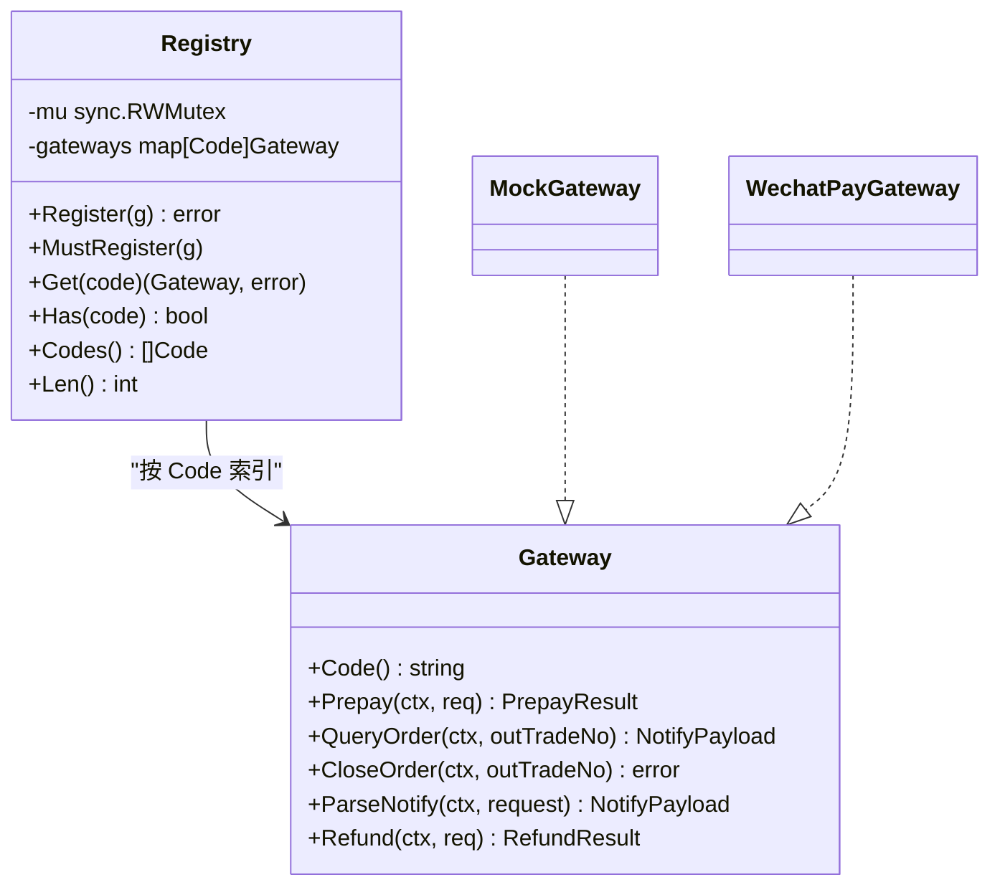
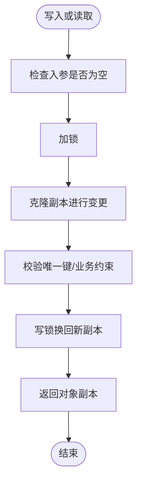
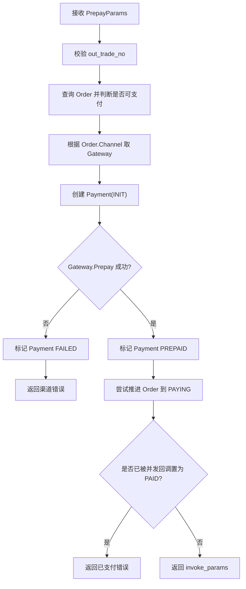
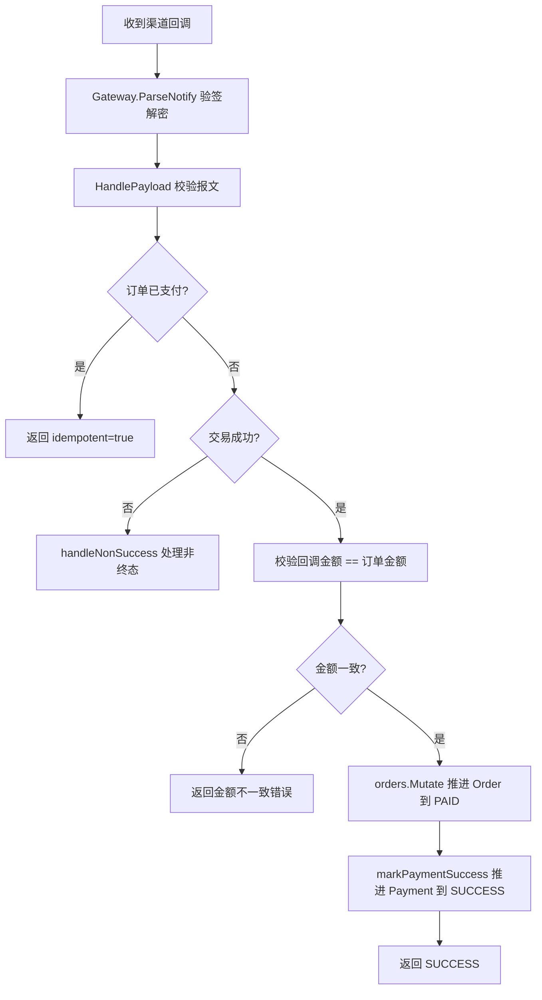
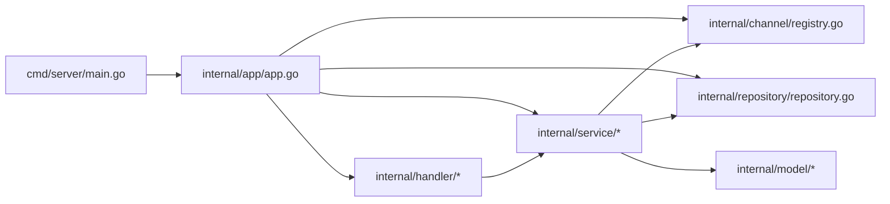

# 项目概述

<cite>
**本文引用的文件**   
- [README.md](file://README.md)
- [go.mod](file://go.mod)
- [cmd/server/main.go](file://cmd/server/main.go)
- [internal/app/app.go](file://internal/app/app.go)
- [configs/config.yaml](file://configs/config.yaml)
- [Dockerfile](file://Dockerfile)
- [Makefile](file://Makefile)
- [internal/channel/registry.go](file://internal/channel/registry.go)
- [internal/model/order.go](file://internal/model/order.go)
- [internal/model/payment.go](file://internal/model/payment.go)
- [internal/repository/repository.go](file://internal/repository/repository.go)
- [internal/repository/memory_payment.go](file://internal/repository/memory_payment.go)
- [internal/service/order_service.go](file://internal/service/order_service.go)
- [internal/service/payment_service.go](file://internal/service/payment_service.go)
- [internal/handler/order_handler.go](file://internal/handler/order_handler.go)
- [internal/handler/payment_handler.go](file://internal/handler/payment_handler.go)
- [internal/handler/callback_handler.go](file://internal/handler/callback_handler.go)
</cite>

## 目录
1. [引言](#引言)
2. [项目结构](#项目结构)
3. [核心组件](#核心组件)
4. [架构总览](#架构总览)
5. [详细组件分析](#详细组件分析)
6. [依赖关系分析](#依赖关系分析)
7. [性能与可靠性考量](#性能与可靠性考量)
8. [快速开始](#快速开始)
9. [故障排查指南](#故障排查指南)
10. [结论](#结论)

## 引言
本项目是一个 Go + Gin 的支付服务骨架，目标是用最简路径跑通「下单 → 发起支付 → 渠道回调 → 查单」的全链路流程，并通过 `channel.Gateway` 抽象层收敛不同支付渠道的差异。当前版本以内存仓储运行，默认使用 mock 渠道完成端到端演示；真实微信支付对接、数据库持久化、测试与鉴权限流等尚未实现。

技术栈包括：
- Go 1.21+（仓库声明为 1.26.4）
- Gin HTTP 框架
- Viper 配置加载与环境变量覆盖
- Zap 结构化日志
- go-playground/validator 参数校验

设计采用经典分层架构：进程入口 → 装配层 → HTTP 接入层 → 业务服务层 → 领域模型与状态机 → 仓储接口与内存实现 → 渠道抽象层。该分层的优势在于：
- 业务规则集中在领域层，避免在 handler 中散落状态判断。
- 渠道差异被收敛到 channel.Gateway，service 层不感知具体 SDK。
- 存储通过 repository 接口解耦，替换 MySQL 时 service 与 handler 零改动。
- 启动期强校验配置，避免“带病上线”。

## 项目结构
仓库采用按职责分层的组织方式：
- cmd/server：进程生命周期管理，解析参数、加载配置、启动 HTTP、优雅关闭。
- internal/app：依赖装配中心，构造 logger、registry、repository、service、handler、router。
- internal/channel：渠道抽象层与注册表，mock 实现占位 wechatpay。
- internal/config：Viper 加载 yaml 与环境变量映射，含启动期校验。
- internal/dto：对外契约，金额用字符串元，与 model 严格分离。
- internal/errcode：统一业务错误码与 HTTP 状态映射。
- internal/handler：HTTP 接入层，负责请求绑定、调用 service、封装响应。
- internal/middleware：request_id、logger、recovery、cors、404/405 等通用中间件。
- internal/model：领域模型与状态机，Order 与 Payment 的状态流转规则固化在此。
- internal/pkg：money、idgen、logger、response 等工具包。
- internal/repository：仓储接口与内存实现，提供并发安全的读写与 Mutate 原子更新。
- internal/router：路由表，集中暴露对外接口。
- configs：配置模板，不含真实密钥。
- docs/certs：接入文档与证书说明。

图示来源
- [cmd/server/main.go:31-124](file://cmd/server/main.go#L31-L124)
- [internal/app/app.go:45-106](file://internal/app/app.go#L45-L106)
- [internal/handler/order_handler.go:23-60](file://internal/handler/order_handler.go#L23-L60)
- [internal/handler/payment_handler.go:32-85](file://internal/handler/payment_handler.go#L32-L85)
- [internal/handler/callback_handler.go:44-86](file://internal/handler/callback_handler.go#L44-L86)
- [internal/service/order_service.go:72-109](file://internal/service/order_service.go#L72-L109)
- [internal/service/payment_service.go:108-226](file://internal/service/payment_service.go#L108-L226)
- [internal/model/order.go:73-183](file://internal/model/order.go#L73-L183)
- [internal/model/payment.go:54-159](file://internal/model/payment.go#L54-L159)
- [internal/repository/repository.go:27-64](file://internal/repository/repository.go#L27-L64)
- [internal/repository/memory_payment.go:13-121](file://internal/repository/memory_payment.go#L13-L121)
- [internal/channel/registry.go:11-107](file://internal/channel/registry.go#L11-L107)

章节来源
- [README.md:38-62](file://README.md#L38-L62)
- [configs/config.yaml:9-61](file://configs/config.yaml#L9-L61)

## 核心组件
- 进程入口与优雅关闭：main.go 负责解析配置、初始化应用、监听 SIGINT/SIGTERM、设置 ReadHeaderTimeout 抵御慢速攻击，并在 shutdown_timeout 内等待存量请求处理完成。
- 装配层 app.New：按配置构建 logger、channel registry、memory repository、order/payment service、handler 与 router；release 模式不注册 mock 路由，且若启用微信支付但未实现则直接启动失败。
- 渠道抽象层：Gateway 接口定义 Prepay、QueryOrder、ParseNotify、Refund 等方法；Registry 提供并发安全的渠道注册与查找；当前仅注册 mock 渠道。
- 领域模型与状态机：Order 与 Payment 各自维护合法状态转移表，所有变更必须通过 Mark* 方法，禁止外部直接赋值 Status。
- 仓储接口与内存实现：OrderRepository 与 PaymentRepository 提供 Create、Get、Mutate/MutateByPaymentNo、ListByOutTradeNo、Count；内存实现使用 sync.RWMutex 与 draft-copy-then-swap 保证并发安全，并返回对象副本防止绕过状态机。
- 业务服务：OrderService 负责创建订单与查询；PaymentService 负责预下单、回调处理、幂等、金额校验、非成功态处理、主动查单同步。
- HTTP 接入层：OrderHandler/PaymentHandler/CallbackHandler 负责请求绑定、调用 service、统一响应体；回调接口遵循微信规范返回 SUCCESS/FAIL。

章节来源
- [cmd/server/main.go:25-124](file://cmd/server/main.go#L25-L124)
- [internal/app/app.go:31-106](file://internal/app/app.go#L31-L106)
- [internal/channel/registry.go:11-107](file://internal/channel/registry.go#L11-L107)
- [internal/model/order.go:20-183](file://internal/model/order.go#L20-L183)
- [internal/model/payment.go:10-159](file://internal/model/payment.go#L10-L159)
- [internal/repository/repository.go:1-90](file://internal/repository/repository.go#L1-L90)
- [internal/repository/memory_payment.go:13-121](file://internal/repository/memory_payment.go#L13-L121)
- [internal/service/order_service.go:21-125](file://internal/service/order_service.go#L21-L125)
- [internal/service/payment_service.go:34-583](file://internal/service/payment_service.go#L34-L583)
- [internal/handler/order_handler.go:13-79](file://internal/handler/order_handler.go#L13-L79)
- [internal/handler/payment_handler.go:16-119](file://internal/handler/payment_handler.go#L16-L119)
- [internal/handler/callback_handler.go:14-87](file://internal/handler/callback_handler.go#L14-L87)

## 架构总览
系统采用经典分层，控制流从 HTTP 进入 handler，再进入 service，service 通过 repository 访问领域模型，必要时通过 channel.Registry 获取 Gateway 与渠道交互。渠道差异全部收敛在 Gateway 之后，service 只认接口类型。

图示来源
- [internal/handler/order_handler.go:23-60](file://internal/handler/order_handler.go#L23-L60)
- [internal/handler/payment_handler.go:32-51](file://internal/handler/payment_handler.go#L32-L51)
- [internal/handler/callback_handler.go:44-86](file://internal/handler/callback_handler.go#L44-L86)
- [internal/service/order_service.go:72-109](file://internal/service/order_service.go#L72-L109)
- [internal/service/payment_service.go:108-226](file://internal/service/payment_service.go#L108-L226)
- [internal/service/payment_service.go:258-379](file://internal/service/payment_service.go#L258-L379)
- [internal/channel/registry.go:63-74](file://internal/channel/registry.go#L63-L74)

## 详细组件分析

### 领域模型与状态机
Order 与 Payment 分别维护合法状态转移表，并提供 CanTransitionTo、IsTerminal、Mark* 等方法。所有状态变更都通过 transit 统一入口，先校验再 mutate，确保非法流转不会留下脏数据。Clone 返回副本，避免调用方绕过状态机修改内部字段。

图示来源
- [internal/model/order.go:20-69](file://internal/model/order.go#L20-L69)
- [internal/model/order.go:122-170](file://internal/model/order.go#L122-L170)

章节来源
- [internal/model/order.go:20-183](file://internal/model/order.go#L20-L183)
- [internal/model/payment.go:10-159](file://internal/model/payment.go#L10-L159)

### 渠道抽象层与注册表
Gateway 是唯一的渠道接缝，service 层只依赖接口。Registry 提供 Register、Get、Has、Codes、Len 等并发安全操作，重复注册会报错，未注册渠道会返回明确错误码。当前仅注册 mock 渠道；wechatpay 包为占位文档，启用但未实现时会阻止启动。

图示来源
- [internal/channel/registry.go:11-107](file://internal/channel/registry.go#L11-L107)

章节来源
- [internal/channel/registry.go:11-107](file://internal/channel/registry.go#L11-L107)
- [internal/app/app.go:108-152](file://internal/app/app.go#L108-L152)

### 仓储接口与内存实现
OrderRepository 与 PaymentRepository 提供 Create、Get、Mutate/MutateByPaymentNo、ListByOutTradeNo、Count。内存实现使用 RWMutex 保护 map，写操作走 draft-copy-then-swap，读操作返回 Clone 副本；ListByOutTradeNo 显式排序以保证结果稳定。

图示来源
- [internal/repository/memory_payment.go:34-121](file://internal/repository/memory_payment.go#L34-L121)
- [internal/repository/repository.go:27-64](file://internal/repository/repository.go#L27-L64)

章节来源
- [internal/repository/repository.go:1-90](file://internal/repository/repository.go#L1-L90)
- [internal/repository/memory_payment.go:13-121](file://internal/repository/memory_payment.go#L13-L121)

### 业务服务：下单与支付
OrderService.Create 校验金额、确定渠道、生成 out_trade_no、落库 Order。PaymentService.Prepay 校验订单可支付、创建 Payment、调用 Gateway.Prepay、将 Payment 置为 PREPAID、Order 置为 PAYING；渠道失败时标记 Payment FAILED 并保留 Order 状态以便重试。

图示来源
- [internal/service/order_service.go:72-109](file://internal/service/order_service.go#L72-L109)
- [internal/service/payment_service.go:108-226](file://internal/service/payment_service.go#L108-L226)

章节来源
- [internal/service/order_service.go:21-125](file://internal/service/order_service.go#L21-L125)
- [internal/service/payment_service.go:75-226](file://internal/service/payment_service.go#L75-L226)

### 业务服务：回调与查单
HandleNotify 先通过 Gateway.ParseNotify 验签解密得到 NotifyPayload，然后复用 HandlePayload 统一处理成功与非成功态。成功分支先做金额一致性校验，再用 orders.Mutate 二次幂等判断并推进 Order 到 PAID，随后 markPaymentSuccess 推进对应 Payment 到 SUCCESS。SyncFromChannel 通过 Gateway.QueryOrder 拉取渠道状态并复用 HandlePayload，作为掉单兜底。

图示来源
- [internal/service/payment_service.go:258-379](file://internal/service/payment_service.go#L258-L379)
- [internal/service/payment_service.go:381-520](file://internal/service/payment_service.go#L381-L520)
- [internal/service/payment_service.go:548-582](file://internal/service/payment_service.go#L548-L582)

章节来源
- [internal/service/payment_service.go:246-583](file://internal/service/payment_service.go#L246-L583)
- [internal/handler/callback_handler.go:44-87](file://internal/handler/callback_handler.go#L44-L87)

## 依赖关系分析
- 进程入口 main.go 依赖 internal/app 与 internal/config，负责生命周期与优雅关闭。
- app.New 依赖 logger、channel、repository、service、handler、router，是装配的唯一入口。
- service 依赖 model、repository 接口与 channel 抽象，不感知 HTTP 与具体渠道 SDK。
- handler 依赖 dto、service、pkg/response，只做请求绑定与响应封装。
- repository 接口与内存实现解耦了存储后端，未来替换 MySQL 只需新增实现并在 app 装配处替换。
- channel.Registry 由 app 装配时按配置注册 mock 渠道；wechatpay 启用但未实现会阻断启动。

图示来源
- [cmd/server/main.go:31-124](file://cmd/server/main.go#L31-L124)
- [internal/app/app.go:45-106](file://internal/app/app.go#L45-L106)
- [internal/channel/registry.go:11-107](file://internal/channel/registry.go#L11-L107)
- [internal/repository/repository.go:1-90](file://internal/repository/repository.go#L1-L90)
- [internal/service/order_service.go:21-125](file://internal/service/order_service.go#L21-L125)
- [internal/service/payment_service.go:34-583](file://internal/service/payment_service.go#L34-L583)
- [internal/handler/order_handler.go:13-79](file://internal/handler/order_handler.go#L13-L79)
- [internal/handler/payment_handler.go:16-119](file://internal/handler/payment_handler.go#L16-L119)
- [internal/handler/callback_handler.go:14-87](file://internal/handler/callback_handler.go#L14-L87)

章节来源
- [internal/app/app.go:1-200](file://internal/app/app.go#L1-L200)
- [internal/channel/registry.go:11-107](file://internal/channel/registry.go#L11-L107)

## 性能与可靠性考量
- 金额全程使用 int64 存「分」，避免 float64 精度丢失；对外同时返回 amount（元，字符串）与 amount_fen（分，整数）。
- 内存仓储使用 RWMutex + draft-copy-then-swap，读多写少场景开销低；对外返回 Clone 副本，避免并发下绕过状态机。
- 回调幂等：锁外快速判断已支付后返回 idempotent=true；orders.Mutate 内再次判断并发窗口，命中哨兵错误 errAlreadyPaidConcurrently 仍返回 SUCCESS。
- 金额一致性校验放在推进状态之前，拒绝回调金额与订单金额不一致的请求，防止串单与篡改。
- HTTP 层设置 ReadHeaderTimeout 抵御慢速连接攻击；shutdown_timeout 确保回调等关键请求不被硬切断。
- 主动查单 SyncFromChannel 复用 HandlePayload，保证回调与查单对同一笔交易的结论一致，是掉单兜底的核心手段。

章节来源
- [README.md:193-214](file://README.md#L193-L214)
- [internal/service/payment_service.go:282-379](file://internal/service/payment_service.go#L282-L379)
- [internal/service/payment_service.go:548-582](file://internal/service/payment_service.go#L548-L582)
- [cmd/server/main.go:25-124](file://cmd/server/main.go#L25-L124)

## 快速开始

### 编译与运行
- 本机编译：make build，产物位于 bin/payment-server。
- 前台运行：make run，默认加载 configs/config.yaml。
- 看到日志包含 addr、mode、default_channel 即表示就绪，可用 curl localhost:8080/readyz 确认。

章节来源
- [Makefile:50-56](file://Makefile#L50-L56)
- [README.md:13-29](file://README.md#L13-L29)

### Docker 部署
- 构建镜像：make docker-build。
- 运行容器：docker run -p 8080:8080 payment-server:latest。
- 证书挂载：-v "$PWD/certs:/app/certs:ro"，certs 目录刻意不 COPY 进镜像层。

章节来源
- [Dockerfile:9-56](file://Dockerfile#L9-L56)
- [README.md:31-36](file://README.md#L31-L36)

### 基本 API 调用流程
- 创建订单：POST /api/v1/orders，amount 用字符串「元」。
- 发起支付：POST /api/v1/payments/prepay，返回前端调起参数。
- 模拟回调：POST /api/v1/mock/pay-success（仅 debug 模式）。
- 查询支付状态：GET /api/v1/payments/:out_trade_no，?sync=true 强制向渠道查单。

章节来源
- [README.md:85-134](file://README.md#L85-L134)
- [internal/handler/order_handler.go:23-60](file://internal/handler/order_handler.go#L23-L60)
- [internal/handler/payment_handler.go:32-85](file://internal/handler/payment_handler.go#L32-L85)

## 故障排查指南
- 启动失败：release 模式下没有可用渠道会直接报错；wechatpay.enabled=true 但未实现也会阻断启动。请保持 server.mode=debug 联调，或在 app 装配处完成微信支付实现后再切 release。
- 回调反复重试：确认回调接口返回的是微信规范的 {"code":"SUCCESS"} 或 {"code":"FAIL"}，不要使用本服务的统一响应体。
- 金额不一致：当回调金额与订单金额不一致时，服务会返回明确的业务错误码并记录告警；需人工介入核对订单与渠道侧金额。
- 订单不可支付：根据返回的错误码区分「已支付」「已关闭」「已退款」，客户端应据此跳转成功页或引导重新下单。
- 日志追踪：使用 request_id 贯穿一次请求的所有日志，便于定位问题。

章节来源
- [internal/app/app.go:108-152](file://internal/app/app.go#L108-L152)
- [internal/handler/callback_handler.go:14-87](file://internal/handler/callback_handler.go#L14-L87)
- [internal/service/payment_service.go:320-379](file://internal/service/payment_service.go#L320-L379)
- [README.md:136-160](file://README.md#L136-L160)

## 结论
该项目以最小可行路径实现了支付全链路的骨架：分层清晰、领域状态机严谨、内存仓储并发安全、渠道抽象层收敛差异。当前以 mock 渠道验证全流程，真实微信支付对接、数据库持久化、测试与鉴权限流是后续重点。对于初学者，建议先从 README 的全链路演示入手理解概念；对于有经验的开发者，应重点关注 service 层的幂等与金额一致性、repository 的 Mutate 原子性、以及 channel.Gateway 的实现边界与安全红线。