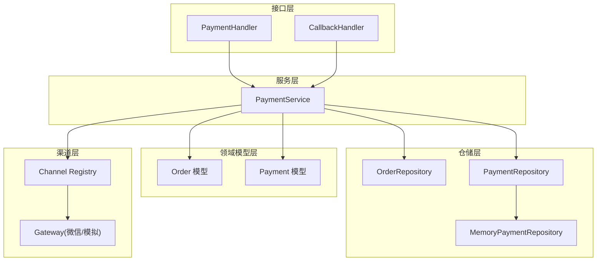
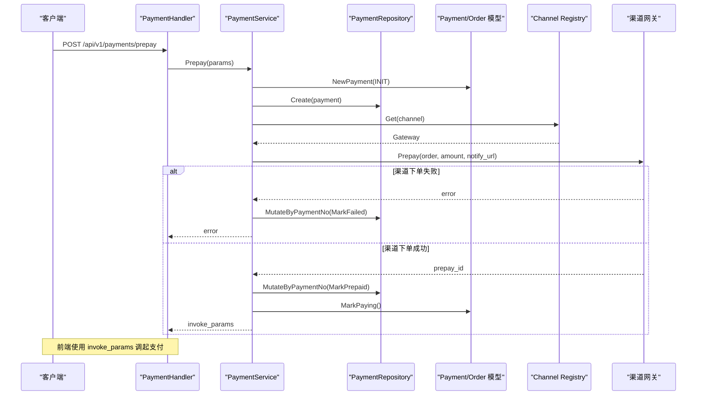
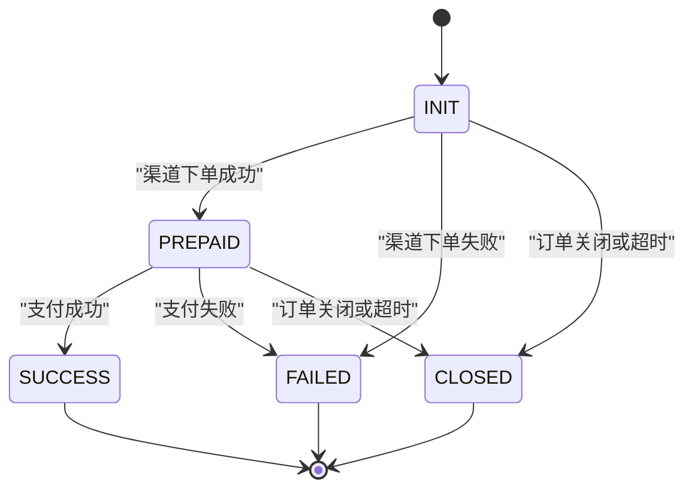
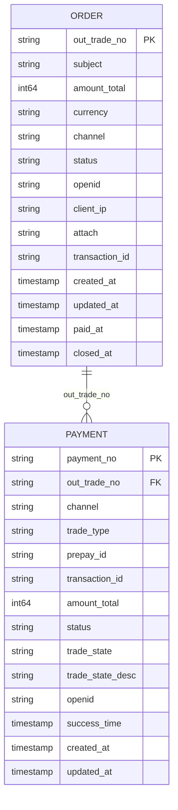
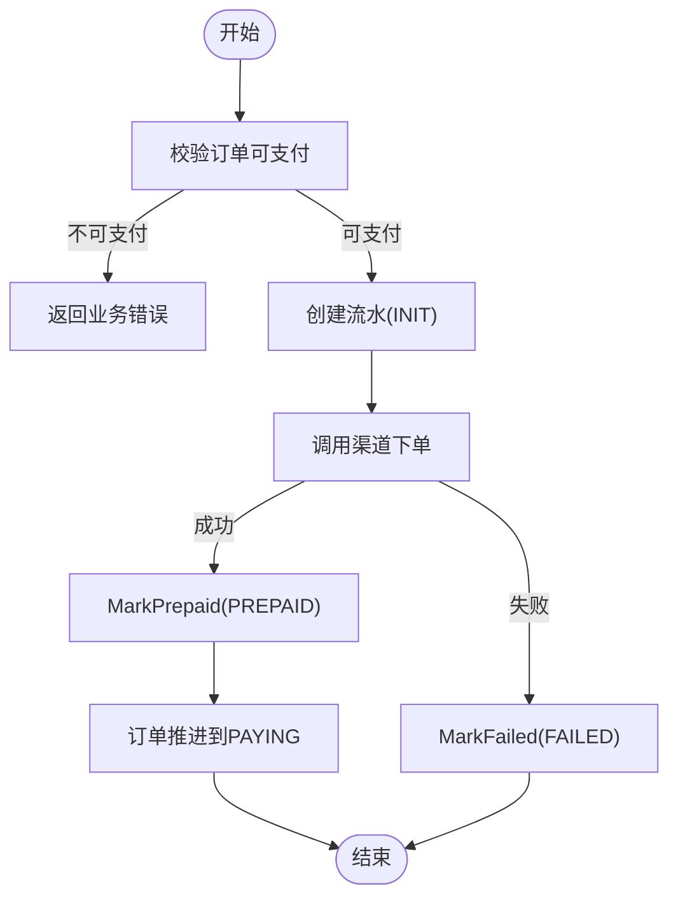
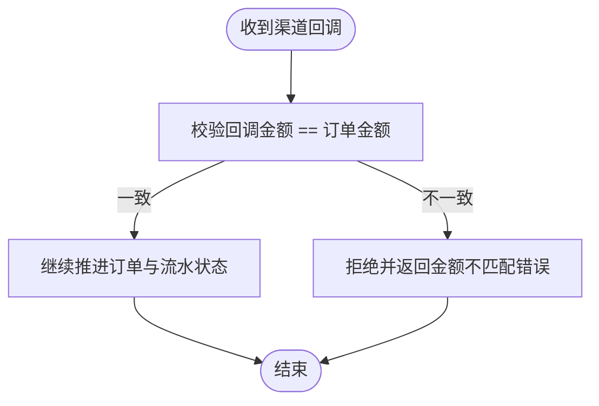
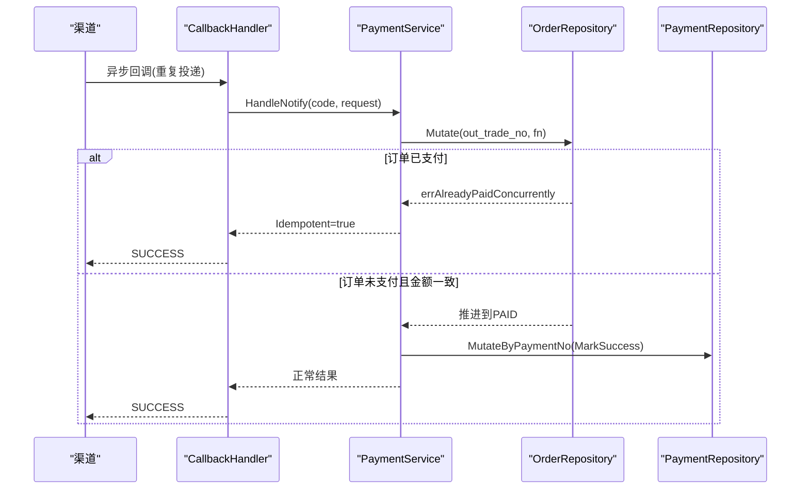
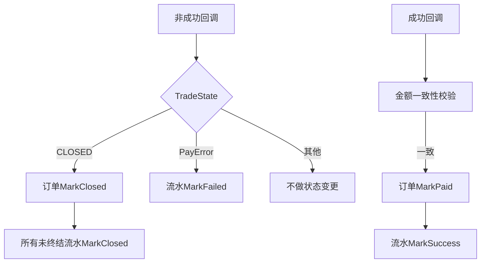
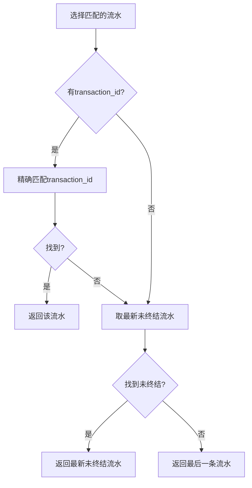
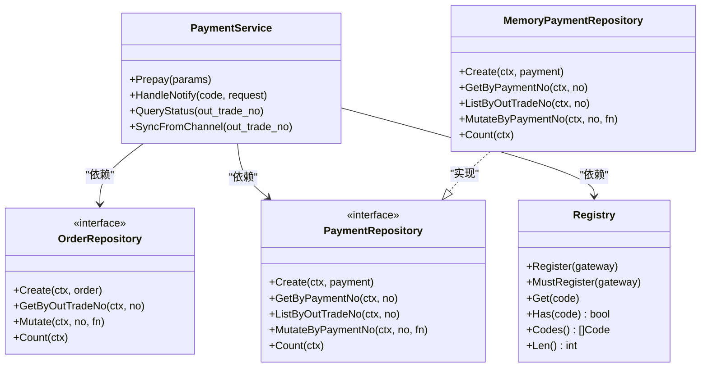

# 支付流水模型

<cite>
**本文引用的文件**   
- [internal/model/payment.go](file://internal/model/payment.go)
- [internal/model/order.go](file://internal/model/order.go)
- [internal/service/payment_service.go](file://internal/service/payment_service.go)
- [internal/handler/payment_handler.go](file://internal/handler/payment_handler.go)
- [internal/handler/callback_handler.go](file://internal/handler/callback_handler.go)
- [internal/dto/payment.go](file://internal/dto/payment.go)
- [internal/repository/memory_payment.go](file://internal/repository/memory_payment.go)
- [internal/repository/repository.go](file://internal/repository/repository.go)
- [internal/channel/registry.go](file://internal/channel/registry.go)
</cite>

## 目录
1. [引言](#引言)
2. [项目结构](#项目结构)
3. [核心组件](#核心组件)
4. [架构总览](#架构总览)
5. [详细组件分析](#详细组件分析)
6. [依赖关系分析](#依赖关系分析)
7. [性能与一致性考量](#性能与一致性考量)
8. [故障排查指南](#故障排查指南)
9. [结论](#结论)
10. [附录：字段与状态速查](#附录字段与状态速查)

## 引言
本文围绕支付流水模型展开，重点说明 Payment 实体的状态机设计、生命周期管理、与 Order 的一对多关系、金额一致性校验机制，以及如何通过支付流水实现幂等性与重试。文档面向具备基础后端知识的读者，同时提供可视化图示帮助理解复杂的状态流转和调用链。

## 项目结构
本项目采用分层架构：
- 领域模型层：Order 与 Payment 定义订单与支付流水的状态机与业务语义。
- 服务层：PaymentService 编排发起支付、处理回调、查询状态与主动查单。
- 仓储层：Repository 抽象存储接口，MemoryPaymentRepository 提供内存实现。
- 渠道层：Registry 管理支付渠道网关，统一 Prepay / ParseNotify / QueryOrder 能力。
- 接口层：Handler 暴露 HTTP 接口，负责参数绑定、响应封装与渠道应答格式适配。

**图表来源**
- [internal/handler/payment_handler.go:32-51](file://internal/handler/payment_handler.go#L32-L51)
- [internal/handler/callback_handler.go:47-86](file://internal/handler/callback_handler.go#L47-L86)
- [internal/service/payment_service.go:34-73](file://internal/service/payment_service.go#L34-L73)
- [internal/model/order.go:73-102](file://internal/model/order.go#L73-L102)
- [internal/model/payment.go:54-89](file://internal/model/payment.go#L54-L89)
- [internal/repository/repository.go:27-64](file://internal/repository/repository.go#L27-L64)
- [internal/repository/memory_payment.go:13-30](file://internal/repository/memory_payment.go#L13-L30)
- [internal/channel/registry.go:11-24](file://internal/channel/registry.go#L11-L24)

**章节来源**
- [internal/handler/payment_handler.go:32-51](file://internal/handler/payment_handler.go#L32-L51)
- [internal/handler/callback_handler.go:47-86](file://internal/handler/callback_handler.go#L47-L86)
- [internal/service/payment_service.go:34-73](file://internal/service/payment_service.go#L34-L73)
- [internal/model/order.go:73-102](file://internal/model/order.go#L73-L102)
- [internal/model/payment.go:54-89](file://internal/model/payment.go#L54-L89)
- [internal/repository/repository.go:27-64](file://internal/repository/repository.go#L27-L64)
- [internal/repository/memory_payment.go:13-30](file://internal/repository/memory_payment.go#L13-L30)
- [internal/channel/registry.go:11-24](file://internal/channel/registry.go#L11-L24)

## 核心组件
- Payment 实体：表示一次支付尝试的流水记录，包含状态机、金额、渠道信息、预支付参数与交易号等。
- Order 实体：表示商户订单，拥有独立的状态机，并与 Payment 形成一对多关系。
- PaymentService：编排 Prepay、HandleNotify、QueryStatus、SyncFromChannel 等关键流程。
- Repository 接口与 MemoryPaymentRepository：抽象并实现支付流水的持久化操作，保证并发安全与幂等。
- Channel Registry：注册与获取支付渠道网关，屏蔽具体渠道差异。

**章节来源**
- [internal/model/payment.go:10-89](file://internal/model/payment.go#L10-L89)
- [internal/model/order.go:20-102](file://internal/model/order.go#L20-L102)
- [internal/service/payment_service.go:34-73](file://internal/service/payment_service.go#L34-L73)
- [internal/repository/repository.go:27-64](file://internal/repository/repository.go#L27-L64)
- [internal/repository/memory_payment.go:13-30](file://internal/repository/memory_payment.go#L13-L30)
- [internal/channel/registry.go:11-24](file://internal/channel/registry.go#L11-L24)

## 架构总览
支付流水的核心交互路径包括：
- 发起支付：前端调用 Prepay，服务创建 INIT 流水，调起渠道下单，成功后置 PREPAID，订单推进至 PAYING。
- 异步回调：渠道通知成功或失败，服务校验金额与幂等，更新订单与对应流水状态。
- 查询与对账：前端轮询 QueryStatus；必要时 SyncFromChannel 主动查单兜底掉单。

**图表来源**
- [internal/handler/payment_handler.go:32-51](file://internal/handler/payment_handler.go#L32-L51)
- [internal/service/payment_service.go:108-226](file://internal/service/payment_service.go#L108-L226)
- [internal/model/payment.go:91-109](file://internal/model/payment.go#L91-L109)
- [internal/repository/memory_payment.go:34-53](file://internal/repository/memory_payment.go#L34-L53)
- [internal/channel/registry.go:63-73](file://internal/channel/registry.go#L63-L73)

**章节来源**
- [internal/handler/payment_handler.go:32-51](file://internal/handler/payment_handler.go#L32-L51)
- [internal/service/payment_service.go:108-226](file://internal/service/payment_service.go#L108-L226)
- [internal/model/payment.go:91-109](file://internal/model/payment.go#L91-L109)
- [internal/repository/memory_payment.go:34-53](file://internal/repository/memory_payment.go#L34-L53)
- [internal/channel/registry.go:63-73](file://internal/channel/registry.go#L63-L73)

## 详细组件分析

### Payment 实体与状态机
Payment 是单次支付尝试的记录，其状态机如下：
- INIT：流水已创建，尚未调起渠道下单。
- PREPAID：渠道下单成功，拿到 prepay_id，等待用户付款。
- SUCCESS：支付成功，终态。
- FAILED：支付失败，终态。
- CLOSED：流水关闭（订单关单或超时），终态。

合法后继由 paymentTransitions 显式定义，非法流转会被拒绝。所有状态变更必须通过 Mark* 方法完成，确保原子性和可审计性。

**图表来源**
- [internal/model/payment.go:10-33](file://internal/model/payment.go#L10-L33)
- [internal/model/payment.go:106-137](file://internal/model/payment.go#L106-L137)

**章节来源**
- [internal/model/payment.go:10-33](file://internal/model/payment.go#L10-L33)
- [internal/model/payment.go:54-89](file://internal/model/payment.go#L54-L89)
- [internal/model/payment.go:91-137](file://internal/model/payment.go#L91-L137)

### Payment 与 Order 的关系
- 一对多关系：一个 Order 可能产生多条 Payment，用于记录多次支付尝试（重试、换支付方式、重复点击）。
- OutTradeNo：Payment.OutTradeNo 关联 Order.OutTradeNo，作为业务主键关联。
- 金额一致性：Payment.AmountTotal 必须等于 Order.AmountTotal，防止篡改与串单。
- 状态联动：当 Order 从 CREATED/PAYING 进入 PAID/CLOSED 时，相关未终结的 Payment 需要相应地标记为 SUCCESS/FAILED/CLOSED。

**图表来源**
- [internal/model/order.go:73-102](file://internal/model/order.go#L73-L102)
- [internal/model/payment.go:54-89](file://internal/model/payment.go#L54-L89)

**章节来源**
- [internal/model/order.go:73-102](file://internal/model/order.go#L73-L102)
- [internal/model/payment.go:54-89](file://internal/model/payment.go#L54-L89)

### 支付流水的生命周期管理
- 创建时机：Prepay 流程中，服务在验证订单可支付后，生成 PaymentNo 并创建 INIT 流水。
- 状态更新触发点：
  - 渠道下单成功：MarkPrepaid，订单推进到 PAYING。
  - 渠道下单失败：MarkFailed，订单状态不动，允许重试。
  - 回调成功：MarkSuccess，订单推进到 PAID。
  - 回调失败：MarkFailed，订单状态不动。
  - 订单关闭：MarkClosed，所有未终结流水关闭。
- 清理策略：当前实现保留全部流水以便对账与排障；未引入自动删除逻辑，生产环境可按策略归档历史流水。

**图表来源**
- [internal/service/payment_service.go:108-226](file://internal/service/payment_service.go#L108-L226)
- [internal/model/payment.go:106-137](file://internal/model/payment.go#L106-L137)

**章节来源**
- [internal/service/payment_service.go:108-226](file://internal/service/payment_service.go#L108-L226)
- [internal/model/payment.go:106-137](file://internal/model/payment.go#L106-L137)

### 金额一致性校验机制
- 校验位置：HandlePayload 在处理成功回调前，比较 payload.AmountTotal 与 order.AmountTotal。
- 不一致处理：直接拒绝并返回金额不匹配错误，避免将错误金额订单置为已支付。
- 目的：防止「订单被篡改金额后支付」与「串单」两类资金事故。

**图表来源**
- [internal/service/payment_service.go:320-333](file://internal/service/payment_service.go#L320-L333)

**章节来源**
- [internal/service/payment_service.go:320-333](file://internal/service/payment_service.go#L320-L333)

### 幂等性与重试机制
- 订单级幂等：HandlePayload 在进入状态变更前检查 order.Status.IsPaid()，若已支付则直接返回 Idempotent=true，让渠道停止重试。
- 并发保护：Mutate 在仓储层提供原子上下文，避免「读取-判断-写回」竞态导致重复推进。
- 流水级幂等：markPaymentSuccess 中若流水已是终态，返回 errPaymentAlreadyFinal，服务层按幂等分支处理。
- 重试策略：渠道在未收到成功应答时会按固定间隔重试；服务对幂等命中返回 SUCCESS，对临时错误返回 FAIL 以触发重试。

**图表来源**
- [internal/handler/callback_handler.go:55-86](file://internal/handler/callback_handler.go#L55-L86)
- [internal/service/payment_service.go:282-379](file://internal/service/payment_service.go#L282-L379)
- [internal/repository/repository.go:8-18](file://internal/repository/repository.go#L8-L18)

**章节来源**
- [internal/handler/callback_handler.go:55-86](file://internal/handler/callback_handler.go#L55-L86)
- [internal/service/payment_service.go:282-379](file://internal/service/payment_service.go#L282-L379)
- [internal/repository/repository.go:8-18](file://internal/repository/repository.go#L8-L18)

### 支付流水与订单的状态联动
- 非成功回调处理：handleNonSuccess 根据 TradeState 决定动作：
  - CLOSED：订单推进到 CLOSED，所有未终结流水 MarkClosed。
  - PayError：仅 MarkFailed 流水，订单状态不动。
  - 其他状态（如 NOTPAY / USERPAYING）：不做变更，等待后续回调或查单。
- 成功回调处理：先校验金额，再推进订单到 PAID，最后 markPaymentSuccess 对应流水。

**图表来源**
- [internal/service/payment_service.go:381-415](file://internal/service/payment_service.go#L381-L415)
- [internal/service/payment_service.go:417-453](file://internal/service/payment_service.go#L417-L453)

**章节来源**
- [internal/service/payment_service.go:381-415](file://internal/service/payment_service.go#L381-L415)
- [internal/service/payment_service.go:417-453](file://internal/service/payment_service.go#L417-L453)

### 支付流水选择与匹配策略
- pickPayment 优先级：
  1. 渠道交易号精确匹配。
  2. 最新一条未终结流水。
  3. 最后一条流水。
- 找不到时的行为：返回错误而不是新建流水，避免凭空造出无渠道信息的流水影响对账。

**图表来源**
- [internal/service/payment_service.go:455-486](file://internal/service/payment_service.go#L455-L486)

**章节来源**
- [internal/service/payment_service.go:455-486](file://internal/service/payment_service.go#L455-L486)

## 依赖关系分析
- PaymentService 依赖：
  - OrderRepository：读写订单状态。
  - PaymentRepository：读写支付流水。
  - Channel Registry：获取渠道网关进行 Prepay / ParseNotify / QueryOrder。
- Repository 接口设计强调：
  - Mutate 原子上下文：保证并发回调下的幂等。
  - 对外返回副本：防止绕过领域模型状态机直接修改。

**图表来源**
- [internal/service/payment_service.go:34-73](file://internal/service/payment_service.go#L34-L73)
- [internal/repository/repository.go:27-64](file://internal/repository/repository.go#L27-L64)
- [internal/repository/memory_payment.go:13-30](file://internal/repository/memory_payment.go#L13-L30)
- [internal/channel/registry.go:11-24](file://internal/channel/registry.go#L11-L24)

**章节来源**
- [internal/service/payment_service.go:34-73](file://internal/service/payment_service.go#L34-L73)
- [internal/repository/repository.go:27-64](file://internal/repository/repository.go#L27-L64)
- [internal/repository/memory_payment.go:13-30](file://internal/repository/memory_payment.go#L13-L30)
- [internal/channel/registry.go:11-24](file://internal/channel/registry.go#L11-L24)

## 性能与一致性考量
- 并发安全：
  - Repository.Mutate 与 MutateByPaymentNo 提供原子上下文，避免并发回调导致的重复状态推进。
  - MemoryPaymentRepository 使用互斥锁保护索引与数据。
- 排序稳定性：
  - ListByOutTradeNo 返回按创建时间升序的结果，时间相同时按流水号兜底，确保「最新未终结流水」选择稳定。
- 幂等优化：
  - 订单级快速返回：IsPaid() 命中即返回 Idempotent=true，减少不必要的状态机计算。
  - 流水级快速返回：IsTerminal() 命中即跳过更新。
- 对账友好：
  - 保留全部流水，便于还原历史支付尝试与问题定位。

**章节来源**
- [internal/repository/memory_payment.go:66-90](file://internal/repository/memory_payment.go#L66-L90)
- [internal/repository/repository.go:8-18](file://internal/repository/repository.go#L8-L18)
- [internal/service/payment_service.go:301-313](file://internal/service/payment_service.go#L301-L313)
- [internal/service/payment_service.go:435-451](file://internal/service/payment_service.go#L435-L451)

## 故障排查指南
- 金额不一致：
  - 现象：回调处理失败，需人工介入。
  - 原因：payload.AmountTotal 与 order.AmountTotal 不一致。
  - 处理：拒绝回调并告警，避免错误订单被置为已支付。
- 验签失败：
  - 现象：回调处理失败，需人工介入。
  - 原因：渠道签名校验失败。
  - 处理：返回 FAIL 让渠道重试，同时记录告警。
- 订单已支付但缺少流水：
  - 现象：pickPayment 未找到匹配流水。
  - 原因：回调到达早于流水创建或丢失。
  - 处理：记录警告日志，订单已支付事实不变，流水可事后补记。
- 渠道下单失败：
  - 现象：Prepay 返回错误，流水标记为 FAILED。
  - 处理：允许用户重试，订单状态不动。

**章节来源**
- [internal/handler/callback_handler.go:55-86](file://internal/handler/callback_handler.go#L55-L86)
- [internal/service/payment_service.go:164-178](file://internal/service/payment_service.go#L164-L178)
- [internal/service/payment_service.go:427-433](file://internal/service/payment_service.go#L427-L433)

## 结论
Payment 实体通过严格的状态机与领域方法控制状态流转，结合 Order 的一对多关系与金额一致性校验，构建了可靠的支付流水模型。PaymentService 在 Prepay、HandleNotify、QueryStatus、SyncFromChannel 等流程中实现了幂等性与重试机制，并通过 Repository 的原子上下文保障并发安全。整体设计兼顾了对账可追溯性与生产环境的健壮性。

## 附录：字段与状态速查
- Payment 关键字段：
  - PaymentNo：流水号，业务主键。
  - OutTradeNo：关联订单号。
  - Channel：支付渠道编码。
  - TradeType：交易类型（JSAPI/NATIVE/H5/APP）。
  - PrepayID：渠道预支付标识。
  - TransactionID：渠道交易号。
  - AmountTotal：本次支付金额（分）。
  - Status：流水状态（INIT/PREPAID/SUCCESS/FAILED/CLOSED）。
  - TradeState / TradeStateDesc：渠道原始状态与描述。
  - OpenID：实际付款用户标识。
  - SuccessTime / CreatedAt / UpdatedAt：时间戳。
- Order 关键字段：
  - OutTradeNo：商户订单号。
  - Subject：商品标题。
  - AmountTotal：订单总金额（分）。
  - Currency：币种。
  - Channel：支付渠道编码。
  - Status：订单状态（CREATED/PAYING/PAID/CLOSED/REFUNDED）。
  - OpenID / ClientIP / Attach / TransactionID：附加信息与渠道交易号。
  - CreatedAt / UpdatedAt / PaidAt / ClosedAt：时间戳。

**章节来源**
- [internal/model/payment.go:54-89](file://internal/model/payment.go#L54-L89)
- [internal/model/order.go:73-102](file://internal/model/order.go#L73-L102)
- [internal/dto/payment.go:60-98](file://internal/dto/payment.go#L60-L98)