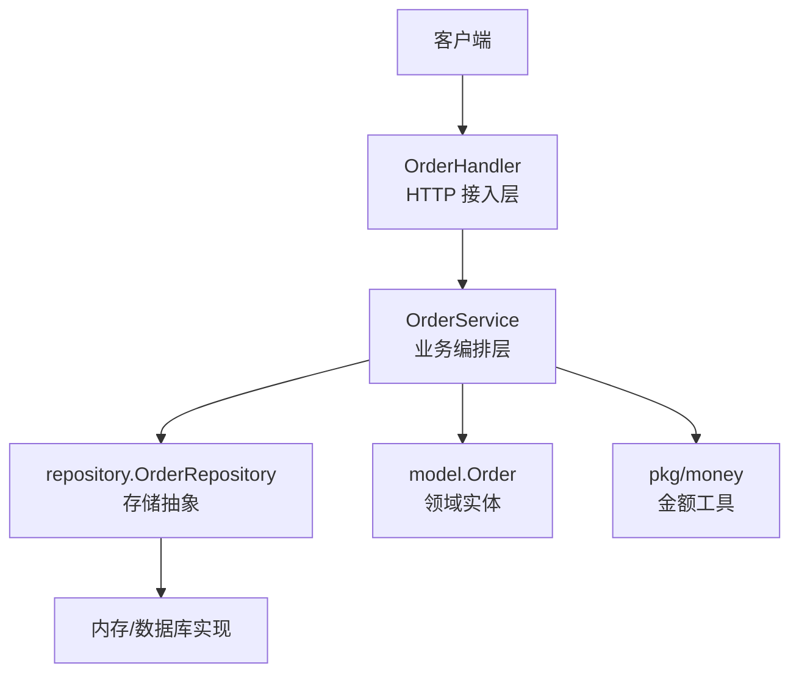
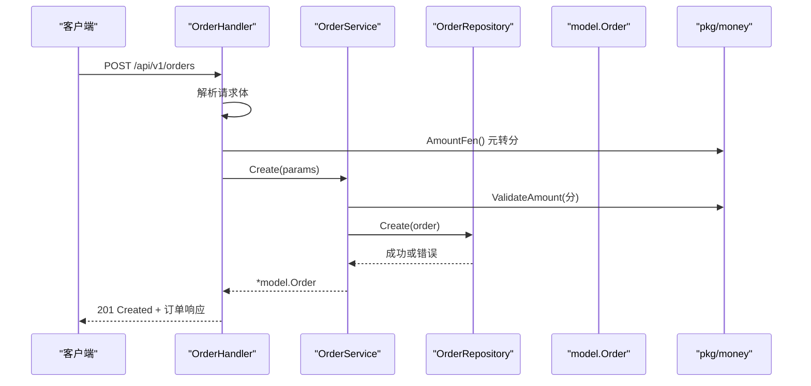
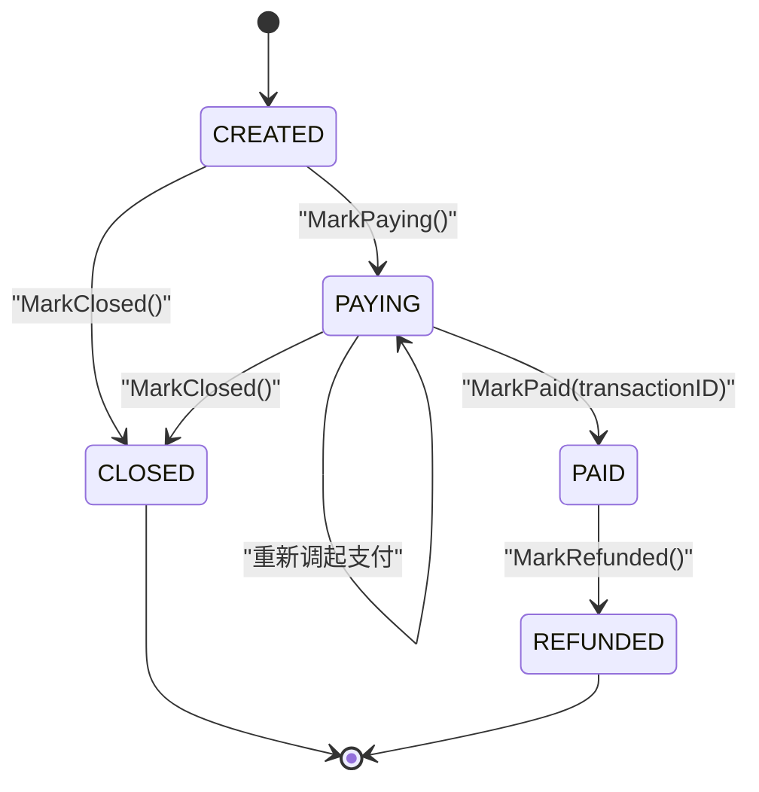
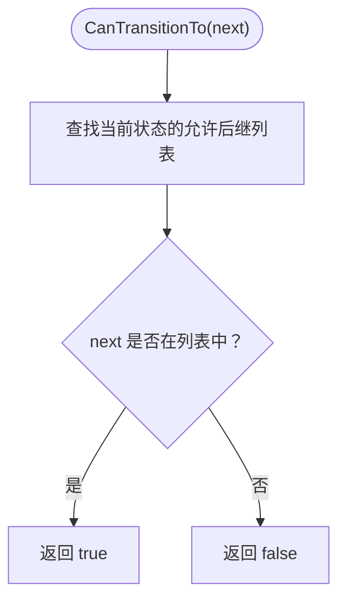
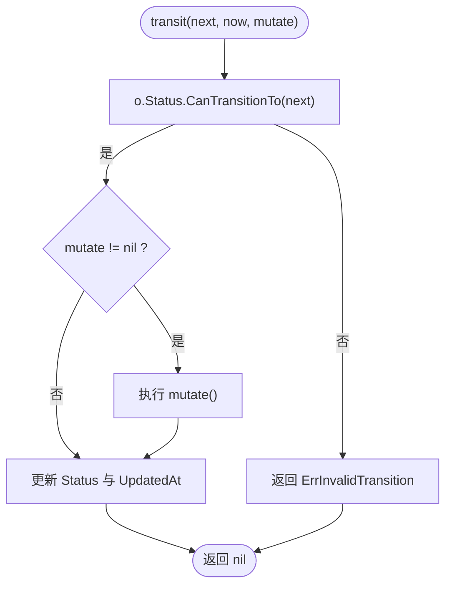
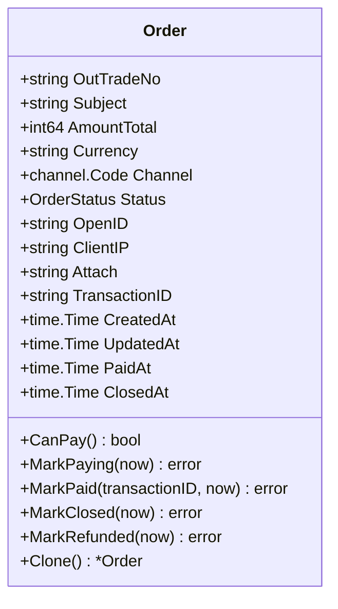
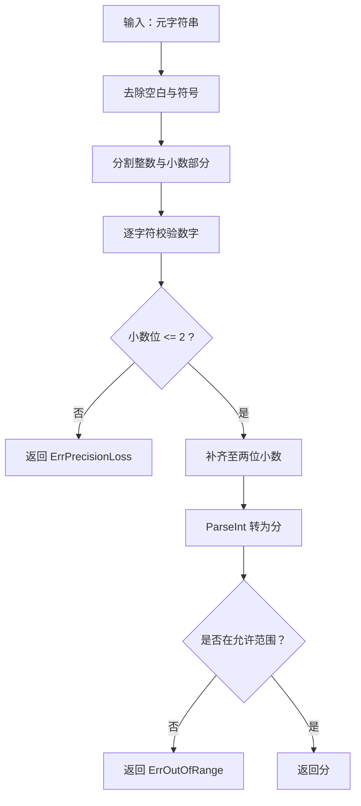
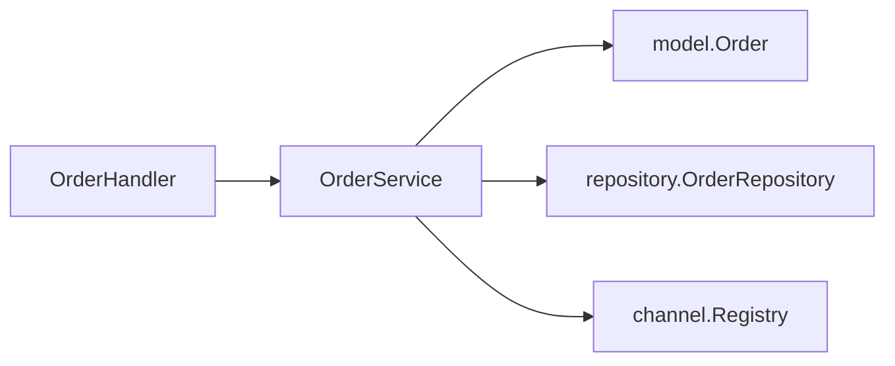
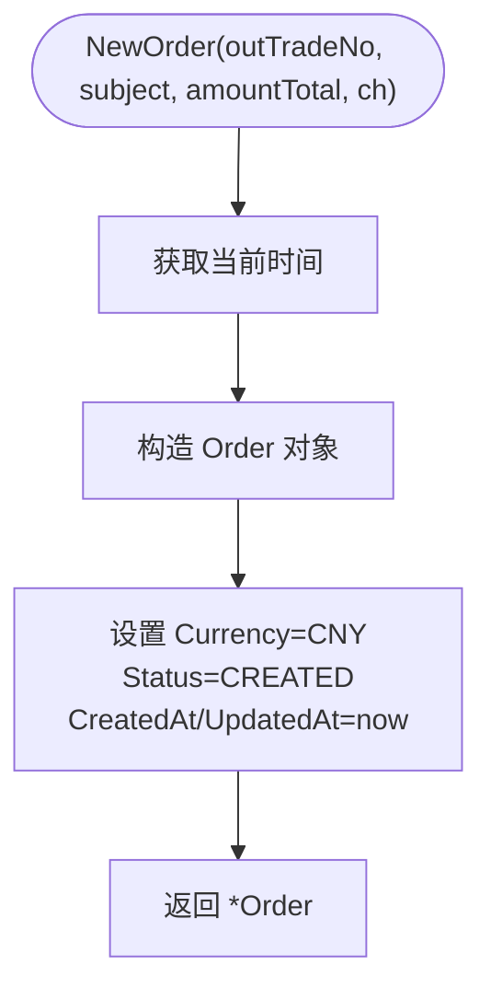
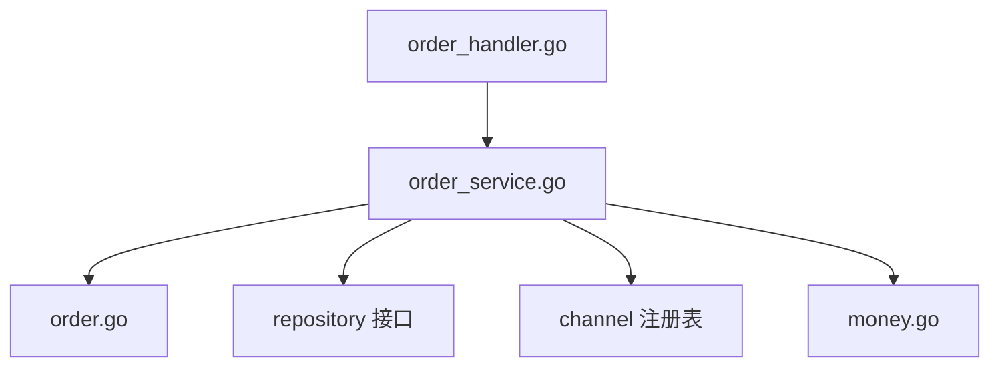

# 订单模型

<cite>
**本文引用的文件**   
- [internal/model/order.go](file://internal/model/order.go)
- [internal/service/order_service.go](file://internal/service/order_service.go)
- [internal/handler/order_handler.go](file://internal/handler/order_handler.go)
- [internal/pkg/money/money.go](file://internal/pkg/money/money.go)
</cite>

## 目录
1. [引言](#引言)
2. [项目结构](#项目结构)
3. [核心组件](#核心组件)
4. [架构总览](#架构总览)
5. [详细组件分析](#详细组件分析)
6. [依赖关系分析](#依赖关系分析)
7. [性能与并发考虑](#性能与并发考虑)
8. [故障排查指南](#故障排查指南)
9. [结论](#结论)

## 引言
本文聚焦支付系统中的「订单模型」，重点说明 Order 实体的状态机设计、金额处理策略、并发安全机制以及领域驱动实践。目标是让读者既能理解业务规则如何被固化在实体中，也能掌握从接口到仓储的完整调用链。

## 项目结构
围绕订单模型的代码主要分布在以下层次：
- 接入层：HTTP Handler 负责参数绑定、元分转换与错误分类。
- 服务层：OrderService 编排创建订单流程，校验金额与渠道，并持久化订单。
- 领域层：model.Order 定义订单实体、状态枚举、状态机与不可变访问语义。
- 工具层：money 包提供安全的元分转换与金额校验。

**图表来源**
- [internal/handler/order_handler.go:23-60](file://internal/handler/order_handler.go#L23-L60)
- [internal/service/order_service.go:67-110](file://internal/service/order_service.go#L67-L110)
- [internal/model/order.go:73-120](file://internal/model/order.go#L73-L120)
- [internal/pkg/money/money.go:39-106](file://internal/pkg/money/money.go#L39-L106)

**章节来源**
- [internal/handler/order_handler.go:23-79](file://internal/handler/order_handler.go#L23-L79)
- [internal/service/order_service.go:21-125](file://internal/service/order_service.go#L21-L125)
- [internal/model/order.go:1-184](file://internal/model/order.go#L1-L184)
- [internal/pkg/money/money.go:1-152](file://internal/pkg/money/money.go#L1-L152)

## 核心组件
- Order 实体：封装订单数据与状态机方法，禁止外部直接赋值 Status。
- 状态枚举与转移表：显式声明合法后继状态，便于测试穷举与审查。
- transit() 统一入口：先校验再变更，避免脏状态。
- Clone() 防篡改：对外返回副本，防止绕过状态机修改内部字段。
- NewOrder() 构造函数：保证 Currency、Status、时间戳等初始值正确。
- money 工具：以 int64「分」表示金额，避免浮点精度问题。

**章节来源**
- [internal/model/order.go:20-120](file://internal/model/order.go#L20-L120)
- [internal/model/order.go:122-184](file://internal/model/order.go#L122-L184)
- [internal/pkg/money/money.go:1-37](file://internal/pkg/money/money.go#L1-L37)

## 架构总览
订单创建与查询的关键调用链如下：

**图表来源**
- [internal/handler/order_handler.go:23-60](file://internal/handler/order_handler.go#L23-L60)
- [internal/service/order_service.go:67-110](file://internal/service/order_service.go#L67-L110)
- [internal/pkg/money/money.go:124-136](file://internal/pkg/money/money.go#L124-L136)

## 详细组件分析

### Order 实体与状态机
Order 实体将支付业务规则内聚于领域对象中，所有状态变更必须通过 Mark* 方法进入 transit()，从而确保：
- 非法流转在运行期被拒绝。
- 状态变更后更新时间戳。
- 支付成功时回填 TransactionID 与 PaidAt。
- 关闭与退款分别设置 ClosedAt。

**图表来源**
- [internal/model/order.go:23-50](file://internal/model/order.go#L23-L50)
- [internal/model/order.go:127-153](file://internal/model/order.go#L127-L153)

#### CanTransitionTo() 校验逻辑
- 基于 orderTransitions 映射表判断当前状态是否允许流转到目标状态。
- 未列出的任何转换均视为非法，返回 false。
- IsTerminal() 用于识别终态（CLOSED、REFUNDED），但 REFUNDED 由 PAID 流向，仍属于终态之一。

**图表来源**
- [internal/model/order.go:52-65](file://internal/model/order.go#L52-L65)

#### transit() 统一入口与错误处理
- 先校验 CanTransitionTo(next)，失败则返回 ErrInvalidTransition 包装的错误，包含源状态、目标状态与商户订单号。
- 仅在校验通过后执行 mutate 回调（如设置 PaidAt、TransactionID）。
- 最后更新 Status 与 UpdatedAt，保证原子性。

**图表来源**
- [internal/model/order.go:155-170](file://internal/model/order.go#L155-L170)

#### Clone() 并发安全与防篡改
- 对 Order 进行浅拷贝后返回新指针，避免调用方直接修改原对象的状态字段。
- 仓储层对外返回 Clone() 的结果，防止内存仓储中被外部绕过状态机修改。
- 若传入 nil，Clone() 返回 nil，避免空指针异常。

**图表来源**
- [internal/model/order.go:73-102](file://internal/model/order.go#L73-L102)
- [internal/model/order.go:172-184](file://internal/model/order.go#L172-L184)

**章节来源**
- [internal/model/order.go:20-120](file://internal/model/order.go#L20-L120)
- [internal/model/order.go:122-184](file://internal/model/order.go#L122-L184)

### 金额处理策略
- 所有金额以 int64 表示「分」，严禁使用 float64 参与计算，避免二进制浮点精度丢失。
- YuanToFen() 全程字符串与整数运算，拒绝小数位超过两位的输入，不静默截断。
- FenToYuan() 使用 big.Int 格式化输出，避免 math.MinInt64 取负溢出。
- ValidateAmount() 校验金额为正数且不超过单笔上限。
- Mul() 提供安全的乘法，检测溢出与超上限。

**图表来源**
- [internal/pkg/money/money.go:39-106](file://internal/pkg/money/money.go#L39-L106)
- [internal/pkg/money/money.go:124-152](file://internal/pkg/money/money.go#L124-L152)

**章节来源**
- [internal/pkg/money/money.go:1-152](file://internal/pkg/money/money.go#L1-L152)

### 领域驱动设计与分层约束
- 领域层（model）：集中定义 Order 实体与状态机，业务规则不泄露到服务层或接入层。
- 服务层（service）：只编排流程，依赖 repository 接口与 channel 抽象，不感知 HTTP 与具体渠道 SDK。
- 接入层（handler）：只做参数绑定、元分转换与错误分类，不承载复杂业务规则。

**图表来源**
- [internal/handler/order_handler.go:13-21](file://internal/handler/order_handler.go#L13-L21)
- [internal/service/order_service.go:21-51](file://internal/service/order_service.go#L21-L51)

**章节来源**
- [internal/handler/order_handler.go:1-79](file://internal/handler/order_handler.go#L1-L79)
- [internal/service/order_service.go:1-125](file://internal/service/order_service.go#L1-L125)

### NewOrder 初始化逻辑
- 默认币种为 CNY。
- 初始状态为 CREATED。
- CreatedAt 与 UpdatedAt 设置为当前时间。
- 其他可选字段（OpenID、Attach、ClientIP）由服务层填充。

**图表来源**
- [internal/model/order.go:104-120](file://internal/model/order.go#L104-L120)

**章节来源**
- [internal/model/order.go:104-120](file://internal/model/order.go#L104-L120)

## 依赖关系分析
- handler 依赖 service 与 dto，负责 HTTP 入参与出参转换。
- service 依赖 model、repository、channel.registry、money 与 idgen。
- model 依赖 channel.Code 作为枚举类型，但不依赖 HTTP 或存储实现。
- money 为纯工具包，无外部业务依赖。

**图表来源**
- [internal/handler/order_handler.go:1-11](file://internal/handler/order_handler.go#L1-L11)
- [internal/service/order_service.go:9-19](file://internal/service/order_service.go#L9-L19)
- [internal/model/order.go:9-15](file://internal/model/order.go#L9-L15)

**章节来源**
- [internal/handler/order_handler.go:1-79](file://internal/handler/order_handler.go#L1-L79)
- [internal/service/order_service.go:1-125](file://internal/service/order_service.go#L1-L125)
- [internal/model/order.go:1-184](file://internal/model/order.go#L1-L184)

## 性能与并发考虑
- 状态机校验为 O(k) 查找（k 为允许后继数量），常量级开销。
- Clone() 为浅拷贝，O(1) 分配与复制指针，适合高频返回场景。
- 金额计算使用 big.Int 仅在必要时引入，避免频繁大数运算。
- 建议仓储层对并发写做幂等控制（例如基于 out_trade_no 的唯一索引），配合 service 层的重复回调处理。

[本节为通用指导，不涉及具体文件分析]

## 故障排查指南
- 非法状态转换
  - 现象：调用 MarkPaying/MarkPaid/MarkClosed/MarkRefunded 时报错。
  - 原因：当前状态不允许流转到目标状态。
  - 处理：检查业务时序，确认是否误用接口；查看 ErrInvalidTransition 包装的错误信息中的源状态、目标状态与商户订单号。
  - 参考路径：[internal/model/order.go:155-170](file://internal/model/order.go#L155-L170)

- 金额格式或范围错误
  - 现象：创建订单时报金额解析失败或超出范围。
  - 原因：客户端传入的元字符串格式非法、小数位超过两位、金额为负或零、超过单笔上限。
  - 处理：修正客户端传入金额；在服务层区分 400 参数错误与业务错误。
  - 参考路径：[internal/pkg/money/money.go:39-106](file://internal/pkg/money/money.go#L39-L106), [internal/pkg/money/money.go:124-136](file://internal/pkg/money/money.go#L124-L136)

- 渠道未启用
  - 现象：创建订单时报渠道未启用。
  - 原因：传入的 channel.Code 未在 registry 中注册。
  - 处理：检查配置与默认渠道；确保创建订单前渠道已启用。
  - 参考路径：[internal/service/order_service.go:81-85](file://internal/service/order_service.go#L81-L85)

- 重复订单号
  - 现象：创建订单报重复。
  - 原因：随机源或时钟异常导致生成的 out_trade_no 重复。
  - 处理：检查 ID 生成器与系统时钟；记录告警日志。
  - 参考路径：[internal/service/order_service.go:93-102](file://internal/service/order_service.go#L93-L102)

**章节来源**
- [internal/model/order.go:155-170](file://internal/model/order.go#L155-L170)
- [internal/pkg/money/money.go:39-106](file://internal/pkg/money/money.go#L39-L106)
- [internal/pkg/money/money.go:124-136](file://internal/pkg/money/money.go#L124-L136)
- [internal/service/order_service.go:81-102](file://internal/service/order_service.go#L81-L102)

## 结论
本项目的订单模型通过领域实体集中管理支付业务规则，结合显式的状态转移表与统一的 transit() 入口，确保状态机在编译期与运行期都难以被绕过。金额处理采用 int64「分」与严格的字符串解析，杜绝浮点精度风险。Clone() 提供对外不可变语义，配合仓储层返回副本，有效防止外部直接修改状态字段。整体分层清晰，便于单元测试与扩展维护。