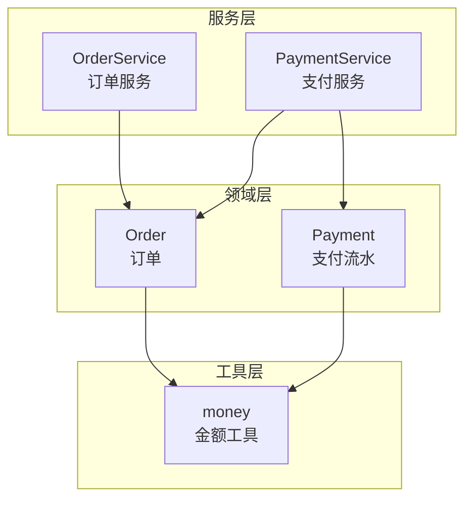
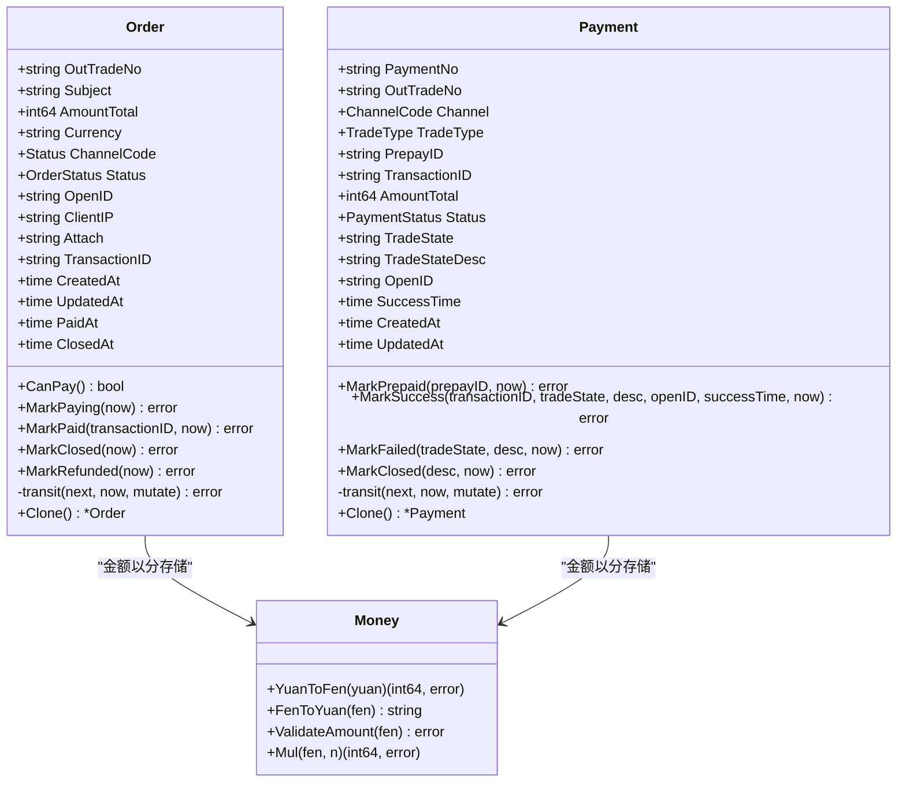
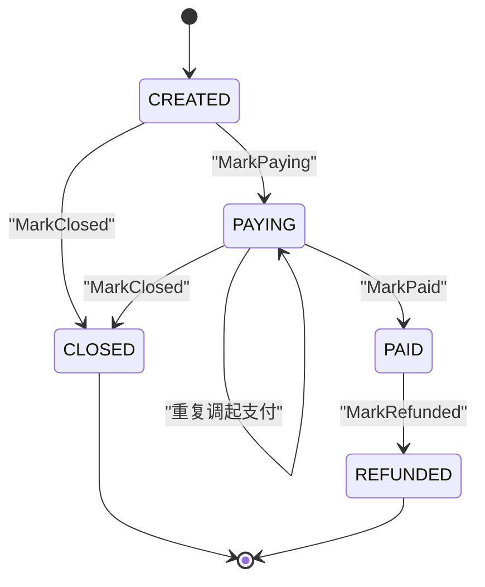
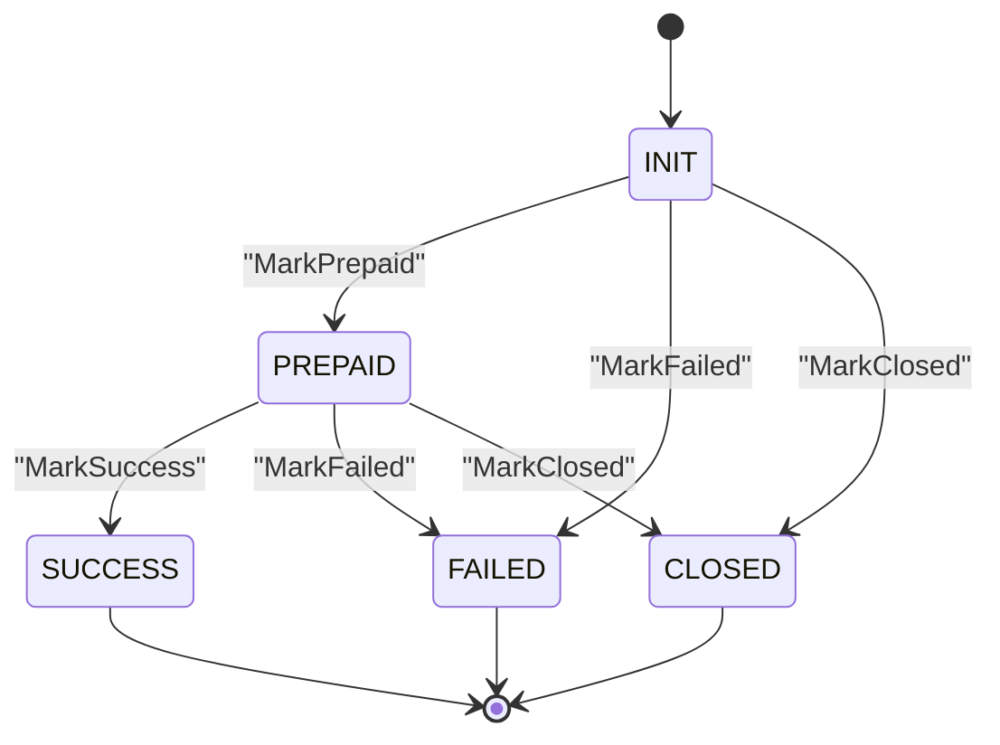
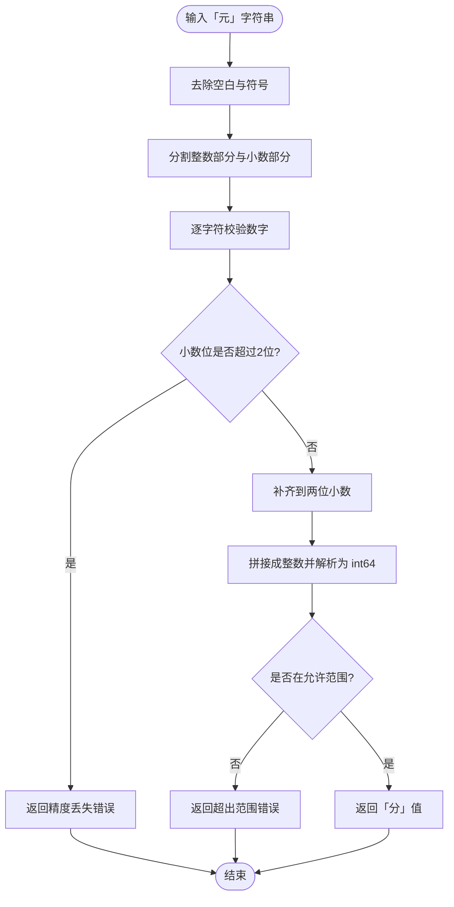
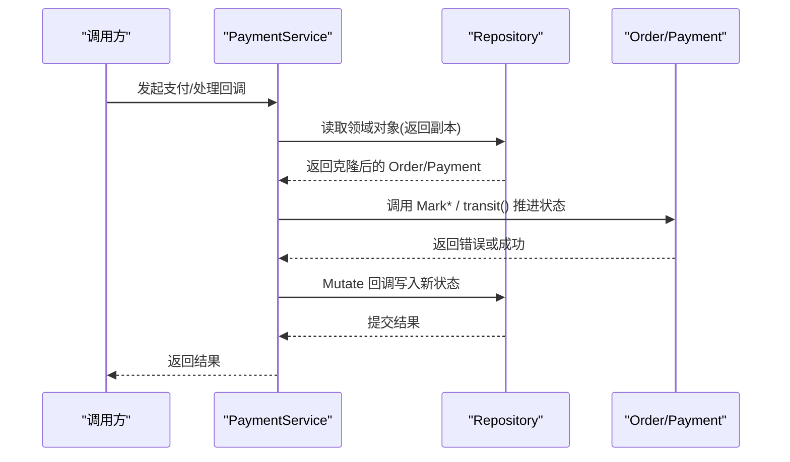
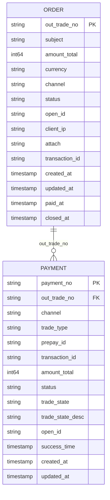
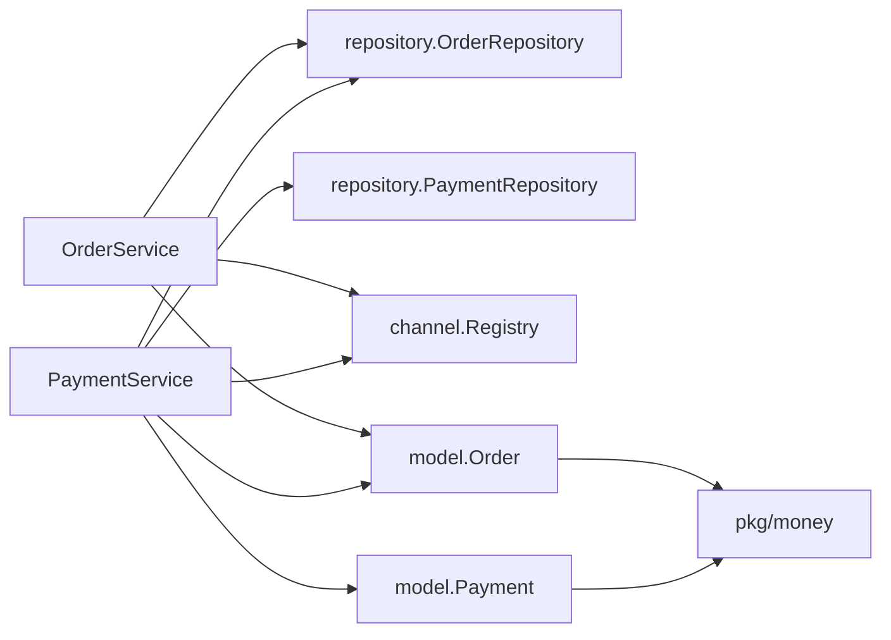

# 领域模型

<cite>
**本文引用的文件**   
- [internal/model/order.go](file://internal/model/order.go)
- [internal/model/payment.go](file://internal/model/payment.go)
- [internal/pkg/money/money.go](file://internal/pkg/money/money.go)
- [internal/service/order_service.go](file://internal/service/order_service.go)
- [internal/service/payment_service.go](file://internal/service/payment_service.go)
</cite>

## 目录
1. [引言](#引言)
2. [项目结构](#项目结构)
3. [核心组件](#核心组件)
4. [架构总览](#架构总览)
5. [详细组件分析](#详细组件分析)
6. [依赖关系分析](#依赖关系分析)
7. [性能与并发特性](#性能与并发特性)
8. [故障排查指南](#故障排查指南)
9. [结论](#结论)

## 引言
本文聚焦支付领域的两个核心实体：订单 Order 与支付流水 Payment，重点说明其状态机设计、金额处理策略、并发安全机制以及领域驱动设计实践。目标是让读者既能理解业务语义，又能准确定位实现位置，便于扩展、测试与排障。

## 项目结构
围绕领域模型的相关代码主要分布在以下模块：
- internal/model：定义 Order、Payment 及其状态机方法 transit()、Clone()。
- internal/pkg/money：提供「元」与「分」的转换工具，避免浮点精度问题。
- internal/service：OrderService 与 PaymentService 编排领域对象与仓储、渠道网关之间的交互。

**图表来源**
- [internal/model/order.go:20-102](file://internal/model/order.go#L20-L102)
- [internal/model/payment.go:10-89](file://internal/model/payment.go#L10-L89)
- [internal/pkg/money/money.go:1-37](file://internal/pkg/money/money.go#L1-L37)
- [internal/service/order_service.go:21-65](file://internal/service/order_service.go#L21-L65)
- [internal/service/payment_service.go:34-97](file://internal/service/payment_service.go#L34-L97)

**章节来源**
- [internal/model/order.go:1-184](file://internal/model/order.go#L1-L184)
- [internal/model/payment.go:1-160](file://internal/model/payment.go#L1-L160)
- [internal/pkg/money/money.go:1-152](file://internal/pkg/money/money.go#L1-L152)
- [internal/service/order_service.go:1-125](file://internal/service/order_service.go#L1-L125)
- [internal/service/payment_service.go:1-583](file://internal/service/payment_service.go#L1-L583)

## 核心组件
- Order：表示商户侧的支付订单，包含订单号、商品标题、总金额（分）、币种、支付渠道、状态、OpenID、客户端 IP、附加数据、渠道交易号及时间戳等字段。
- Payment：表示一次支付尝试的流水记录，包含流水号、所属订单号、渠道、交易类型、预支付 ID、渠道交易号、金额、状态、渠道原始状态与描述、OpenID 及时间戳。
- money：金额工具包，提供「元」字符串与「分」int64 的转换、校验与乘法计算，全程不经过 float64。

关键职责边界：
- model 包是语义中心：所有状态变更必须通过 Mark* 与 transit() 完成，禁止外部直接赋值 Status。
- service 层编排业务流程：创建订单、发起支付、处理回调、查询状态、主动查单兜底。
- money 包统一金额语义：对外暴露「元」字符串，内部使用 int64「分」。

**章节来源**
- [internal/model/order.go:20-102](file://internal/model/order.go#L20-L102)
- [internal/model/payment.go:10-89](file://internal/model/payment.go#L10-L89)
- [internal/pkg/money/money.go:1-37](file://internal/pkg/money/money.go#L1-L37)

## 架构总览
领域模型采用“领域对象 + 状态机”的设计：Order 与 Payment 各自维护合法的状态转移表，并通过 transit() 统一校验与落盘前修改。服务层只负责调用领域对象的公开方法，不直接拼装状态字符串或绕过校验。

**图表来源**
- [internal/model/order.go:20-184](file://internal/model/order.go#L20-L184)
- [internal/model/payment.go:10-160](file://internal/model/payment.go#L10-L160)
- [internal/pkg/money/money.go:39-151](file://internal/pkg/money/money.go#L39-L151)

## 详细组件分析

### 订单 Order 的状态机
- 初始状态：CREATED。
- 允许流转：
  - CREATED → PAYING：成功调起支付后进入支付中。
  - CREATED → CLOSED：超时未支付或主动关单。
  - PAYING → PAYING：用户首次未付，重新调起支付属于正常路径。
  - PAYING → PAID：支付成功。
  - PAYING → CLOSED：支付过程中关闭。
  - PAID → REFUNDED：退款成功后进入终态。
  - CLOSED、REFUNDED 为终态（REFUNDED 由 PAID 流向）。
- 非法流转拒绝：任何不在 orderTransitions 中的目标状态都会返回 ErrInvalidTransition。
- 唯一入口：transit() 先校验 CanTransitionTo，再执行 mutate 副作用，最后更新 Status 与 UpdatedAt，保证失败时不会产生脏状态。
- Clone()：返回副本，防止仓储层返回指针后被外部绕过状态机直接修改内存仓储数据。

**图表来源**
- [internal/model/order.go:23-50](file://internal/model/order.go#L23-L50)
- [internal/model/order.go:127-153](file://internal/model/order.go#L127-L153)
- [internal/model/order.go:155-170](file://internal/model/order.go#L155-L170)

**章节来源**
- [internal/model/order.go:20-184](file://internal/model/order.go#L20-L184)

### 支付流水 Payment 的状态机
- 初始状态：INIT。
- 允许流转：
  - INIT → PREPAID：渠道下单成功，拿到 prepay_id。
  - INIT → FAILED：渠道下单失败。
  - INIT → CLOSED：订单关闭或超时导致流水关闭。
  - PREPAID → SUCCESS：支付成功。
  - PREPAID → FAILED：支付失败。
  - PREPAID → CLOSED：订单关闭或超时导致流水关闭。
  - SUCCESS、FAILED、CLOSED 为终态。
- 唯一入口：transit() 与 Order 一致，先校验后落改。
- Clone()：同 Order，用于仓储层返回副本。

**图表来源**
- [internal/model/payment.go:13-33](file://internal/model/payment.go#L13-L33)
- [internal/model/payment.go:106-150](file://internal/model/payment.go#L106-L150)

**章节来源**
- [internal/model/payment.go:10-160](file://internal/model/payment.go#L10-L160)

### 金额处理策略：元与分
- 内部存储：所有金额一律使用 int64 表示「分」，严禁在业务逻辑中使用 float64 参与金额运算。
- 对外接口：对外暴露「元」字符串，例如 "19.99"，避免二进制浮点精度问题。
- 转换工具：
  - YuanToFen：解析「元」字符串为「分」，严格校验小数位不超过两位，拒绝静默截断。
  - FenToYuan：将「分」格式化为「元」字符串，始终保留两位小数，使用 big.Int 避免溢出。
  - ValidateAmount：校验金额为正数且不超过单笔上限。
  - Mul：数量乘以单价的安全乘法，检测溢出与超上限。
- 上限保护：MaxAmountFen 限制单笔金额，防止 int64 溢出导致负数金额传给渠道。

**图表来源**
- [internal/pkg/money/money.go:44-105](file://internal/pkg/money/money.go#L44-L105)
- [internal/pkg/money/money.go:108-151](file://internal/pkg/money/money.go#L108-L151)

**章节来源**
- [internal/pkg/money/money.go:1-152](file://internal/pkg/money/money.go#L1-L152)

### 并发安全机制：draft-copy-swap 与 Clone()
- draft-copy-swap 模式：
  - 服务层从仓储读取领域对象副本（Clone），在内存中构造新的草稿对象。
  - 对草稿进行状态推进与字段修改。
  - 通过 Mutate 回调把草稿交换回仓储，确保原子性。
- Clone() 的作用：
  - 仓储层对外返回副本而不是内部指针，防止调用方绕过状态机直接修改内存仓储中的数据。
  - 对于数据库实现，ORM 扫描语义天然保证隔离；对于内存实现，Clone() 是必备防护。
- 服务层的幂等与并发保护：
  - 在回调与查单路径中，先做快速幂等判断（如订单已支付），再在 Mutate 回调内再次检查，避免竞态条件。
  - 使用哨兵错误区分「已是终态」与「非法流转」，避免掩盖真正的错误日志。

**图表来源**
- [internal/model/order.go:172-183](file://internal/model/order.go#L172-L183)
- [internal/model/payment.go:152-159](file://internal/model/payment.go#L152-L159)
- [internal/service/payment_service.go:180-213](file://internal/service/payment_service.go#L180-L213)
- [internal/service/payment_service.go:342-365](file://internal/service/payment_service.go#L342-L365)

**章节来源**
- [internal/model/order.go:172-183](file://internal/model/order.go#L172-L183)
- [internal/model/payment.go:152-159](file://internal/model/payment.go#L152-L159)
- [internal/service/payment_service.go:180-213](file://internal/service/payment_service.go#L180-L213)
- [internal/service/payment_service.go:342-365](file://internal/service/payment_service.go#L342-L365)

### 实体关系图：订单与支付流水的一对多
- 一个订单可能产生多次支付尝试（用户取消、网络失败、重复点击等），每次尝试都是一条独立流水。
- 保留全部流水而非覆盖更新，是对账与故障排查的前提。

**图表来源**
- [internal/model/order.go:73-102](file://internal/model/order.go#L73-L102)
- [internal/model/payment.go:54-89](file://internal/model/payment.go#L54-L89)

**章节来源**
- [internal/model/order.go:73-102](file://internal/model/order.go#L73-L102)
- [internal/model/payment.go:54-89](file://internal/model/payment.go#L54-L89)

### 领域驱动设计实践
- 业务规则固化在领域对象中：
  - Order 与 Payment 各自维护合法状态转移表，并通过 transit() 统一校验与副作用执行。
  - 外部无法直接赋值 Status，避免非法流转悄悄发生。
- 服务层只做编排：
  - OrderService 负责创建订单、校验金额、选择渠道、生成订单号并持久化。
  - PaymentService 负责发起支付、处理回调、查询状态、主动查单兜底，复用 HandlePayload 保证回调与查单一致性。
- 金额语义集中管理：
  - 所有金额以「分」存储，对外提供「元」字符串，避免浮点精度问题。
- 可测试性与可维护性：
  - 服务层不感知 HTTP 与具体渠道 SDK，便于纯单元测试覆盖业务规则。
  - 通过 Clone() 与 Mutate 回调保证并发安全与状态一致性。

**章节来源**
- [internal/model/order.go:1-7](file://internal/model/order.go#L1-L7)
- [internal/model/order.go:39-65](file://internal/model/order.go#L39-L65)
- [internal/model/payment.go:26-52](file://internal/model/payment.go#L26-L52)
- [internal/service/order_service.go:1-7](file://internal/service/order_service.go#L1-L7)
- [internal/service/payment_service.go:258-281](file://internal/service/payment_service.go#L258-L281)

## 依赖关系分析
- model 依赖 channel.Code 与 channel.TradeType，但不依赖具体渠道实现。
- service 依赖 repository 接口与 channel.Registry，解耦存储与渠道。
- money 包独立于业务，仅提供金额工具。

**图表来源**
- [internal/service/order_service.go:21-65](file://internal/service/order_service.go#L21-L65)
- [internal/service/payment_service.go:34-97](file://internal/service/payment_service.go#L34-L97)
- [internal/model/order.go:14-15](file://internal/model/order.go#L14-L15)
- [internal/model/payment.go:3-8](file://internal/model/payment.go#L3-L8)
- [internal/pkg/money/money.go:1-15](file://internal/pkg/money/money.go#L1-L15)

**章节来源**
- [internal/service/order_service.go:1-125](file://internal/service/order_service.go#L1-L125)
- [internal/service/payment_service.go:1-583](file://internal/service/payment_service.go#L1-L583)
- [internal/model/order.go:1-184](file://internal/model/order.go#L1-L184)
- [internal/model/payment.go:1-160](file://internal/model/payment.go#L1-L160)
- [internal/pkg/money/money.go:1-152](file://internal/pkg/money/money.go#L1-L152)

## 性能与并发特性
- 状态机复杂度：
  - CanTransitionTo 基于映射查找，时间复杂度 O(k)，k 为允许后继数量，通常很小。
- 金额计算：
  - YuanToFen/FenToYuan 使用字符串与 big.Int，避免浮点误差，但会带来少量额外开销；适合在边界处调用。
- 并发安全：
  - 通过 Mutate 回调与领域对象 Clone() 保证并发场景下的原子更新与幂等。
  - 回调路径中先做快速幂等判断，再在锁内二次检查，减少竞争窗口。

[本节为通用指导，不直接分析具体文件]

## 故障排查指南
- 非法状态流转：
  - 现象：调用 Mark* 返回 ErrInvalidTransition。
  - 排查：检查当前状态与目标状态是否在 orderTransitions/paymentTransitions 中。
  - 参考：[internal/model/order.go:155-170](file://internal/model/order.go#L155-L170)、[internal/model/payment.go:139-150](file://internal/model/payment.go#L139-L150)。
- 金额不一致：
  - 现象：HandleNotify 返回金额不一致错误。
  - 排查：核对回调报文中的 AmountTotal 与订单 AmountTotal 是否一致，确认是否存在串单或篡改。
  - 参考：[internal/service/payment_service.go:320-333](file://internal/service/payment_service.go#L320-L333)。
- 重复回调与幂等：
  - 现象：订单已支付但收到多次回调。
  - 排查：确认快速幂等分支与 Mutate 内二次检查是否生效。
  - 参考：[internal/service/payment_service.go:301-313](file://internal/service/payment_service.go#L301-L313)、[internal/service/payment_service.go:342-365](file://internal/service/payment_service.go#L342-L365)。
- 流水匹配失败：
  - 现象：未找到匹配的支付流水。
  - 排查：确认 pickPayment 的优先级（渠道交易号 > 最新未终结流水 > 最后一条流水）是否正确。
  - 参考：[internal/service/payment_service.go:455-486](file://internal/service/payment_service.go#L455-L486)。

**章节来源**
- [internal/model/order.go:155-170](file://internal/model/order.go#L155-L170)
- [internal/model/payment.go:139-150](file://internal/model/payment.go#L139-L150)
- [internal/service/payment_service.go:301-333](file://internal/service/payment_service.go#L301-L333)
- [internal/service/payment_service.go:342-365](file://internal/service/payment_service.go#L342-L365)
- [internal/service/payment_service.go:455-486](file://internal/service/payment_service.go#L455-L486)

## 结论
本领域模型通过 Order 与 Payment 的状态机将业务规则固化在领域对象中，结合 money 包的金额工具与服务层的编排逻辑，实现了清晰、可测试、并发安全的支付流程。状态机显式列举合法后继，transit() 作为唯一入口确保非法流转被拒绝；金额处理全程避免浮点误差；Clone() 与 Mutate 回调保障并发安全。该设计既满足微信支付等渠道的业务约束，也为后续扩展与排障提供了坚实基础。